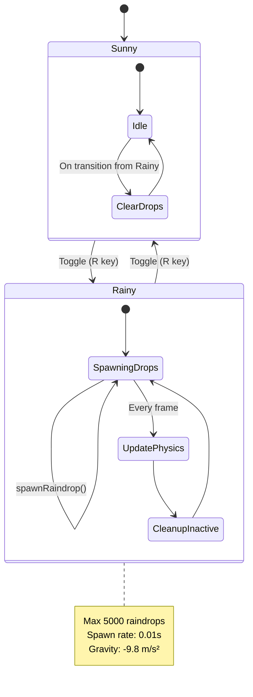
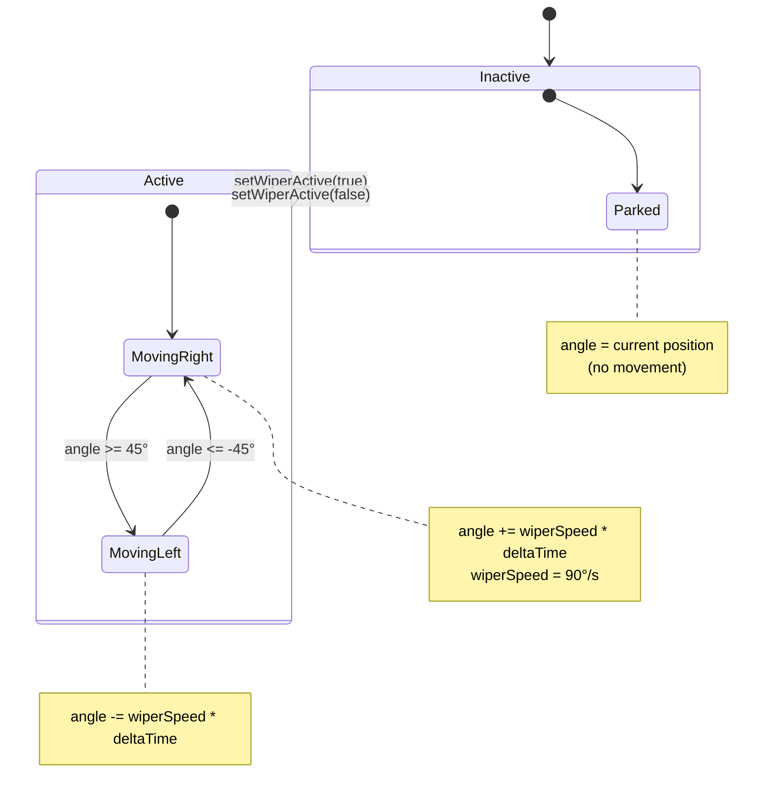
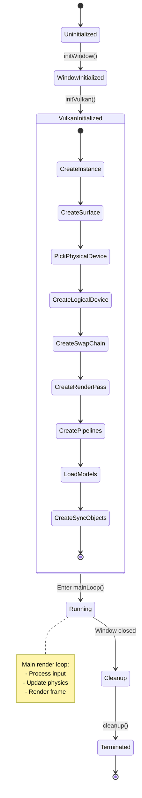
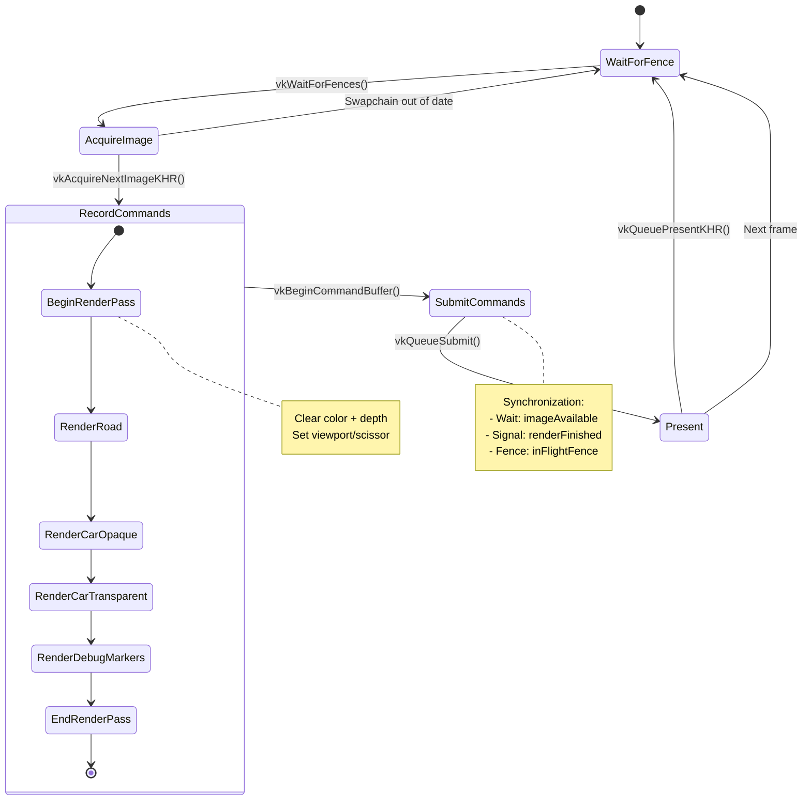
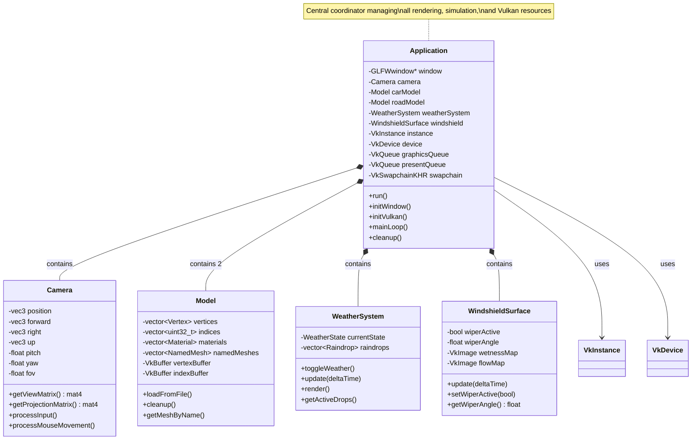
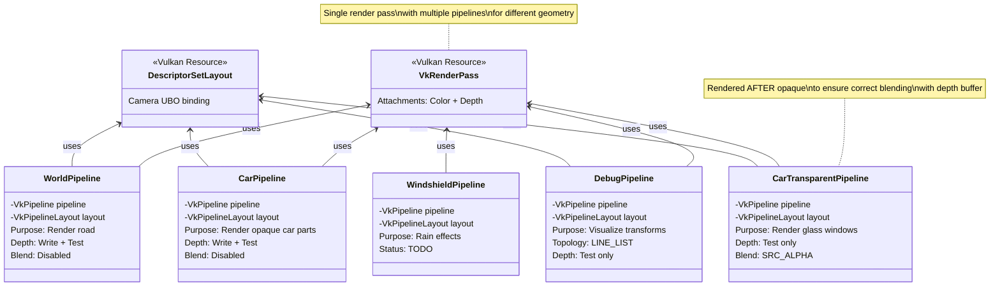
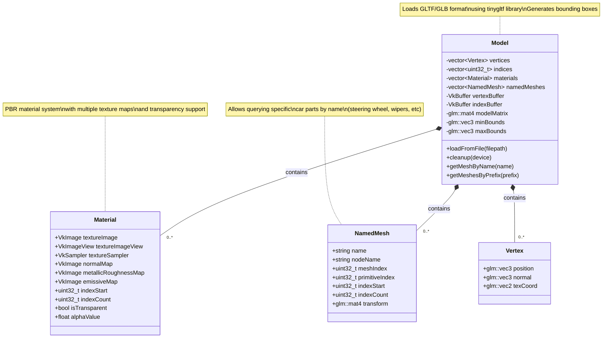
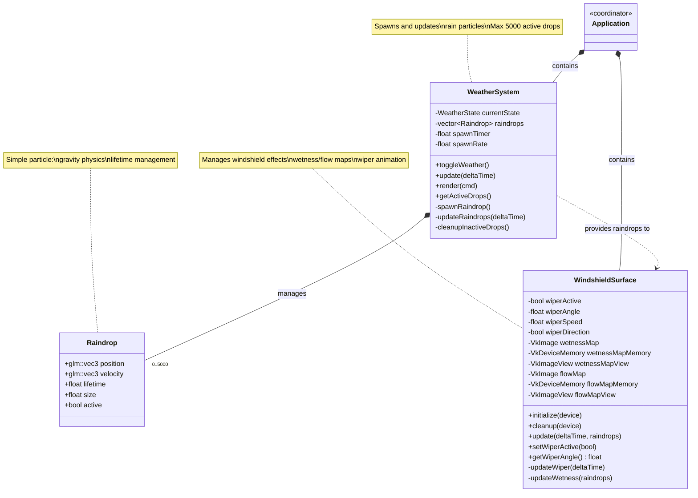

# DownPour Architecture Documentation

This document provides comprehensive architectural diagrams documenting the structure and behavior of the DownPour rain simulator.

## Table of Contents

1. [State Diagrams](#state-diagrams)
   - [Weather System](#weather-system-state-machine)
   - [Wiper System](#wiper-system-state-machine)
   - [Application Lifecycle](#application-lifecycle)
   - [Frame Rendering](#frame-rendering-state-machine)
2. [Object Diagrams](#object-diagrams)
   - [Core Application Architecture](#core-application-architecture)
   - [Rendering Pipeline Architecture](#rendering-pipeline-architecture)
   - [Model Loading Architecture](#model-loading-architecture)
   - [Simulation System Architecture](#simulation-system-architecture)

---

## State Diagrams

State diagrams document the behavior and transitions of various systems within the application.

### Weather System State Machine

The weather system controls environmental conditions and rain particle spawning.

**Implementation:** [`src/simulation/WeatherSystem.h`](src/simulation/WeatherSystem.h), [`src/simulation/WeatherSystem.cpp`](src/simulation/WeatherSystem.cpp)

**Key Points:**
- Simple two-state system toggled by user input
- Rainy state manages particle lifecycle: spawn → update → cleanup
- Particles deactivate when hitting ground (y < 0) or exceeding lifetime (10s)
- State transition immediately clears all raindrops when switching to Sunny

---

### Wiper System State Machine

The windshield wiper system oscillates between angular bounds when active.

**Implementation:** [`src/simulation/WindshieldSurface.h`](src/simulation/WindshieldSurface.h), [`src/simulation/WindshieldSurface.cpp`](src/simulation/WindshieldSurface.cpp)

**Key Points:**
- Wiper oscillates between -45° and +45° when active
- Movement speed: 90°/s (4 seconds for full sweep)
- Direction reverses at boundary conditions
- When inactive, wiper stays at current angle (parked position)

---

### Application Lifecycle

The main application progresses through distinct initialization and execution phases.

**Implementation:** [`src/DownPour.cpp`](src/DownPour.cpp) - `Application::run()` at line 39

**Key Points:**
- Sequential initialization ensures proper resource creation order
- Vulkan initialization is complex with many dependent steps
- Main loop runs until window close requested
- Cleanup releases all Vulkan resources in reverse creation order

---

### Frame Rendering State Machine

Each frame cycles through acquisition, recording, submission, and presentation phases.

**Implementation:** [`src/DownPour.cpp`](src/DownPour.cpp) - `Application::drawFrame()` and `Application::recordCommandBuffer()`

**Key Points:**
- Double buffering: MAX_FRAMES_IN_FLIGHT = 2
- Fence prevents CPU from getting ahead of GPU
- Semaphores synchronize GPU operations (image acquisition → rendering → presentation)
- Render order: opaque objects first (depth write), then transparent (depth test only)
- Swapchain recreation handled on OUT_OF_DATE error

---

## Object Diagrams

Object diagrams document the structural relationships between components.

### Core Application Architecture

The main application class orchestrates all major subsystems.

**Key Relationships:**
- **Composition:** Application owns and manages lifetime of all subsystems
- **Vulkan Resources:** Application holds device, queues, and swapchain
- **Dual Models:** Separate Model instances for car and road
- **Frame State:** Camera, car position, and weather updated each frame

---

### Rendering Pipeline Architecture

Multiple graphics pipelines handle different rendering passes with shared resources.

**Key Points:**
- **Single Render Pass:** All pipelines use same render pass for efficiency
- **Render Order:** World → Car (opaque) → Car (transparent) → Debug
- **Depth Strategy:** Opaque objects write depth, transparent only test
- **Descriptor Sharing:** Camera UBO shared across most pipelines
- **Material System:** Car pipeline has per-material descriptor sets for textures

---

### Model Loading Architecture

The Model class encapsulates GLTF loading with material and mesh management.

**Implementation:** [`src/renderer/Model.h`](src/renderer/Model.h), [`src/renderer/Model.cpp`](src/renderer/Model.cpp)

**Key Points:**
- **GLTF Support:** Loads both ASCII (.gltf) and binary (.glb) formats
- **Material System:** Each material tracks texture resources and index range
- **PBR Textures:** Base color, normal, metallic-roughness, emissive maps
- **Named Meshes:** Query by name for animation (steering wheel, wipers)
- **Transparency Detection:** Reads glTF alphaMode and baseColorFactor
- **Bounding Box:** Calculated during load for physics and camera positioning

---

### Simulation System Architecture

The simulation systems manage dynamic environmental effects.

**Implementation:**
- [`src/simulation/WeatherSystem.h`](src/simulation/WeatherSystem.h) / [`.cpp`](src/simulation/WeatherSystem.cpp)
- [`src/simulation/WindshieldSurface.h`](src/simulation/WindshieldSurface.h) / [`.cpp`](src/simulation/WindshieldSurface.cpp)

**Key Points:**
- **Loose Coupling:** Weather and windshield are separate systems
- **Data Flow:** WeatherSystem provides active raindrops to WindshieldSurface
- **Future Integration:** Wetness map will be updated based on raindrop impacts
- **Wiper State:** Oscillates independently of rain state
- **Particle Pool:** Fixed maximum prevents unbounded memory growth
- **Spawn Strategy:** Uniform random distribution in 40m × 30m volume

---

## Diagram Conventions

### State Diagrams
- **Rounded boxes:** States
- **Arrows:** Transitions with conditions
- **Notes:** Implementation details and constants
- **Nested states:** Sub-state machines

### Object Diagrams
- **Classes:** Components or data structures
- **Solid arrows:** Composition (ownership)
- **Dashed arrows:** Dependency (uses)
- **Multiplicity:** 0..*, 1, 2, etc.
- **Stereotypes:** `<<Vulkan Resource>>`, `<<coordinator>>`

---

## Related Documentation

- **Mathematical Formulas:** See [MATH.md](MATH.md) for all equations and transformations
- **Code Standards:** See [CODING_STANDARDS.md](CODING_STANDARDS.md) for style guidelines
- **Project Overview:** See [README.md](README.md) for building and running

---

*Last Updated: January 2026*
