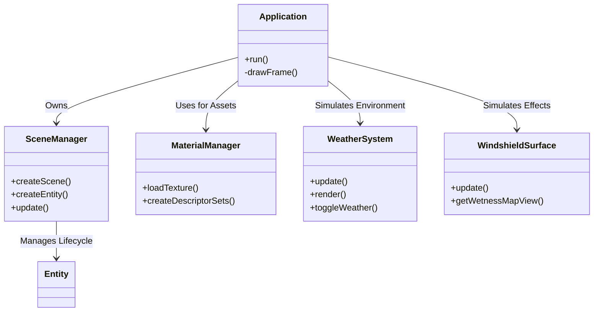
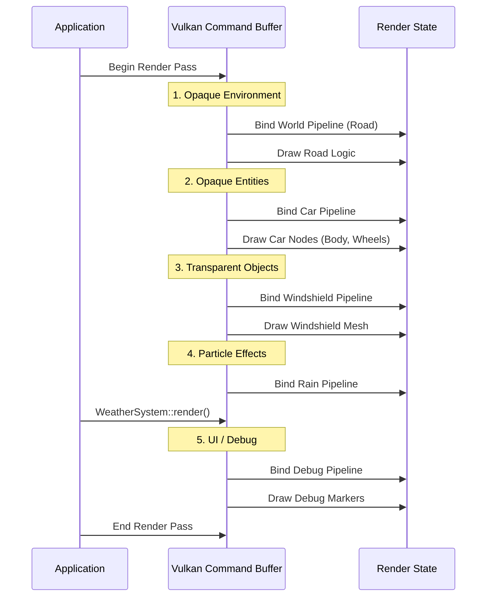

# How to Edit & Configure DownPour

This guide serves as a technical manual for customizing the DownPour simulation. It covers the system architecture, rendering pipeline, physics configuration, and asset management.

> [!TIP]
> This document uses **collapsible sections** for deep dives. Click the ▶ arrows to expand advanced technical details.

## 🏗️ System Architecture & Managers

The application is structured around several key managers that handle distinct responsibilities.



<details>
<summary><strong>🔍 Deep Dive: The Vulkan Render Loop</strong></summary>

### How the Frame is Drawn

The frame rendering follows a strict sequence to handle opacity and effects correctly. This happens every frame in `Application::drawFrame()`.



### Key Components

*   **Command Buffers**: We re-record command buffers every frame (or use dynamic rendering) to handle changing object counts.
*   **Descriptor Sets**: Updates are pushed to the GPU to bind textures (ALBEDO, NORMAL, METALLIC-ROUGHNESS) before drawing each GLTF node.
*   **Pipelines**:
    *   `worldPipeline`: Standard PBR for static terrain.
    *   `carPipeline`: PBR optimized for the car model.
    *   `windshieldPipeline`: Specialized shader with rain/wiper masks.
    *   `rainPipeline`: Billboard particle renderer.

</details>

## 🎬 Scenes & Entities

<details>
<summary><strong>� Deep Dive: Scene Graph Architecture</strong></summary>

### The Logical Hierarchy

DownPour uses a simplified scenegraph to manage transforms.

*   **Scene**: A container for nodes (e.g., "Menu", "Garage", "Driving").
*   **SceneNode**: A single transformable object (Position, Rotation, Scale) with an optional parent.
*   **Entity**: A high-level logic wrapper that owns a sub-tree of nodes.

When you create a `CarEntity`:
1.  A **Wrapper Root** node is created to represent the car's global position.
2.  The raw **glTF Nodes** are imported and re-parented under this wrapper.
3.  **Roles** (strings like "wheel_FL") are assigned to specific nodes so the C++ code can find and animate them without hardcoding IDs.

### Configuring Scenes

You can define new scenes in `SceneManager`. Currently, the logic is implicitly handled in `DownPour.cpp` (state machine), but you can formalize it by creating explicit `Scene` objects in `SceneManager::init()`.

</details>

## 🚗 Car Physics & configuration

**File**: [src/scene/CarEntity.h](file:///Users/adminh/DownPour/src/scene/CarEntity.h)

You can tune the vehicle's dynamics by modifying the `Config` struct.

<details>
<summary><strong>📐 Physics Formulas (LaTeX)</strong></summary>

The motion is governed by simplified vehicle dynamics.

*   **Acceleration** ($F = ma$): We simulate this via `maxAcceleration`.
    $$ v_{new} = v_{old} + (a_{max} \cdot \text{throttle}) \cdot \Delta t $$
*   **Steering & Turning Radius**: The turning radius $R$ is determined by the wheelbase $L$ and steering angle $\delta$. This is the Ackermann steering geometry approximation.
    $$ R = \frac{L}{\sin(\delta)} $$
*   **Centripetal Force**: Relevant for tire grip limits (future expansion).
    $$ F_c = \frac{m v^2}{R} $$

</details>

### Configuration Table

| Parameter | C++ Variable | Unit | Description |
| :--- | :--- | :--- | :--- |
| **Wheel Base** | `wheelBase` | Meters ($m$) | Distance between front and rear axles $(L)$. Affects turning radius. |
| **Track Width** | `trackWidth` | Meters ($m$) | Distance between left and right wheels. Affects visual alignment. |
| **Steering Angle** | `maxSteerAngle` | Degrees ($^\circ$) | Maximum angle the front wheels can turn $(\delta_{max})$. |
| **Acceleration** | `maxAcceleration` | $m/s^2$ | Rate of speed increase. |

```cpp
// src/scene/CarEntity.h
struct Config {
    float wheelBase   = 2.85f;
    float maxSteerAngle = 35.0f;
    // ...
};
```

## 🌧️ Weather & Atmosphere

**File**: [src/simulation/WeatherSystem.h](file:///Users/adminh/DownPour/src/simulation/WeatherSystem.h)

<details>
<summary><strong>🔍 Deep Dive: Particle Simulation</strong></summary>

Rain is simulated on the CPU for logic and rendered via GPU instancing.

1.  **Spawn**: Every frame, `spawnRate` adds new drops if `MAX_RAINDROPS` isn't reached.
2.  **Update**:
    $$ P_y(t) = P_{y0} - v_{drop} \cdot t $$
    Where $v_{drop}$ is variable based on simulated drop mass.
3.  **Recycle**: Drops that hit the ground ($y < 0$) are marked inactive and recycled.

To increase density:
*   Increase `MAX_RAINDROPS`.
*   Decrease `spawnRate` (time between spawns).

</details>

## 📚 References & Resources

To understand and edit this project further, these resources are invaluable:

### Graphics & Vulkan
*   **[Vulkan Tutorial](https://vulkan-tutorial.com/)**: The core rendering architecture of this engine is based on these best practices.
*   **[RenderDoc](https://renderdoc.org/)**: Essential tool for debugging the frame capture and render tree visually.

### Formats & Assets
*   **[glTF 2.0 Specification](https://registry.khronos.org/glTF/specs/2.0/glTF-2.0.html)**: Understanding the node hierarchy, scenes, and materials in the car models.
*   **[Blender](https://www.blender.org/)**: Recommended tool for editing the `.glb` files found in `assets/models/`.

### Physics & Math
*   **[Vehicle Dynamics (Wikipedia)](https://en.wikipedia.org/wiki/Vehicle_dynamics)**: Deeper dive into Ackermann steering and tire forces.
*   **[Real-Time Rendering](https://www.realtimerendering.com/)**: The "bible" for the math behind the camera, projection matrices, and lighting.
