# How to Edit & Configure DownPour - Deep Dive

> [!NOTE]
> This document is optimized for Obsidian with collapsible sections and internal links.
> It provides comprehensive technical documentation for modifying the DownPour rain simulator.

## Purpose

This guide provides an in-depth technical reference for understanding and modifying the DownPour codebase. It includes:

- Detailed system architecture breakdowns
- Visual diagrams (Mermaid) for all major subsystems  
- Mathematical formulas (LaTeX) for physics and graphics
- Practical modification scenarios with step-by-step instructions
- Performance analysis and multiprocessing opportunities
- Troubleshooting guides for common issues

## Table of Contents

1. [Quick Start Guide](#1-quick-start-guide)
   - [File Structure Reference](#11-file-structure-reference)
   - [Build Commands](#12-build-commands)
   - [Most Commonly Edited Files](#13-most-commonly-edited-files)

2. [System Architecture Overview](#2-system-architecture-overview)
   - [High-Level Component Diagram](#21-high-level-component-diagram)
   - [Data Flow Overview](#22-data-flow-overview)
   - [Module Dependencies](#23-module-dependencies)

3. [Core Systems Deep Dive](#3-core-systems-deep-dive)
   - [Scene Graph System](#31-scene-graph-system)
   - [Material System](#32-material-system)
   - [Rendering Pipeline](#33-rendering-pipeline)
   - [Simulation Systems](#34-simulation-systems)
   - [Camera System](#35-camera-system)
   - [Model Loading & glTF Pipeline](#36-model-loading--gltf-pipeline)

4. [Common Modification Scenarios](#4-common-modification-scenarios)
   - [Changing Car Model](#41-changing-car-model)
   - [Adding New Weather Effects](#42-adding-new-weather-effects)
   - [Tweaking Physics Parameters](#43-tweaking-physics-parameters)
   - [Adding New Shaders](#44-adding-new-shaders)
   - [Performance Tuning](#45-performance-tuning)

5. [Multiprocessing Opportunities](#5-multiprocessing-opportunities)
   - [Why Multiprocessing?](#51-why-multiprocessing)
   - [Parallelization Opportunities](#52-parallelization-opportunities)
   - [Implementation Examples](#53-implementation-examples)
   - [Timeline & Dependencies](#54-timeline--dependencies)

6. [Performance Analysis](#6-performance-analysis)
   - [Current Bottlenecks](#61-current-bottlenecks)
   - [Optimization Priorities](#62-optimization-priorities)
   - [Profiling Guide](#63-profiling-guide)

7. [Troubleshooting Guide](#7-troubleshooting-guide)
   - [Common Build Errors](#71-common-build-errors)
   - [Runtime Issues](#72-runtime-issues)
   - [Shader Compilation Issues](#73-shader-compilation-issues)
   - [Git Workflow](#74-git-workflow)

8. [Appendix](#8-appendix)
   - [Complete File Inventory](#81-complete-file-inventory)
   - [External Dependencies](#82-external-dependencies)
   - [Glossary](#83-glossary)
   - [Related Documentation](#84-related-documentation)

9. [Car System Deep Dive](#9-car-system-deep-dive)
   - [Car Architecture Overview](#91-car-architecture-overview)
   - [Car Position & Physics](#92-car-position--physics)
   - [Car Parts & Animation System](#93-car-parts--animation-system)
   - [Car Rendering Pipeline](#94-car-rendering-pipeline)
   - [Car Transform Mathematics](#95-car-transform-mathematics)
   - [Car Model Loading & Scaling](#96-car-model-loading--scaling)
   - [Accessing Car Data](#97-accessing-car-data)
   - [Common Car Modification Scenarios](#98-common-car-modification-scenarios)
   - [Car Debugging Guide](#99-car-debugging-guide)
   - [Car State Variables Quick Reference](#910-car-state-variables-quick-reference)

10. [Camera System Deep Dive](#10-camera-system-deep-dive)

11. [2026-01-25 Refactoring: Core Subsystems Extraction](#11-2026-01-25-refactoring-core-subsystems-extraction)
   - [Refactoring Overview](#111-refactoring-overview)
   - [New Core Subsystems](#112-new-core-subsystems)
   - [Model Loading Refactoring](#113-model-loading-refactoring)
   - [Type Aliases Introduction](#114-type-aliases-introduction)
   - [Migration Guide](#115-migration-guide)
   - [Benefits Summary](#116-benefits-summary)
   - [Future Refactoring Opportunities](#117-future-refactoring-opportunities)
   - [Camera Architecture](#101-camera-architecture)
   - [Camera State Variables](#102-camera-state-variables)
   - [Camera Modes](#103-camera-modes)
   - [Camera Mathematics](#104-camera-mathematics)
   - [Camera Controls](#105-camera-controls)
   - [Modifying Camera Behavior](#106-modifying-camera-behavior)
   - [Camera UBO Structure](#107-camera-ubo-structure)

11. [Road System Deep Dive](#11-road-system-deep-dive)
   - [Road Architecture](#111-road-architecture)
   - [Road Configuration](#112-road-configuration)
   - [Road Loading Process](#113-road-loading-process)
   - [Road Rendering](#114-road-rendering)
   - [Modifying Road](#115-modifying-road)

12. [Skybox System](#12-skybox-system)
   - [Skybox Architecture](#121-skybox-architecture)
   - [Skybox Implementation](#122-skybox-implementation)
   - [Skybox Geometry](#123-skybox-geometry)
   - [Skybox Shader Technique](#124-skybox-shader-technique)
   - [Modifying Skybox](#125-modifying-skybox)

13. [Weather & Rain System](#13-weather--rain-system)
   - [Weather System Architecture](#131-weather-system-architecture)
   - [Weather States](#132-weather-states)
   - [Rain Particle System](#133-rain-particle-system)
   - [Windshield System](#134-windshield-system)
   - [Modifying Weather System](#135-modifying-weather-system)
   - [Performance Considerations](#136-performance-considerations)

---

## 1. Quick Start Guide

### 1.1 File Structure Reference

This table shows where to find and edit key parts of the codebase:

| Path                                       | Type             | Purpose                                      | When to Edit                               |
| ------------------------------------------ | ---------------- | -------------------------------------------- | ------------------------------------------ |
| `src/DownPour.{h,cpp}`                     | Application Core | Main loop, input, orchestration (refactored) | Window size, controls, high-level flow     |
| `src/core/VulkanContext.{h,cpp}`           | Core (NEW)       | Vulkan instance, device, queues              | Device selection, features, extensions     |
| `src/core/SwapChainManager.{h,cpp}`        | Core (NEW)       | Swap chain, render pass, framebuffers        | Presentation mode, format, resize handling |
| `src/core/PipelineFactory.{h,cpp}`         | Core (NEW)       | Graphics pipeline creation utility           | Pipeline defaults, shader loading          |
| `src/core/ResourceManager.{h,cpp}`         | Core (NEW)       | Buffer/image creation, memory mgmt           | Memory allocation strategies               |
| `src/scene/Scene.{h,cpp}`                  | Scene Graph      | Hierarchical node management, transforms     | Scene graph logic, node iteration          |
| `src/scene/SceneNode.{h,cpp}`              | Scene Graph      | Individual node data, TRS transforms         | Node properties, transform decomposition   |
| `src/scene/SceneBuilder.{h,cpp}`           | Scene Graph      | Build scene from glTF models                 | Material-to-node mapping logic             |
| `src/scene/SceneManager.{h,cpp}`           | Scene Graph      | Multi-scene management                       | Scene lifecycle, entity management         |
| `src/scene/Entity.{h,cpp}`                 | Scene Graph      | High-level game objects                      | Entity base class, common behaviors        |
| `src/scene/CarEntity.h`                    | Game Logic       | Car-specific entity                          | Wheel config, steering angles, dimensions  |
| `src/scene/RoadEntity.h`                   | Game Logic       | Road-specific entity                         | Road dimensions, segment count             |
| `src/renderer/Model.{h,cpp}`               | Asset Loading    | glTF/GLB model loading                       | Mesh extraction, texture paths, hierarchy  |
| `src/renderer/Material.h`                  | Materials        | Material data structures                     | Material properties, texture types         |
| `src/renderer/MaterialManager.cpp`         | Materials        | GPU texture management                       | Texture loading, descriptor sets           |
| `src/renderer/Camera.{h,cpp}`              | Camera           | View/projection matrices                     | FOV, near/far planes, movement speed       |
| `src/renderer/Vertex.{h,cpp}`              | Rendering        | Vertex layout definition                     | Adding vertex attributes (colors, etc.)    |
| `src/simulation/WeatherSystem.{h,cpp}`     | Simulation       | Rain particle system                         | Spawn rate, particle count, gravity        |
| `src/simulation/WindshieldSurface.{h,cpp}` | Simulation       | Windshield effects, wipers                   | Wiper speed, wetness maps                  |
| `src/vulkan/VulkanDispatch.h`              | Vulkan Utils     | Resource dispatcher (optional)               | Centralized handle management              |
| `src/vulkan/VulkanTypes.h`                 | Vulkan Utils     | Type definitions, queue families             | Vulkan helper structures                   |
| `src/logger/Logger.{h,cpp}`                | Utilities        | Logging system                               | Log levels, output formatting              |
| `shaders/*.vert`                           | GPU Code         | Vertex shaders                               | Vertex transformations                     |
| `shaders/*.frag`                           | GPU Code         | Fragment shaders                             | Lighting, PBR, effects                     |
| `assets/models/*.glb`                      | Assets           | 3D models (binary glTF)                      | Replace models (requires code changes)     |
| `CMakeLists.txt`                           | Build            | CMake configuration                          | Adding new source files                    |

### 1.2 Build Commands

```bash
# Quick build and run (from project root)
./run.sh

# Clean rebuild (nuclear option - deletes build/)
./run_clean.sh

# Manual CMake workflow
mkdir -p build
cd build
cmake ..
cmake --build .
./DownPour

# Shader compilation (when editing shaders)
cd shaders
glslc basic.vert -o basic.vert.spv
glslc basic.frag -o basic.frag.spv
```

> [!TIP]
> Use `./run_clean.sh` if you encounter strange linker errors or if CMake cache is stale.

### 1.3 Most Commonly Edited Files

These are the top 10 files you'll most likely modify, with key configuration points:

| Rank | File | Key Lines | What's There |
|------|------|-----------|--------------|
| 1 | `src/DownPour.h` | 60-61, 102 | Window size, cockpit offset |
| 2 | `src/scene/CarEntity.h` | 36-50 | Car physics config (wheelbase, steering, acceleration) |
| 3 | `src/simulation/WeatherSystem.h` | 91-93 | Rain particle limits, spawn rate |
| 4 | `src/simulation/WindshieldSurface.h` | 74-76 | Wiper speed, angle limits |
| 5 | `src/renderer/Camera.h` | 14-36 | FOV, pitch, yaw, movement |
| 6 | `src/DownPour.cpp` | 1589-1610 | Car part node name matching |
| 7 | `shaders/car.frag` | All | PBR lighting, material properties |
| 8 | `shaders/windshield_rain.frag` | All | Water effects, refraction |
| 9 | `src/scene/RoadEntity.h` | 18-21 | Road length, width, segments |
| 10 | `CMakeLists.txt` | 17-32 | Add new source files here |

> [!WARNING]
> If you add a new `.cpp` file, you MUST update `CMakeLists.txt` line 17-32 or the linker will fail.

---

## 2. System Architecture Overview

> [!NOTE]
> **Updated for 2026-01-25 Refactoring**: This section reflects the new modular architecture with extracted core subsystems. See [Section 11](#11-2026-01-25-refactoring-core-subsystems-extraction) for details.

### 2.1 High-Level Component Diagram


### 2.2 Data Flow Overview


### 2.3 Module Dependencies


---

## 3. Core Systems Deep Dive

### 3.1 Scene Graph System

The scene graph is a hierarchical data structure for organizing 3D objects with parent-child transform relationships.

#### Architecture

**Design Philosophy:**
- **Flat array storage** instead of pointer-based trees for cache efficiency
- **Index-based handles** with generation counters for stable references
- **Active nodes tracking** for fast iteration (skips freed nodes)
- **Dirty flag propagation** for efficient transform updates

**Key Files:**
- [`src/scene/Scene.h`](src/scene/Scene.h) - Scene container and management
- [`src/scene/SceneNode.h`](src/scene/SceneNode.h) - Node data structure
- [`src/scene/Entity.h`](src/scene/Entity.h) - High-level entity wrapper
- [`src/scene/SceneBuilder.h`](src/scene/SceneBuilder.h) - Build from glTF

#### Class Diagram


#### Transform Propagation Flow

This shows how transforms are updated from root to leaves:


**Formula**: $$W_{child} = W_{parent} \times L_{child}$$

Where:
- $W$ = World transform matrix (4×4)
- $L$ = Local transform matrix (4×4) 
- $L = T \times R \times S$ (Translation × Rotation × Scale)

**Code Reference**: [`src/scene/Scene.cpp`](src/scene/Scene.cpp) lines 155-189

#### Entity-Node Relationship


**Usage Pattern:**
```cpp
// Create entity with multiple nodes
Entity* car = sceneManager.createEntity("player_car", "driving");
car->addNode(bodyNode, "body");
car->addNode(wheelFLNode, "wheel_FL");
car->addNode(wheelFRNode, "wheel_FR");

// Animate specific parts
car->animateRotation("wheel_FL", wheelRotation);
car->setPosition(glm::vec3(0, 0, 10));  // Moves entire car
```

#### Active Nodes Optimization

> [!TIP]
> This optimization was added to fix a segmentation fault caused by iterating over freed nodes.

**Problem:** The `nodes` vector contains both active and freed nodes. Freed nodes are added to a `freeList` for reuse, but remain in the vector with stale data.

**Solution:** Maintain a separate `activeNodes` vector tracking only valid nodes.


**Performance Impact:**
- **Before**: O(n) iteration checking every node + validity checks
- **After**: O(m) iteration where m = active nodes only
- **Speedup**: ~2x for scenes with many freed nodes

**Code References:**
- [`Scene.h`](src/scene/Scene.h) line 83 - `activeNodes` declaration
- [`Scene.cpp`](src/scene/Scene.cpp) line 33 - Add to `activeNodes`
- [`Scene.cpp`](src/scene/Scene.cpp) line 84 - Remove from `activeNodes`
- [`Scene.cpp`](src/scene/Scene.cpp) lines 238-254 - Iterate `activeNodes` in `getRenderBatches()`

---

### 3.2 Material System

The material system separates data (Material struct) from GPU resources (MaterialManager), enabling clean testing and serialization.

#### Architecture

**Key Principle:** Data vs. Implementation Separation


**Key Files:**
- [`src/renderer/Material.h`](src/renderer/Material.h) - Data structures
- [`src/renderer/MaterialManager.cpp`](src/renderer/MaterialManager.cpp) - GPU implementation

#### Material Loading Sequence

This sequence diagram shows the critical initialization order fix:


> [!WARNING]
> **Critical Bug (Fixed):** Materials were created before descriptor support was initialized, causing NULL descriptor sets and segmentation faults during rendering.

**Solution:** Two-phase initialization pattern:
1. `initDescriptorSupport()` - Store pool/layout references
2. `createDescriptorSetsForExistingMaterials()` - Create sets for existing materials

**Code References:**
- [`MaterialManager.cpp`](src/renderer/MaterialManager.cpp) lines 103-108 - `initDescriptorSupport()`
- [`MaterialManager.cpp`](src/renderer/MaterialManager.cpp) lines 110-174 - `createDescriptorSetsForExistingMaterials()`
- [`DownPour.cpp`](src/DownPour.cpp) lines 1964-1967 - Usage during init

#### Embedded Texture Handling

GLB files store textures as embedded binary data, not external files:


**EmbeddedTexture Structure:**
```cpp
struct EmbeddedTexture {
    std::vector<unsigned char> pixels;  // RGBA data
    int width;
    int height;
    bool isValid() const;
};
```

**Material Fields:**
```cpp
struct Material {
    // External textures (file paths)
    std::string baseColorTexture;
    
    // Embedded textures (GLB data)
    EmbeddedTexture embeddedBaseColor;
    
    // Mesh association
    int32_t meshIndex;      // Which glTF mesh
    int32_t primitiveIndex; // Which primitive within mesh
    
    // Index range for rendering
    uint32_t indexStart;
    uint32_t indexCount;
};
```

**Loading Priority:** Embedded > File Path

**Code References:**
- [`Material.h`](src/renderer/Material.h) lines 66-103 - Struct definitions
- [`Model.cpp`](src/renderer/Model.cpp) lines 193-251 - Extract embedded textures
- [`MaterialManager.cpp`](src/renderer/MaterialManager.cpp) lines 31-58 - Load textures
- [`MaterialManager.cpp`](src/renderer/MaterialManager.cpp) lines 246-264 - `loadTextureFromData()`

#### Material-to-Mesh Mapping

**Problem (Fixed):** SceneBuilder was assigning the first material to ALL mesh nodes.

**Solution:** Materials now store `meshIndex` and `primitiveIndex`. SceneBuilder uses `Model::getMaterialsForMesh()` to find correct materials.


**Code References:**
- [`Material.h`](src/renderer/Material.h) lines 93-94 - `meshIndex`/`primitiveIndex` fields
- [`Model.cpp`](src/renderer/Model.cpp) lines 546-554 - `getMaterialsForMesh()` implementation
- [`SceneBuilder.cpp`](src/scene/SceneBuilder.cpp) lines 70-105 - Material assignment logic

---

### 3.3 Rendering Pipeline

#### Frame Rendering State Machine


**Double Buffering:** `MAX_FRAMES_IN_FLIGHT = 2`
- Allows CPU to prepare frame N+1 while GPU renders frame N
- Prevents CPU/GPU idle time

**Code Reference:** [`DownPour.cpp`](src/DownPour.cpp) lines 1054-1098

#### Render Pass Flow


**Render Order Rationale:**
1. **Skybox** first (no depth write, always pass)
2. **Opaque objects** (road, car body) with depth write
3. **Transparent objects** (glass) without depth write, sorted back-to-front
4. **Debug overlays** last (on top of everything)

#### User Journey: From Input to Render


**Latency:** Input → Display = 16-33ms (60-30 fps)

#### Uniform Buffer Structure (Packet Diagram)

```cpp
struct CameraUBO {
    alignas(16) glm::mat4 view;       // 64 bytes
    alignas(16) glm::mat4 proj;       // 64 bytes  
    alignas(16) glm::mat4 viewProj;   // 64 bytes
};
// Total size: 192 bytes
```

**Memory Layout:**
```
Offset | Size | Field
-------|------|-------
0      | 64   | view matrix
64     | 64   | proj matrix
128    | 64   | viewProj matrix
```

**Alignment:** 16-byte alignment required by Vulkan UBO rules

#### Pipeline Comparison Table

| Pipeline | Depth Test | Depth Write | Blend Mode | Topology | Purpose |
|----------|------------|-------------|------------|----------|---------|
| `worldPipeline` | Enabled | Enabled | None | TRIANGLE_LIST | Road rendering |
| `carPipeline` | Enabled | Enabled | None | TRIANGLE_LIST | Car opaque parts |
| `carTransparentPipeline` | Enabled | **Disabled** | SRC_ALPHA | TRIANGLE_LIST | Glass windows |
| `debugPipeline` | Enabled | Disabled | None | LINE_LIST | Debug markers |
| `windshieldPipeline` | Disabled | Disabled | Additive | TRIANGLE_STRIP | Post-process effect |

> [!TIP]
> Transparent pipeline disables depth write to prevent occlusion issues. Objects behind glass remain visible.

#### Transform Math

The MVP (Model-View-Projection) transformation:

$$v_{clip} = P \times V \times M \times v_{model}$$

Where:
- $v_{model}$ = Vertex position in model space
- $M$ = Model matrix (object world transform)
- $V$ = View matrix (camera transform)
- $P$ = Projection matrix (perspective)
- $v_{clip}$ = Final clip space position

**In practice:**
- $VP = P \times V$ is precomputed in CameraUBO
- $M$ is passed as push constant per-object
- Shader computes: `gl_Position = ubo.viewProj * pushConstants.model * inPosition;`

**Code References:**
- [`DownPour.h`](src/DownPour.h) lines 33-37 - CameraUBO struct
- [`DownPour.cpp`](src/DownPour.cpp) lines 873-1007 - `recordCommandBuffer()`
- [`shaders/car.vert`](shaders/car.vert) - Vertex shader MVP transform

---

### 3.4 Simulation Systems

#### Rain Simulation Mind Map

```mermaid
mindmap
  root((Rain Simulation))
    Particle System
      Spawning
        Spawn Rate 0.01s
        Max 5000 particles
        Random distribution
      Physics
        Gravity 9.8 m/s²
        Velocity integration
        Lifetime tracking
      Cleanup
        Ground collision
        Timeout after 10s
    Windshield Effects
      Wetness Map
        256×256 texture
        R8 UNORM format
        UV mapping
      Flow Map
        Direction vectors
        RG8 format
        Gravity flow
      Wiper System
        Angle 45 to +45
        Speed 90 deg/s
        Bidirectional
    Rendering
      Particle Sprites
        Point rendering
        Size attenuation
      Post Process
        Refraction
        Highlights
        Blur
```



#### Weather System

**State Machine:** See [ARCHITECTURE.md](ARCHITECTURE.md#weather-system-state-machine) for detailed state diagram.

**Rain Physics:**

Particle motion under gravity:

$$v(t) = v_0 + gt$$
$$p(t) = p_0 + v_0 t + \frac{1}{2}gt^2$$

Where:
- $v(t)$ = Velocity at time $t$
- $p(t)$ = Position at time $t$
- $g = -9.8 \text{ m/s}^2$ (gravity acceleration)
- $v_0 = (0, -5, 0)$ (initial downward velocity)

**Implementation:**
```cpp
// WeatherSystem.cpp
void WeatherSystem::updateRaindrops(float deltaTime) {
    for (auto& drop : raindrops) {
        if (!drop.active) continue;
        
        // Apply gravity: v = v₀ + gt
        drop.velocity.y += GRAVITY * deltaTime;
        
        // Update position: p = p + vΔt
        drop.position += drop.velocity * deltaTime;
        
        // Deactivate on ground collision
        if (drop.position.y < 0.0f) {
            drop.active = false;
        }
    }
}
```

**Configuration Parameters:**

| Parameter | Value | Location | Effect |
|-----------|-------|----------|--------|
| `MAX_RAINDROPS` | 5000 | `WeatherSystem.h:91` | Max particle count |
| `spawnRate` | 0.01s | `WeatherSystem.h:93` | 100 drops/sec |
| `GRAVITY` | -9.8 m/s² | `WeatherSystem.cpp` | Fall acceleration |
| `SPAWN_HEIGHT` | 30m | `WeatherSystem.cpp` | Drop spawn altitude |
| `MAX_LIFETIME` | 10s | `WeatherSystem.cpp` | Particle timeout |

**Code References:**
- [`WeatherSystem.h`](src/simulation/WeatherSystem.h) lines 14-110
- [`WeatherSystem.cpp`](src/simulation/WeatherSystem.cpp) - Full implementation

#### Windshield Wiper System

**Wiper Animation Formula:**

$$\theta(t) = \theta_0 + \omega \cdot t \cdot d$$

Where:
- $\theta(t)$ = Wiper angle at time $t$
- $\theta_0$ = Initial angle
- $\omega = 90°/\text{s}$ (wiper speed)
- $d \in \{-1, +1\}$ (direction: left/right)

**Boundary Conditions:**
- If $\theta \geq 45°$: reverse direction ($d = -1$)
- If $\theta \leq -45°$: reverse direction ($d = +1$)

**Implementation:**
```cpp
void WindshieldSurface::updateWiper(float deltaTime) {
    if (!wiperActive) return;
    
    if (wiperDirection) {
        wiperAngle += wiperSpeed * deltaTime;
        if (wiperAngle >= 45.0f) {
            wiperAngle = 45.0f;
            wiperDirection = false;  // Reverse
        }
    } else {
        wiperAngle -= wiperSpeed * deltaTime;
        if (wiperAngle <= -45.0f) {
            wiperAngle = -45.0f;
            wiperDirection = true;  // Reverse
        }
    }
}
```

**Code References:**
- [`WindshieldSurface.h`](src/simulation/WindshieldSurface.h) lines 72-76 - State variables
- [`WindshieldSurface.cpp`](src/simulation/WindshieldSurface.cpp) - `updateWiper()` method

---

### 3.5 Camera System

#### Coordinate Transform Pipeline


**View Matrix (Look-At):**

$$\mathbf{V} = \text{lookAt}(\mathbf{p}, \mathbf{p} + \mathbf{f}, \mathbf{u})$$

- $\mathbf{p}$ = Camera position
- $\mathbf{f}$ = Forward direction
- $\mathbf{u}$ = Up vector

**Projection Matrix (Perspective):**

$$\mathbf{P} = \text{perspective}(\text{FOV}, \text{aspect}, n, f)$$

- FOV = 75° (wide for cockpit immersion)
- aspect = 800/600 = 1.333
- n = 0.1m, f = 10,000m

**Code References:**
- [`Camera.cpp`](src/renderer/Camera.cpp) lines 39-45 - Matrix getters
- [`DownPour.h`](src/DownPour.h) line 102 - Cockpit offset

---

### 3.6 Model Loading & glTF Pipeline

#### glTF Structure (ER Diagram)


#### Model Loading Flowchart


**JSON Structure Example:**

```json
{
  "nodes": [
    {
      "name": "Wheel Front L",
      "mesh": 42,
      "translation": [1.2, 0.0, 0.35],
      "rotation": [0, 0, 0, 1]
    }
  ],
  "meshes": [
    {
      "name": "WheelMesh",
      "primitives": [
        {
          "attributes": {"POSITION": 0, "NORMAL": 1, "TEXCOORD_0": 2},
          "indices": 3,
          "material": 5
        }
      ]
    }
  ]
}
```

**Code References:**
- [`Model.cpp`](src/renderer/Model.cpp) lines 17-250 - `loadFromFile()` 
- [`Model.cpp`](src/renderer/Model.cpp) lines 52-234 - Mesh/primitive loop

---

## 5. Multiprocessing Opportunities

### 5.1 Why Multiprocessing?

**Current Bottlenecks:**
- Particle updates: O(n) sequential loop for 5000 particles
- Transform propagation: 512 nodes processed serially
- Texture loading: 217 textures loaded one-by-one (I/O bound)

**C++ Parallel Libraries:**
- `<thread>` - Manual thread management
- `<future>` and `<async>` - Task-based parallelism
- `<execution>` (C++17) - Parallel algorithms (`std::execution::par`)
- **Intel TBB** (optional) - Industrial-strength task scheduler

### 5.2 Parallelization Opportunities

#### Opportunity 1: Rain Particle Updates ⭐⭐⭐

**Current Implementation:** Sequential loop

```cpp
// Current: O(n) sequential
for (auto& drop : raindrops) {
    drop.velocity.y += GRAVITY * deltaTime;
    drop.position += drop.velocity * deltaTime;
    // ...
}
```

**Parallel Implementation:**

```cpp
#include <execution>
#include <algorithm>

void WeatherSystem::updateRaindrops(float deltaTime) {
    std::for_each(std::execution::par_unseq,
                  raindrops.begin(),
                  raindrops.end(),
                  [deltaTime](Raindrop& drop) {
                      if (!drop.active) return;
                      drop.velocity.y += GRAVITY * deltaTime;
                      drop.position += drop.velocity * deltaTime;
                      drop.lifetime += deltaTime;
                      if (drop.position.y < 0.0f || drop.lifetime > 10.0f) {
                          drop.active = false;
                      }
                  });
}
```

**Benefits:**
- **Speedup:** 2-4x on 4+ core systems
- **Complexity:** Low (embarrassingly parallel)
- **Thread safety:** Each particle is independent
- **Trade-off:** Thread overhead for <1000 particles

**When to use:** Particle count > 1000

---

#### Opportunity 2: Scene Transform Propagation ⭐⭐

**Current:** Sequential BFS traversal

**Parallel Strategy:** Level-synchronous parallel BFS
- Process all nodes at the same depth level in parallel
- Synchronize between levels (children depend on parents)

```cpp
void Scene::updateTransformsParallel() {
    std::vector<NodeHandle> currentLevel = rootNodes;
    glm::mat4 identity(1.0f);
    
    while (!currentLevel.empty()) {
        std::vector<NodeHandle> nextLevel;
        std::mutex nextLevelMutex;
        
        // Process current level in parallel
        std::for_each(std::execution::par,
                      currentLevel.begin(),
                      currentLevel.end(),
                      [&](NodeHandle handle) {
                          SceneNode* node = getNode(handle);
                          // Compute world transform
                          // ...
                          // Collect children for next level
                          std::lock_guard lock(nextLevelMutex);
                          nextLevel.insert(nextLevel.end(), 
                                          node->children.begin(),
                                          node->children.end());
                      });
        
        currentLevel = std::move(nextLevel);
    }
}
```

**Benefits:**
- **Speedup:** 1.5-3x for wide hierarchies (many siblings)
- **Complexity:** Medium (requires level synchronization)
- **Best for:** Wide trees (car model: 512 nodes, many siblings)

**Trade-off:** Overhead from mutex on `nextLevel` collection

---

#### Opportunity 3: Texture Loading ⭐⭐⭐⭐⭐

**Current:** Sequential texture loading (I/O bound)

```cpp
// Current: Load 217 textures sequentially
for (const auto& material : materials) {
    uint32_t gpuId = materialManager->createMaterial(material);
}
```

**Parallel Implementation using `std::async`:**

```cpp
#include <future>
#include <vector>

void Application::loadCarModelParallel() {
    const auto& materials = carModelPtr->getMaterials();
    std::vector<std::future<uint32_t>> futures;
    
    // Launch async texture loads
    for (const auto& material : materials) {
        futures.push_back(std::async(std::launch::async, [&]() {
            return materialManager->createMaterial(material);
        }));
    }
    
    // Wait for all and collect IDs
    for (size_t i = 0; i < futures.size(); i++) {
        carMaterialIds[i] = futures[i].get();
    }
}
```

**Benefits:**
- **Speedup:** 10-20x (I/O bound operations scale nearly linearly)
- **Complexity:** Low (truly independent operations)
- **Thread safety:** Each texture creates separate Vulkan resources

**Critical:** MaterialManager must be thread-safe. Consider:
- Per-thread staging buffers
- Mutex around descriptor set allocation
- Thread-local texture loading

**Expected Impact:** Reduce loading time from ~2s to ~200ms

---

#### Opportunity 4: Mesh Processing ⭐⭐

**Current:** Sequential primitive extraction

**Parallel Strategy:** Process each mesh/primitive pair in parallel, then merge

```cpp
struct MeshData {
    std::vector<Vertex> vertices;
    std::vector<uint32_t> indices;
    uint32_t meshIndex;
};

void Model::loadFromFileParallel(...) {
    std::vector<std::future<MeshData>> futures;
    
    for (size_t meshIdx = 0; meshIdx < model.meshes.size(); meshIdx++) {
        futures.push_back(std::async(std::launch::async, [&, meshIdx]() {
            return extractMeshData(model, meshIdx);
        }));
    }
    
    // Merge results
    for (auto& future : futures) {
        MeshData data = future.get();
        // Append to vertices/indices with offset adjustment
    }
}
```

**Benefits:**
- **Speedup:** 2-3x for complex models
- **Complexity:** Medium (requires index offset adjustment during merge)

---

### 5.3 Implementation Timeline


**Dependencies:**
- Texture loading has NO dependencies → implement first
- Particle updates require thread-safe random number generation
- Transform propagation requires level-synchronous BFS implementation
- Mesh processing requires careful index offset management

### 5.4 Expected Performance Gains

| System | Current Time | Parallel Time | Speedup | Complexity |
|--------|--------------|---------------|---------|------------|
| Texture Loading | ~2000ms | ~150ms | **13x** | Low |
| Particle Update (5000) | ~3ms/frame | ~1ms/frame | **3x** | Low |
| Transform Propagation | ~0.5ms/frame | ~0.2ms/frame | **2.5x** | Medium |
| Mesh Processing | ~500ms | ~200ms | **2.5x** | Medium |

**Total Loading Time:** 2500ms → ~350ms (**7x faster**)
**Frame Time Reduction:** ~3.5ms → ~1.2ms (**enables 144fps**)

---

## 4. Common Modification Scenarios

### 4.1 Changing Car Model

> [!TIP]
> **NEW (2026-01-25)**: Use sidecar JSON for configuration! No code changes needed for most adjustments. See [Sidecar JSON System](#113-model-loading-refactoring).

**Steps:**

1. **Export model as GLB** with embedded textures
2. **Place files:** `assets/models/your_car/your_car.glb`
3. **Create sidecar JSON:** `assets/models/your_car/your_car.glb.json`
4. **Configure metadata** (see template below)
5. **Update application** to load your model instead of BMW

**Sidecar JSON Template:**
```json
{
  "model": {
    "cockpitOffset": [0.35, 0.5, -0.8],
    "targetLength": 4.7,
    "orientation": {
      "pitch": 0,
      "yaw": 0,
      "roll": 90
    }
  },
  "roles": {
    "wheel_FL": "YourWheelFrontLeftNodeName",
    "wheel_FR": "YourWheelFrontRightNodeName",
    "wheel_RL": "YourWheelRearLeftNodeName",
    "wheel_RR": "YourWheelRearRightNodeName",
    "steering_wheel": "YourSteeringWheelNodeName",
    "left_wiper": "YourLeftWiperNodeName",
    "right_wiper": "YourRightWiperNodeName"
  },
  "config": {
    "wheelBase": 2.851,
    "maxSteerAngle": 35.0,
    "maxAcceleration": 5.0,
    "maxSpeed": 50.0
  }
}
```

**Finding Node Names:**
1. Open GLB in Blender
2. View outliner panel (scene collection)
3. Note exact names (case-sensitive!)
4. Or use: `strings your_car.glb | grep -i wheel`

> [!WARNING]
> Node names are **case-sensitive** and must match exactly. Incorrect names → parts won't animate.

**Load in Application:**
```cpp
// In DownPour.cpp initVulkan()
auto adapter = std::make_shared<ModelAdapter>();
adapter->loadWithMetadata("assets/models/your_car/your_car.glb");
carModelPtr = adapter->getModel();
```

**Benefits of Sidecar JSON:**
- ✅ No C++ recompilation for config changes
- ✅ Easy A/B testing (multiple JSON files)
- ✅ Designer-friendly format
- ✅ Version control friendly

---

### 4.2 Adding New Weather Effects

**Example: Add Fog**

1. **Update enum** in `WeatherSystem.h`:
```cpp
enum class WeatherState { Sunny, Rainy, Foggy };
```

2. **Add state in update logic**:
```cpp
void WeatherSystem::update(float deltaTime) {
    if (currentState == WeatherState::Foggy) {
        updateFogDensity(deltaTime);
    }
}
```

3. **Create fog shader** or modify existing fragment shaders
4. **Add toggle key** in `DownPour.cpp` main loop

---

### 4.3 Tweaking Physics Parameters

| Parameter | File | Line | Default | Effect |
|-----------|------|------|---------|--------|
| Max acceleration | `CarEntity.h` | 44 | 5.0 m/s² | 0-60 speed |
| Max steering | `CarEntity.h` | 43 | 35° | Turn radius |
| Spawn rate | `WeatherSystem.h` | 93 | 0.01s | Rain intensity |
| Wiper speed | `WindshieldSurface.h` | 75 | 90°/s | Wiper animation speed |
| Camera FOV | `DownPour.cpp` | 103 | 75° | Field of view |

---

### 4.4 Adding New Shaders

**Template for new shader pipeline:**

1. **Create GLSL files:** `shaders/myeffect.vert`, `shaders/myeffect.frag`
2. **Compile to SPIR-V:**
```bash
cd shaders
glslc myeffect.vert -o myeffect.vert.spv
glslc myeffect.frag -o myeffect.frag.spv
```
3. **Add pipeline in `DownPour.h`:**
```cpp
VkPipeline myEffectPipeline = VK_NULL_HANDLE;
VkPipelineLayout myEffectPipelineLayout = VK_NULL_HANDLE;
```
4. **Create pipeline** in `initVulkan()` using existing pipeline creation as template
5. **Bind and draw** in `recordCommandBuffer()`

---

### 4.5 Performance Tuning

**Quick Wins:**

| Action | File | Impact |
|--------|------|--------|
| Reduce particle count | `WeatherSystem.h:91` | +15 fps |
| Disable debug visualization | `DownPour.h:105` set `false` | +5 fps |
| Lower texture resolution | Re-export GLB | +10 fps, -VRAM |
| Increase far plane | `DownPour.cpp:108` | -5 fps |

---

## 6. Performance Analysis

### 6.1 Current Bottlenecks


### 6.2 Optimization Priorities

| Priority | System | Current | Target | Technique |
|----------|--------|---------|--------|-----------|
| 🔴 HIGH | Texture Loading | 2000ms | 150ms | Async parallel loading |
| 🟡 MEDIUM | Particle Updates | 3ms | 1ms | Parallel for_each |
| 🟡 MEDIUM | Transform Propagation | 0.5ms | 0.2ms | Level-parallel BFS |
| 🟢 LOW | Mesh Processing | 500ms | 200ms | Parallel extraction |

### 6.3 Profiling Guide

**Using Xcode Instruments (macOS):**
```bash
# Build with debug symbols
cmake -DCMAKE_BUILD_TYPE=RelWithDebInfo ..
cmake --build .

# Profile with Instruments
open -a Instruments
# Select "Time Profiler" template
# Run DownPour target
```

**Using Valgrind (Linux):**
```bash
valgrind --tool=callgrind ./DownPour
kcachegrind callgrind.out.*
```

---

## 7. Troubleshooting Guide

### 7.1 Common Build Errors

**Error:** `undefined reference to MaterialManager::createMaterial`
- **Cause:** Forgot to add new `.cpp` file to `CMakeLists.txt`
- **Fix:** Add file to `add_executable()` list

**Error:** `'glm/glm.hpp' file not found`
- **Cause:** Submodules not initialized
- **Fix:** `git submodule update --init --recursive`

**Error:** `vkCreateGraphicsPipeline failed`
- **Cause:** Shader compilation failed or missing `.spv` file
- **Fix:** Run `glslc` on modified shaders

### 7.2 Runtime Issues

**Segmentation Fault 11**
- **Likely causes:**
  1. NULL descriptor set (material without texture)
  2. Invalid NodeHandle (stale generation)
  3. Accessing freed scene node
- **Debug strategy:**
  1. Add logging before crash location
  2. Check validation layers: `VK_LAYER_KHRONOS_validation`
  3. Use lldb: `lldb ./build/DownPour`

**Black Screen / No Rendering**
- Check render pass clear color
- Verify camera position (not inside geometry)
- Check model scale (too large/small)

### 7.3 Shader Compilation Issues

```bash
# Validate GLSL syntax
glslangValidator shaders/myshader.frag

# Compile with debug info
glslc -g shaders/myshader.frag -o shaders/myshader.frag.spv

# Disassemble SPIR-V to inspect
spirv-dis shaders/myshader.frag.spv > myshader.spvasm
```

### 7.4 Git Workflow

```mermaid
gitGraph
    commit id: "main"
    branch feature/new-system
    checkout feature/new-system
    commit id: "Add new files"
    commit id: "Implement logic"
    commit id: "Add tests"
    checkout main
    merge feature/new-system
    commit id: "Release"
```

**Best Practices:**
- Create feature branches for major changes
- Test thoroughly before merging to main
- Use descriptive commit messages
- Keep commits atomic (one logical change per commit)

---

## 8. Appendix

### 8.1 Complete File Inventory

> [!NOTE]
> **Major Refactoring (2026-01-25)**: Core Vulkan subsystems extracted into `src/core/`. See [Section 11](#11-2026-01-25-refactoring-core-subsystems-extraction) for details.

**Source Files (`.cpp`):** 20+ files

| File | Lines | Purpose | Status |
|------|-------|---------|--------|
| `main.cpp` | ~20 | Application entry point | ✅ Stable |
| `src/DownPour.cpp` | ~800 | Application core (reduced from 1937) | ✅ Refactored |
| **Core Subsystems (NEW)** | | | |
| `src/core/VulkanContext.cpp` | ~200 | Vulkan instance, device, queues | ✅ NEW 2026-01-25 |
| `src/core/SwapChainManager.cpp` | ~250 | Swap chain, render pass, framebuffers | ✅ NEW 2026-01-25 |
| `src/core/PipelineFactory.cpp` | ~200 | Graphics pipeline creation utility | ✅ NEW 2026-01-25 |
| `src/core/ResourceManager.cpp` | ~150 | Buffer/image creation, memory mgmt | ✅ NEW 2026-01-25 |
| **Renderer** | | | |
| `src/renderer/Model.cpp` | ~100 | Pure data container (refactored) | ✅ Refactored |
| `src/renderer/GLTFLoader.cpp` | ~400 | GLTF parsing utility | ✅ NEW 2026-01-25 |
| `src/renderer/ModelGeometry.cpp` | ~180 | Vulkan buffer management | ✅ NEW 2026-01-25 |
| `src/renderer/ModelAdapter.cpp` | ~150 | Model + metadata loader | ✅ NEW 2026-01-25 |
| `src/renderer/MaterialManager.cpp` | ~525 | Texture/material GPU | ✅ Stable |
| `src/renderer/Camera.cpp` | ~90 | Camera transforms | ✅ Stable |
| `src/renderer/Vertex.cpp` | ~30 | Vertex layout | ✅ Stable |
| **Scene Graph** | | | |
| `src/scene/Scene.cpp` | ~311 | Scene graph | ✅ Updated (type aliases) |
| `src/scene/SceneNode.cpp` | ~53 | Node transforms | ✅ Updated (type aliases) |
| `src/scene/SceneBuilder.cpp` | ~116 | glTF → Scene | ✅ Stable |
| `src/scene/SceneManager.cpp` | ~137 | Multi-scene management | ✅ Stable |
| `src/scene/Entity.cpp` | ~80 | Entity implementation | ✅ Stable |
| **Simulation** | | | |
| `src/simulation/WeatherSystem.cpp` | ~150 | Rain particles | ✅ Stable |
| `src/simulation/WindshieldSurface.cpp` | ~200 | Windshield effects | ✅ Stable |
| **Utilities** | | | |
| `src/logger/Logger.cpp` | ~1 | Logger stub | ⚠️ Minimal |

**Total LOC:** ~5500 lines (after refactoring)

### 8.2 External Dependencies

| Library | Version | Purpose | License |
|---------|---------|---------|---------|
| **GLFW** | 3.x | Window/input | zlib/libpng |
| **GLM** | 0.9.9+ | Math library | MIT |
| **tinygltf** | 2.x | glTF loader | MIT |
| **Vulkan SDK** | 1.3+ | Graphics API | Apache 2.0 |
| **stb_image** | 2.x (via tinygltf) | Image loading | Public Domain |

**Installation (macOS):**
```bash
brew install vulkan-sdk
brew install glfw
# GLM and tinygltf are git submodules
```

### 8.3 Glossary

**Core Concepts:**
- **BFS** - Breadth-First Search traversal algorithm
- **Descriptor Set** - Vulkan resource binding mechanism
- **ECS** - Entity Component System architecture pattern
- **GLB** - Binary glTF format with embedded resources
- **glTF** - Graphics Language Transmission Format (3D asset standard)
- **MVP** - Model-View-Projection transformation matrix
- **PBR** - Physically Based Rendering
- **SPIR-V** - Vulkan shader bytecode format
- **TRS** - Translation-Rotation-Scale transform decomposition
- **UBO** - Uniform Buffer Object

**Architecture (2026-01-25 Refactoring):**
- **VulkanContext** - Core subsystem managing Vulkan instance, device, and queues
- **SwapChainManager** - Subsystem handling swap chain, render pass, and framebuffers
- **PipelineFactory** - Static utility for graphics pipeline creation
- **ResourceManager** - Static utility for buffer/image allocation and memory management
- **ModelAdapter** - Loads model + sidecar JSON metadata, provides role-based node lookups
- **GLTFLoader** - Static utility for parsing GLTF/GLB files into Model instances
- **ModelGeometry** - Manages Vulkan vertex/index buffers separately from Model data
- **Sidecar JSON** - External metadata file (e.g., `model.glb.json`) containing configuration, roles, and physics parameters

### 8.4 Related Documentation

- **[README.md](README.md)** - Project overview and build instructions
- **[ARCHITECTURE.md](ARCHITECTURE.md)** - State machines and component diagrams
- **[MATH.md](MATH.md)** - Complete mathematical reference with formulas
- **[CODING_STANDARDS.md](CODING_STANDARDS.md)** - Code style and conventions
- **[IMPLEMENTATION_STATUS.md](IMPLEMENTATION_STATUS.md)** - Feature completion status
- **[docs/MATERIAL_MIGRATION.md](docs/MATERIAL_MIGRATION.md)** - Material system refactor guide
- **[docs/VULKAN_DISPATCH_USAGE.md](docs/VULKAN_DISPATCH_USAGE.md)** - VulkanDispatch helper usage

**External References:**
- [Vulkan Tutorial](https://vulkan-tutorial.com/) - Comprehensive Vulkan learning resource
- [glTF 2.0 Specification](https://registry.khronos.org/glTF/specs/2.0/glTF-2.0.html) - Official glTF spec
- [GLM Documentation](https://github.com/g-truc/glm) - Math library reference
- [C++ Parallel Algorithms](https://en.cppreference.com/w/cpp/algorithm#Execution_policies) - C++17 parallel execution

---

## 9. Car System Deep Dive

This section provides comprehensive documentation on the car system architecture, including how the car is represented, rendered, animated, and controlled.

### 9.1 Car Architecture Overview

The car system uses a **dual architecture** approach combining legacy Model-based rendering with a modern entity-component scene graph system.

#### Architecture Components

**Key Files:**
- [`src/DownPour.h`](src/DownPour.h) lines 71-96 - Car state variables
- [`src/DownPour.cpp`](src/DownPour.cpp) lines 1494-1633 - Car loading
- [`src/scene/CarEntity.h`](src/scene/CarEntity.h) - Car entity definition

**Dual System Design:**
- **Legacy Path**: `carModelPtr` (Model*) - Direct model matrix, maintained for transition
- **Modern Path**: `playerCar` (CarEntity*) - Scene graph with hierarchical transforms

```mermaid
classDiagram
    class Application {
        -CarEntity playerCar
        -Model carModelPtr
        -vec3 carPosition
        -float carVelocity
        -float carRotation
        -float carScaleFactor
        +loadCarModel()
        +updateCarPhysics()
    }
    
    class CarEntity {
        -Config config
        -map namedNodes
        +addNode(handle, role)
        +animateRotation(role, quat)
        +setPosition(pos)
        +getConfig()
    }
    
    class Scene {
        -vector SceneNode nodes
        +createNode(name)
        +findNode(name)
        +updateTransforms()
        +getRenderBatches()
    }
    
    class SceneNode {
        +string name
        +vec3 localPosition
        +quat localRotation
        +vec3 localScale
        +mat4 worldTransform
        +NodeHandle parent
        +vector children
        +optional RenderData renderData
    }
    
    Application *-- CarEntity : manages
    Application *-- Scene : uses
    CarEntity --> Scene : references nodes
    Scene o-- "512" SceneNode : contains
    SceneNode --> SceneNode : parent-child
```

#### Car Hierarchy Structure

The car is represented as a hierarchical scene graph:

```mermaid
flowchart TD
    App[Application] --> CarEntity[CarEntity: player_car]
    CarEntity --> WrapperRoot[car_wrapper_root Node]
    WrapperRoot --> Root0[glTF Root 0]
    WrapperRoot --> Root1[glTF Root 1]
    WrapperRoot --> Root2[glTF Root ...]
    
    Root0 --> Body[Body Meshes]
    Root0 --> WheelFL[3DWheel Front L_04]
    Root0 --> WheelFR[3DWheel Front R_04]
    Root0 --> WheelRL[3DWheel Rear L_04]
    Root0 --> WheelRR[3DWheel Rear R_04]
    Root0 --> Steering[steering_wheel_back]
    Root0 --> Hood[m4car_hood1]
    Root0 --> DoorL[left_door]
    Root0 --> DoorR[right_door]
    Root0 --> Lights[m4car_emissive1]
    
    WheelFL -.->|Role: wheel_FL| CarEntity
    WheelFR -.->|Role: wheel_FR| CarEntity
    Steering -.->|Role: steering_wheel| CarEntity
    
    style CarEntity fill:#90EE90
    style WrapperRoot fill:#87CEEB
    style WheelFL fill:#FFD700
    style Steering fill:#FFD700
```

**Wrapper Root Purpose:**
The `car_wrapper_root` node ensures all glTF root nodes receive the same transform when moving/scaling/rotating the car.

#### Transform Pipeline

```mermaid
flowchart LR
    Input[User Input W/A/S/D] --> Physics[updateCarPhysics]
    Physics --> State[Update carPosition<br/>carVelocity<br/>carRotation]
    
    State --> Legacy[carModelPtr setModelMatrix]
    State --> Entity[playerCar setPosition/Rotation/Scale]
    
    Entity --> Scene[Scene updateTransforms]
    Scene --> Propagate[BFS Transform Propagation]
    Propagate --> Nodes[All SceneNodes<br/>worldTransform updated]
    
    Legacy --> Render[recordCommandBuffer]
    Nodes --> Render
    Render --> GPU[Vulkan Draw Calls]
    
    style Physics fill:#90EE90
    style Scene fill:#87CEEB
    style Render fill:#FFD700
```

**Transform Flow:**
1. Input → `updateCarPhysics()` updates `carPosition`, `carVelocity`, `carRotation`
2. **Dual path**:
   - Legacy: Updates `carModelPtr->setModelMatrix()`
   - Modern: Updates `playerCar->setPosition/Rotation/Scale()`
3. Scene graph propagates transforms via BFS (Breadth-First Search)
4. Each SceneNode computes: `worldTransform = parentWorld × localTransform`
5. GPU receives per-node world transforms as push constants

---

### 9.2 Car Position & Physics

The car's physical state is managed by a simple Euler integration physics system.

#### State Variables

**Key Variables** ([`DownPour.h`](src/DownPour.h) lines 71-75):

| Variable | Type | Default | Units | Purpose |
|----------|------|---------|-------|---------|
| `carPosition` | `glm::vec3` | (0, 0, 0) | meters | World space position |
| `carVelocity` | `float` | 0.0 | m/s | Current forward/backward speed |
| `carRotation` | `float` | 0.0 | degrees | Y-axis rotation (steering angle) |
| `carScaleFactor` | `float` | 1.0 | ratio | Auto-calculated to match real size |

#### Physics Constants

**Configuration** ([`DownPour.cpp`](src/DownPour.cpp) lines 1974-1977):

```cpp
const float acceleration = 5.0f;   // m/s² - Forward acceleration
const float deceleration = 8.0f;   // m/s² - Braking force
const float maxSpeed     = 15.0f;  // m/s (54 km/h or ~34 mph)
const float friction     = 2.0f;   // m/s² - Natural slowdown
```

**To modify:** Edit these constants in `updateCarPhysics()` function.

#### Physics Update Equations

**Position Update:**

$$p(t + \Delta t) = p(t) + v \cdot \Delta t$$

**Velocity Update (with input):**

$$v(t + \Delta t) = v(t) + a \cdot \Delta t$$

Where $a \in \{-8.0, 0, +5.0\}$ (brake, neutral, accelerate)

**Velocity Update (friction, no input):**

$$v(t + \Delta t) = v(t) - \text{sign}(v) \cdot f \cdot \Delta t$$

Where $f = 2.0 \text{ m/s}^2$ (friction constant)

**Implementation** ([`DownPour.cpp`](src/DownPour.cpp) lines 1980-2005):

```cpp
// Forward acceleration (W key)
if (glfwGetKey(window, GLFW_KEY_W) == GLFW_PRESS) {
    carVelocity += acceleration * deltaTime;
}

// Backward acceleration (S key)
if (glfwGetKey(window, GLFW_KEY_S) == GLFW_PRESS) {
    carVelocity -= deceleration * deltaTime;
}

// Apply friction when no input
if (no_input) {
    if (carVelocity > 0) {
        carVelocity -= friction * deltaTime;
        if (carVelocity < 0) carVelocity = 0;
    } else if (carVelocity < 0) {
        carVelocity += friction * deltaTime;
        if (carVelocity > 0) carVelocity = 0;
    }
}

// Clamp to max speed
carVelocity = glm::clamp(carVelocity, -maxSpeed * 0.5f, maxSpeed);

// Update position (Z-axis is forward)
carPosition.z += carVelocity * deltaTime;
```

#### Controls

| Key | Action | Effect |
|-----|--------|--------|
| `W` / `↑` | Accelerate forward | `carVelocity += 5.0 m/s²` |
| `S` / `↓` | Brake / Reverse | `carVelocity -= 8.0 m/s²` |
| `A` / `←` | Turn left | `carRotation += steering_speed` |
| `D` / `→` | Turn right | `carRotation -= steering_speed` |

> [!TIP]
> The steering system doesn't currently affect `carRotation` (car doesn't turn). To implement turning, add `carRotation` updates in `updateCarPhysics()` based on A/D keys and velocity.

---

### 9.3 Car Parts & Animation System

The car is composed of animatable parts that can be accessed and controlled via the `CarEntity` system.

#### Standard Car Roles

**Defined in [`CarEntity.h`](src/scene/CarEntity.h) lines 18-30:**

| Role Constant         | String Value       | glTF Node Name (BMW)        | Animation Axis | Purpose                    |
| --------------------- | ------------------ | --------------------------- | -------------- | -------------------------- |
| `ROLE_WHEEL_FL`       | `"wheel_FL"`       | `"3DWheel Front L_04"`      | X-axis         | Front left wheel rotation  |
| `ROLE_WHEEL_FR`       | `"wheel_FR"`       | `"3DWheel Front R_04"`      | X-axis         | Front right wheel rotation |
| `ROLE_WHEEL_RL`       | `"wheel_RL"`       | `"3DWheel Rear L_04"`       | X-axis         | Rear left wheel rotation   |
| `ROLE_WHEEL_RR`       | `"wheel_RR"`       | `"3DWheel Rear R_04"`       | X-axis         | Rear right wheel rotation  |
| `ROLE_STEERING_WHEEL` | `"steering_wheel"` | `"steering_wheel_back"`     | Z-axis         | Interior steering wheel    |
| `ROLE_WIPER_LEFT`     | `"left_wiper"`     | `"left_wiper"`              | Y-axis         | Left windshield wiper      |
| `ROLE_WIPER_RIGHT`    | `"right_wiper"`    | `"right_wiper"`             | Y-axis         | Right windshield wiper     |
| `ROLE_HOOD`           | `"hood"`           | `"m4car_hood1"`             | X-axis         | Hood opening               |
| `ROLE_DOOR_L`         | `"left_door"`      | `"m4:left_door_Mesh_2..."`  | Y-axis         | Left door opening          |
| `ROLE_DOOR_R`         | `"right_door"`     | `"m4:right_door_Mesh_3..."` | Y-axis         | Right door opening         |
| `ROLE_HEADLIGHTS`     | `"headlights"`     | `"m4car_emissive1"`         | N/A            | Headlight meshes           |
| `ROLE_TAILLIGHTS`     | `"taillights"`     | N/A                         | N/A            | Taillight meshes (future)  |

> [!WARNING]
> **Critical for New Models:** When replacing the car model, you MUST update the node name strings in [`DownPour.cpp`](src/DownPour.cpp) lines 1577-1628 to match your model's exact glTF node names. If names don't match, parts won't be found and animations will fail.

#### Node Name Mapping Process

**Location:** [`DownPour.cpp`](src/DownPour.cpp) lines 1577-1628

```cpp
// Find wheels - MUST match exact node names in your GLB
if (auto wheel = drivingScene->findNode("3DWheel Front L_04"); wheel.isValid()) {
    playerCar->addNode(wheel, CarEntity::ROLE_WHEEL_FL);
    std::cout << "Found wheel_FL" << std::endl;
}

// Find steering wheel
if (auto steeringWheel = drivingScene->findNode("steering_wheel_back"); steeringWheel.isValid()) {
    playerCar->addNode(steeringWheel, CarEntity::ROLE_STEERING_WHEEL);
    carParts.hasSteeringWheel = true;
}
```

**To find node names in your model:**
1. Open GLB in Blender: File → Import → glTF 2.0
2. Check the Outliner panel for node names
3. Or open `.gltf` (JSON format) and search for `"name"` fields under `"nodes"`

#### Animating Car Parts

**Wheel Animation Example** ([`DownPour.cpp`](src/DownPour.cpp) lines 2036-2043):

```cpp
// Accumulate wheel rotation based on velocity
static float wheelRotationAccum = 0.0f;
wheelRotationAccum += carVelocity * deltaTime * 10.0f;

// Create rotation quaternion around X-axis
glm::quat wheelRot = glm::angleAxis(wheelRotationAccum, glm::vec3(1.0f, 0.0f, 0.0f));

// Apply to all wheels
playerCar->animateRotation("wheel_FL", wheelRot);
playerCar->animateRotation("wheel_FR", wheelRot);
playerCar->animateRotation("wheel_RL", wheelRot);
playerCar->animateRotation("wheel_RR", wheelRot);
```

**Steering Wheel Animation** ([`DownPour.cpp`](src/DownPour.cpp) lines 2047-2081):

```cpp
const float maxSteeringAngle = 450.0f;  // 1.25 full rotations
const float steeringSpeed    = 180.0f;  // degrees/second

// Update angle based on A/D keys
if (turningLeft) {
    steeringWheelRotation += steeringSpeed * deltaTime;
    steeringWheelRotation = glm::min(steeringWheelRotation, maxSteeringAngle);
}

// Apply rotation around Z-axis
glm::quat steeringRot = glm::angleAxis(
    glm::radians(steeringWheelRotation), 
    glm::vec3(0.0f, 0.0f, 1.0f)
);
playerCar->animateRotation("steering_wheel", steeringRot);
```

#### Animation Pattern

```mermaid
sequenceDiagram
    participant Input as Keyboard Input
    participant Physics as updateCarPhysics
    participant Entity as CarEntity
    participant Node as SceneNode
    participant Scene as Scene Graph
    
    Input->>Physics: A/D keys pressed
    Physics->>Physics: Update steeringWheelRotation
    Physics->>Entity: animateRotation("steering_wheel", quat)
    Entity->>Node: Set localRotation
    Node->>Node: Mark isDirty = true
    
    Note over Scene: Next frame
    Scene->>Scene: updateTransforms (BFS)
    Scene->>Node: Propagate parent transform
    Node->>Node: worldTransform = parent × local
```

**How it Works:**
1. User input updates local state (angles, velocities)
2. `animateRotation()` modifies node's `localRotation`
3. Node is marked dirty, triggering transform update
4. Scene graph propagates transforms on next `updateTransforms()`
5. Node's `worldTransform` is computed from parent chain
6. GPU receives final world transform for rendering

---

### 9.4 Car Rendering Pipeline

The car is rendered using a scene graph batch rendering system that groups nodes by material and transparency.

#### Frame Rendering Sequence

```mermaid
flowchart TD
    Start[drawFrame Called] --> Acquire[Acquire Swapchain Image]
    Acquire --> Record[recordCommandBuffer]
    
    Record --> BeginPass[vkCmdBeginRenderPass]
    BeginPass --> Skybox[Draw Skybox]
    Skybox --> Road[Draw Road Model]
    Road --> CarSetup[Setup Car Rendering]
    
    CarSetup --> UpdateT[activeScene updateTransforms]
    UpdateT --> GetBatch[getRenderBatches]
    GetBatch --> LoopBatch{For each Batch}
    
    LoopBatch -->|Next Batch| CheckBatch{Batch Valid?}
    CheckBatch -->|No| LoopBatch
    CheckBatch -->|Yes| BindPipe[Bind Pipeline opaque/transparent]
    
    BindPipe --> BindBuffers[Bind Vertex/Index Buffers]
    BindBuffers --> LoopNode{For each Node in Batch}
    
    LoopNode -->|Next Node| CheckNode{Node Visible?}
    CheckNode -->|No| LoopNode
    CheckNode -->|Yes| PushTransform[Push World Transform]
    
    PushTransform --> BindMat[Bind Material Descriptor]
    BindMat --> Draw[vkCmdDrawIndexed]
    Draw --> LoopNode
    
    LoopNode -->|Done| LoopBatch
    LoopBatch -->|Done| EndPass[vkCmdEndRenderPass]
    EndPass --> Submit[vkQueueSubmit]
    Submit --> Present[vkQueuePresent]
    
    style UpdateT fill:#90EE90
    style GetBatch fill:#87CEEB
    style Draw fill:#FFD700
```

#### Rendering Code Flow

**1. Transform Update** ([`DownPour.cpp`](src/DownPour.cpp) line 945):

```cpp
Scene* activeScene = sceneManager.getActiveScene();
if (activeScene) {
    // Update all scene node transforms (BFS propagation)
    activeScene->updateTransforms();
```

**2. Batch Generation** (line 948):

```cpp
    // Get render batches grouped by model and transparency
    auto batches = activeScene->getRenderBatches();
```

**RenderBatch Structure:**

```cpp
struct RenderBatch {
    const Model* model;                // Shared geometry
    std::vector<SceneNode*> nodes;     // Instances to render
    bool isTransparent;                // Pipeline selection
};
```

**3. Per-Batch Rendering** (lines 956-998):

```cpp
for (const auto& batch : batches) {
    if (!batch.model || batch.nodes.empty()) continue;
    
    // Bind pipeline based on transparency
    VkPipeline pipeline = batch.isTransparent ? 
        carTransparentPipeline : carPipeline;
    vkCmdBindPipeline(cmd, VK_PIPELINE_BIND_POINT_GRAPHICS, pipeline);
    
    // Bind model's buffers ONCE per batch
    VkBuffer vertexBuffers[] = {batch.model->getVertexBuffer()};
    vkCmdBindVertexBuffers(cmd, 0, 1, vertexBuffers, offsets);
    vkCmdBindIndexBuffer(cmd, batch.model->getIndexBuffer(), 0, VK_INDEX_TYPE_UINT32);
    
    // Draw each node with its transform
    for (SceneNode* node : batch.nodes) {
        if (!node->renderData || !node->renderData->isVisible) continue;
        
        // Push THIS NODE's world transform
        vkCmdPushConstants(cmd, carPipelineLayout, 
            VK_SHADER_STAGE_VERTEX_BIT, 0, sizeof(glm::mat4), 
            &node->worldTransform);
        
        // Bind material descriptor set
        uint32_t matId = node->renderData->materialId;
        VkDescriptorSet matDescriptor = 
            materialManager->getDescriptorSet(matId, frameIndex);
        
        std::vector<VkDescriptorSet> sets = {
            descriptorSets[frameIndex], 
            matDescriptor
        };
        vkCmdBindDescriptorSets(cmd, VK_PIPELINE_BIND_POINT_GRAPHICS, 
            carPipelineLayout, 0, sets.size(), sets.data(), 0, nullptr);
        
        // Draw this node's geometry
        vkCmdDrawIndexed(cmd, node->renderData->indexCount, 1, 
            node->renderData->indexStart, 0, 0);
    }
}
```

#### Transparency Handling

**Pipeline Selection** (line 961):

```cpp
VkPipeline pipeline = batch.isTransparent ? 
    carTransparentPipeline : carPipeline;
```

**Pipeline Differences:**

| Feature | `carPipeline` (Opaque) | `carTransparentPipeline` (Glass) |
|---------|------------------------|----------------------------------|
| Depth Test | Enabled | Enabled |
| Depth Write | **Enabled** | **Disabled** |
| Blending | None | SRC_ALPHA + ONE_MINUS_SRC_ALPHA |
| Render Order | First (after road) | Second (after opaque) |

> [!TIP]
> **Why disable depth write for transparent?**  
> If transparent objects write to the depth buffer, objects behind them get clipped. Disabling depth write allows rendering objects behind glass (like the interior) while still testing against opaque geometry.

#### Render Batch Optimization

**Instanced Rendering Benefits:**
- **Buffer binding**: Once per batch (not per node)
- **Pipeline switch**: Once per transparency group
- **Draw call**: One per node (unavoidable - different transforms)

**Performance:**
- 512 nodes in car model
- ~2-3 batches (opaque + transparent)
- ~512 draw calls total
- At 60 FPS: ~30K draw calls/second (well within budget)

---

### 9.5 Car Transform Mathematics

The car's final position is computed through a series of matrix transformations.

#### Model Matrix Composition

**Formula:**

$$\mathbf{M} = \mathbf{T} \times \mathbf{R}_y \times \mathbf{R}_x \times \mathbf{S}$$

Where:
- $\mathbf{T}$ = Translation by `carPosition`
- $\mathbf{R}_y$ = Y-axis rotation by `carRotation` (steering direction)
- $\mathbf{R}_x$ = X-axis rotation by 270° (model orientation fix)
- $\mathbf{S}$ = Uniform scale by `carScaleFactor`

**Implementation** ([`DownPour.cpp`](src/DownPour.cpp) lines 2008-2015):

```cpp
glm::mat4 modelMatrix = glm::mat4(1.0f);

// 1. Translation
modelMatrix = glm::translate(modelMatrix, carPosition);

// 2. Y-axis rotation (steering)
modelMatrix = glm::rotate(modelMatrix, 
    glm::radians(carRotation), 
    glm::vec3(0.0f, 1.0f, 0.0f));

// 3. X-axis rotation (fix model orientation)
modelMatrix = glm::rotate(modelMatrix, 
    glm::radians(270.0f), 
    glm::vec3(1.0f, 0.0f, 0.0f));

// 4. Scale
modelMatrix = glm::scale(modelMatrix, 
    glm::vec3(carScaleFactor, carScaleFactor, carScaleFactor));

carModelPtr->setModelMatrix(modelMatrix);
```

#### Matrix Multiplication Order

Matrix multiplication is **non-commutative** ($AB \neq BA$). The order matters:

```mermaid
flowchart LR
    V[Vertex<br/>Local Space] -->|S| V1[Scaled]
    V1 -->|Rx| V2[Rotated X]
    V2 -->|Ry| V3[Rotated Y]
    V3 -->|T| V4[World Space]
    
    style V fill:#90EE90
    style V4 fill:#FFD700
```

**Applied in reverse order** (right-to-left):

$$\mathbf{v}_{world} = \mathbf{T} \times \mathbf{R}_y \times \mathbf{R}_x \times \mathbf{S} \times \mathbf{v}_{local}$$

1. First: Scale vertex
2. Second: Rotate around X (orient car upright)
3. Third: Rotate around Y (steer direction)
4. Fourth: Translate to world position

#### Visual Position Offset

**Problem:** The BMW model has an internal Y-offset that places it at Y=10.72 when at local origin.

**Solution** (line 2023):

```cpp
glm::vec3 visualPosition = carPosition;
visualPosition.y -= 10.72f;  // Bring car to ground level
playerCar->setPosition(visualPosition);
```

This offset is model-specific and was determined by observing the car's position at runtime.

#### Entity Transform (Scene Graph)

For the modern `CarEntity` path (lines 2025-2033):

```cpp
// Position (with ground offset)
playerCar->setPosition(visualPosition);

// Rotation (quaternion for clean interpolation)
glm::quat xRotation = glm::angleAxis(
    glm::radians(270.0f), glm::vec3(1.0f, 0.0f, 0.0f));
glm::quat yRotation = glm::angleAxis(
    glm::radians(carRotation), glm::vec3(0.0f, 1.0f, 0.0f));
glm::quat combinedRotation = yRotation * xRotation;  // Order matters!
playerCar->setRotation(combinedRotation);

// Scale
playerCar->setScale(glm::vec3(carScaleFactor));
```

**Quaternion Multiplication:**

$$\mathbf{q}_{final} = \mathbf{q}_y \times \mathbf{q}_x$$

Applied right-to-left: first $\mathbf{q}_x$ (270° X-rotation), then $\mathbf{q}_y$ (steering).

#### Complete Transform Pipeline

```mermaid
flowchart TD
    Local[Vertex in Local Space] --> NodeLocal[Node Local Transform<br/>T × R × S]
    NodeLocal --> Parent{Has Parent?}
    Parent -->|Yes| ParentWorld[Parent World Transform]
    Parent -->|No| Identity[Identity Matrix]
    
    ParentWorld --> Combine[World = Parent × Local]
    Identity --> Combine
    
    Combine --> EntityRoot[Entity Root Transform<br/>carPosition, carRotation, carScale]
    EntityRoot --> Final[Final World Transform]
    
    Final --> View[View Transform Camera]
    View --> Proj[Projection Transform]
    Proj --> Clip[Clip Space]
    Clip --> Screen[Screen Space]
    
    style Local fill:#90EE90
    style Final fill:#87CEEB
    style Screen fill:#FFD700
```

**Full Formula:**

$$\mathbf{v}_{clip} = \mathbf{P} \times \mathbf{V} \times \mathbf{W}_{entity} \times \mathbf{W}_{parent} \times \mathbf{L}_{node} \times \mathbf{v}_{local}$$

Where:
- $\mathbf{v}_{local}$ = Vertex in mesh local space
- $\mathbf{L}_{node}$ = Node's local transform (from glTF)
- $\mathbf{W}_{parent}$ = Parent node's world transform (propagated)
- $\mathbf{W}_{entity}$ = Entity root transform (car position/rotation/scale)
- $\mathbf{V}$ = Camera view matrix
- $\mathbf{P}$ = Projection matrix
- $\mathbf{v}_{clip}$ = Final clip space position

---

### 9.6 Car Model Loading & Scaling

The car loading process automatically scales the model to real-world dimensions.

#### Loading Sequence

**Function:** `loadCarModel()` in [`DownPour.cpp`](src/DownPour.cpp) lines 1494-1633

```mermaid
sequenceDiagram
    participant App as Application
    participant Model as Model Class
    participant GLTF as tinygltf
    participant MM as MaterialManager
    participant Scene as Scene Graph
    participant Entity as CarEntity
    
    App->>Model: new Model()
    App->>Model: loadFromFile("bmw.gltf")
    Model->>GLTF: TinyGLTF::LoadASCIIFromFile()
    GLTF-->>Model: Parsed glTF data
    
    Model->>Model: Extract meshes, vertices, indices
    Model->>Model: Extract 217 materials with textures
    Model-->>App: Model loaded
    
    App->>Model: getDimensions()
    Model-->>App: dimensions (39.5m in Z)
    App->>App: Calculate scale: 4.7 / 39.5 = 0.119
    
    loop For each material
        App->>MM: createMaterial(material)
        MM->>MM: Load embedded textures
        MM-->>App: GPU material ID
    end
    
    App->>Scene: createScene("driving")
    App->>Scene: buildFromModel(model, materialIds)
    Scene->>Scene: Create 512 SceneNodes
    Scene-->>App: Root node handles
    
    App->>Entity: createEntity<CarEntity>("player_car")
    App->>Entity: Create wrapper root
    App->>Entity: Reparent glTF roots
    
    loop For each car part
        App->>Scene: findNode("3DWheel Front L_04")
        Scene-->>App: NodeHandle
        App->>Entity: addNode(handle, "wheel_FL")
    end
    
    App->>App: sceneManager.setActiveScene("driving")
```

#### Automatic Scaling

**1. Get Model Dimensions** (lines 1500-1504):

```cpp
glm::vec3 dimensions = carModelPtr->getDimensions();
std::cout << "Original model dimensions: " 
          << dimensions.x << " x " 
          << dimensions.y << " x " 
          << dimensions.z << std::endl;
```

**Example Output:**
```
Original model dimensions: 14.2 x 13.7 x 39.5
```

**2. Calculate Scale Factor** (lines 1507-1510):

```cpp
// BMW M3 target dimensions in meters
const float targetLength = 4.7f;  // Real BMW M3 length

// Calculate scale based on Z dimension (car length)
carScaleFactor = targetLength / dimensions.z;
// Example: 4.7 / 39.5 = 0.119
```

**Why scale?**
- 3D models from external sources have arbitrary units
- Game engines typically use 1 unit = 1 meter
- Scaling ensures realistic size relative to other objects

**3. Apply Config** (lines 1555-1556):

```cpp
auto& carConfig = playerCar->getConfig();
carConfig.length = targetLength;  // Store for physics calculations
```

#### Material Loading

**217 Materials** (BMW model example) - lines 1534-1540:

```cpp
const auto& carMaterials = carModelPtr->getMaterials();
std::cout << "Loading " << carMaterials.size() << " car materials" << std::endl;

for (size_t i = 0; i < carMaterials.size(); i++) {
    uint32_t gpuId = materialManager->createMaterial(carMaterials[i]);
    carMaterialIds[i] = gpuId;
}
```

**Each material:**
- Loads embedded textures (base color, normal, metallic/roughness)
- Creates Vulkan images and samplers
- Allocates descriptor sets
- Stores GPU material ID for rendering

**Performance:**
- Sequential loading: ~2 seconds for 217 materials
- Opportunity for parallel loading (see Section 5.3)

#### Scene Graph Construction

**1. Build from glTF Hierarchy** (lines 1543-1548):

```cpp
Scene* drivingScene = sceneManager.createScene("driving");
std::vector<NodeHandle> carRootNodes = 
    SceneBuilder::buildFromModel(drivingScene, carModelPtr, carMaterialIds);

std::cout << "Created " << drivingScene->getNodeCount() << " scene nodes" << std::endl;
// Output: Created 512 scene nodes
```

**2. Create Entity Wrapper** (lines 1552-1566):

```cpp
playerCar = sceneManager.createEntity<CarEntity>("player_car", "driving");

// Create wrapper root to unify transforms
NodeHandle carWrapperRoot = drivingScene->createNode("car_wrapper_root");
playerCar->addNode(carWrapperRoot);  // Set as entity root

// Reparent all glTF roots under wrapper
for (size_t i = 0; i < carRootNodes.size(); i++) {
    drivingScene->setParent(carRootNodes[i], carWrapperRoot);
    playerCar->addNode(carRootNodes[i], "gltf_root_" + std::to_string(i));
}
```

**Why a wrapper?**
- glTF files can have multiple root nodes
- Wrapper ensures all roots get the same transform
- Simplifies moving/rotating the entire car

#### Part Discovery

**Find Specific Parts** (lines 1577-1628):

```cpp
// Find wheels by exact node name
if (auto wheel = drivingScene->findNode("3DWheel Front L_04"); wheel.isValid()) {
    playerCar->addNode(wheel, CarEntity::ROLE_WHEEL_FL);
    std::cout << "Found wheel_FL" << std::endl;
}

// Find steering wheel
if (auto steering = drivingScene->findNode("steering_wheel_back"); steering.isValid()) {
    playerCar->addNode(steering, CarEntity::ROLE_STEERING_WHEEL);
    carParts.hasSteeringWheel = true;
}
```

**Console Output:**
```
=== SEARCHING FOR CAR PARTS ===
Available meshes: 127
Found wheel_FL
Found wheel_FR
Found wheel_RL
Found wheel_RR
Found steering_wheel
```

#### Cockpit Offset Calculation

**Automatic Calculation** (lines 1529-1531):

```cpp
glm::vec3 dims = carModelPtr->getDimensions();
glm::vec3 min = carModelPtr->getMinBounds();

// Driver's eye position (in model space before rotation)
float suggestedX = 0.0f;                   // Center
float suggestedY = min.y + dims.y * 0.4f;  // 40% from front
float suggestedZ = min.z + dims.z * 0.75f; // 75% of height
```

**Coordinate System:**
- Model space Y-axis becomes world forward after 90° X rotation
- Model space Z-axis becomes world up after 90° X rotation
- Values are suggestions; actual cockpit offset is hardcoded in `DownPour.h` line 102

---

### 9.7 Accessing Car Data

This section provides practical code examples for accessing and modifying car state.

#### Get Car Position

**Legacy Approach:**

```cpp
// Direct access to state variable
glm::vec3 worldPosition = carPosition;  // From DownPour.h:72

// Component access
float x = carPosition.x;  // Left/Right
float y = carPosition.y;  // Up/Down (usually 0 for ground)
float z = carPosition.z;  // Forward/Backward
```

**Modern Approach (via Entity):**

```cpp
if (playerCar) {
    glm::vec3 position = playerCar->getPosition();
    
    // Note: This returns visualPosition (with Y-offset applied)
    // To get carPosition, add 10.72f to Y component
    glm::vec3 actualCarPos = position;
    actualCarPos.y += 10.72f;
}
```

#### Get Car Velocity & Rotation

```cpp
// Current speed
float speedMetersPerSec = carVelocity;  // From DownPour.h:73
float speedKmPerHour = carVelocity * 3.6f;

// Current rotation
float rotationDegrees = carRotation;  // From DownPour.h:74
float rotationRadians = glm::radians(carRotation);
```

#### Modify Car Config

**Access Config Struct:**

```cpp
if (playerCar) {
    auto& config = playerCar->getConfig();
    
    // Modify physical dimensions
    config.wheelBase = 3.0f;    // meters between axles
    config.trackWidth = 1.7f;   // meters between left/right wheels
    config.wheelRadius = 0.4f;  // wheel radius
    config.length = 5.0f;       // total car length
    
    // Modify dynamics
    config.maxSteerAngle = 45.0f;    // degrees
    config.maxAcceleration = 6.0f;   // m/s²
    config.maxBraking = 10.0f;       // m/s²
    
    // Modify animation limits
    config.doorOpenAngle = 60.0f;    // degrees
    config.hoodOpenAngle = 40.0f;    // degrees
}
```

**Config Location:** [`CarEntity.h`](src/scene/CarEntity.h) lines 35-50

#### Animate Specific Parts

**Rotate Wheels:**

```cpp
if (playerCar) {
    float rotationAngle = 90.0f;  // degrees
    
    // Create quaternion for X-axis rotation
    glm::quat wheelRotation = glm::angleAxis(
        glm::radians(rotationAngle),
        glm::vec3(1.0f, 0.0f, 0.0f)  // X-axis
    );
    
    // Apply to specific wheel
    playerCar->animateRotation("wheel_FL", wheelRotation);
    
    // Or apply to all wheels
    playerCar->animateRotation("wheel_FL", wheelRotation);
    playerCar->animateRotation("wheel_FR", wheelRotation);
    playerCar->animateRotation("wheel_RL", wheelRotation);
    playerCar->animateRotation("wheel_RR", wheelRotation);
}
```

**Rotate Steering Wheel:**

```cpp
if (playerCar && carParts.hasSteeringWheel) {
    float steeringAngle = 180.0f;  // degrees (half rotation)
    
    // Steering wheel rotates around Z-axis
    glm::quat steeringRotation = glm::angleAxis(
        glm::radians(steeringAngle),
        glm::vec3(0.0f, 0.0f, 1.0f)  // Z-axis
    );
    
    playerCar->animateRotation("steering_wheel", steeringRotation);
}
```

**Open Hood (Future Implementation):**

```cpp
if (playerCar) {
    // Stub - implementation needed
    playerCar->openHood(true);  // Open
    playerCar->openHood(false); // Close
    
    // Manual implementation:
    float hoodAngle = 30.0f;  // degrees
    glm::quat hoodRotation = glm::angleAxis(
        glm::radians(hoodAngle),
        glm::vec3(1.0f, 0.0f, 0.0f)
    );
    playerCar->animateRotation("hood", hoodRotation);
}
```

#### Access via SceneManager

**Get Entity by Name:**

```cpp
// Get generic Entity pointer
Entity* carEntity = sceneManager.getEntity("player_car");

if (carEntity) {
    // Downcast to CarEntity for car-specific methods
    CarEntity* playerCar = dynamic_cast<CarEntity*>(carEntity);
    
    if (playerCar) {
        // Now use car-specific methods
        auto& config = playerCar->getConfig();
        playerCar->animateRotation("wheel_FL", rotation);
    }
}
```

**Get Scene and Node Directly:**

```cpp
Scene* drivingScene = sceneManager.getScene("driving");

if (drivingScene) {
    // Find node by name
    NodeHandle wheelNode = drivingScene->findNode("3DWheel Front L_04");
    
    if (wheelNode.isValid()) {
        SceneNode* node = drivingScene->getNode(wheelNode);
        
        // Directly modify transform
        node->localRotation = glm::angleAxis(
            glm::radians(90.0f),
            glm::vec3(1.0f, 0.0f, 0.0f)
        );
        node->isDirty = true;  // Mark for update
    }
}
```

#### Set Car Transform Programmatically

**Move Car to Specific Position:**

```cpp
// Legacy approach
carPosition = glm::vec3(10.0f, 0.0f, 50.0f);

// Modern approach
if (playerCar) {
    glm::vec3 newPos = glm::vec3(10.0f, 0.0f, 50.0f);
    newPos.y -= 10.72f;  // Apply Y-offset
    playerCar->setPosition(newPos);
}
```

**Rotate Car:**

```cpp
// Legacy approach
carRotation = 45.0f;  // degrees

// Modern approach
if (playerCar) {
    glm::quat xRot = glm::angleAxis(
        glm::radians(270.0f), glm::vec3(1.0f, 0.0f, 0.0f));
    glm::quat yRot = glm::angleAxis(
        glm::radians(45.0f), glm::vec3(0.0f, 1.0f, 0.0f));
    playerCar->setRotation(yRot * xRot);
}
```

**Scale Car:**

```cpp
// Legacy approach
carScaleFactor = 0.15f;  // 15% larger

// Modern approach
if (playerCar) {
    playerCar->setScale(glm::vec3(0.15f, 0.15f, 0.15f));
}
```

---

### 9.8 Common Car Modification Scenarios

Practical step-by-step guides for common car-related modifications.

#### Change Car Physics Parameters

**Goal:** Make the car faster and more agile.

**File:** [`DownPour.cpp`](src/DownPour.cpp) lines 1974-1977

**Steps:**

1. Open `DownPour.cpp` and find `updateCarPhysics()` function
2. Modify constants:

```cpp
const float acceleration = 8.0f;   // Was: 5.0 → More responsive
const float deceleration = 12.0f;  // Was: 8.0 → Better braking
const float maxSpeed     = 25.0f;  // Was: 15.0 → Higher top speed (90 km/h)
const float friction     = 3.0f;   // Was: 2.0 → Stops faster
```

3. Rebuild: `cmake --build build`
4. Test: Run and press W to feel the difference

**Effect:**
- 0-15 m/s time reduced from ~3s to ~1.8s
- Top speed increased from 54 km/h to 90 km/h
- Stops in shorter distance

---

#### Replace Car Model

**Goal:** Use your own car model instead of the BMW.

**Prerequisites:**
- Your model in GLB or glTF format
- Embedded textures (recommended)
- Model dimensions known

**Steps:**

**1. Export Your Model:**

In Blender:
- File → Export → glTF 2.0 (.glb/.gltf)
- Format: glTF Binary (.glb) - recommended
- Include: ✓ Meshes, ✓ Materials, ✓ Textures
- Geometry: ✓ Apply Modifiers, ✓ UVs, ✓ Normals
- Save to: `assets/models/mycar.glb`

**2. Find Node Names:**

Option A - Blender:
- File → Import → glTF 2.0
- Open your model
- Check Outliner panel (top right)
- Note names of: front left wheel, front right wheel, rear wheels, steering wheel

Option B - JSON:
- Export as glTF Text (.gltf)
- Open in text editor
- Search for `"nodes"` array
- Look for wheel/part names

**3. Update Model Path** ([`DownPour.cpp`](src/DownPour.cpp) line 1497):

```cpp
// OLD:
carModelPtr->loadFromFile("assets/models/bmw/bmw.gltf", ...);

// NEW:
carModelPtr->loadFromFile("assets/models/mycar.glb", ...);
```

**4. Update Target Dimensions** (line 1507):

```cpp
// Measure your real car or use standard dimensions
const float targetLength = 4.5f;  // Your car's length in meters
```

**5. Update Node Name Mappings** (lines 1577-1628):

Replace BMW-specific node names with yours:

```cpp
// BEFORE (BMW names):
if (auto wheel = drivingScene->findNode("3DWheel Front L_04"); wheel.isValid()) {
    playerCar->addNode(wheel, CarEntity::ROLE_WHEEL_FL);
}

// AFTER (your names - example):
if (auto wheel = drivingScene->findNode("Wheel.FL"); wheel.isValid()) {
    playerCar->addNode(wheel, CarEntity::ROLE_WHEEL_FL);
}
```

Update all parts:
- Front left wheel → Your `"Wheel.FL"` node name
- Front right wheel → Your `"Wheel.FR"` node name
- Rear left wheel → Your `"Wheel.RL"` node name
- Rear right wheel → Your `"Wheel.RR"` node name
- Steering wheel → Your `"SteeringWheel"` node name (if exists)

**6. Rebuild and Test:**

```bash
cd build
cmake --build .
./DownPour
```

**7. Check Console Output:**

```
=== SEARCHING FOR CAR PARTS ===
Found wheel_FL
Found wheel_FR
Found wheel_RL
Found wheel_RR
```

If parts not found, node names don't match. Check step 2.

**8. Adjust Y-Offset** (line 2023) if car floats or sinks:

```cpp
// Try different values: 0.0, 5.0, 10.0, etc.
visualPosition.y -= 10.72f;  // Adjust this
```

> [!WARNING]
> If your model has a different "up" axis than the BMW (which uses Z-up in Blender, Y-up after rotation), you may need to adjust the 270° X-rotation at line 2012.

---

#### Add New Animatable Part

**Goal:** Add a trunk/boot that can open and close.

**Steps:**

**1. Add Role Constant** [`CarEntity.h`](src/scene/CarEntity.h) line 30:

```cpp
static constexpr const char* ROLE_TRUNK = "trunk";
```

**2. Find Trunk Node** [`DownPour.cpp`](src/DownPour.cpp) line 1628:

```cpp
// After the existing part-finding code
if (auto trunk = drivingScene->findNode("car_trunk"); trunk.isValid()) {
    playerCar->addNode(trunk, CarEntity::ROLE_TRUNK);
    std::cout << "Found trunk" << std::endl;
}
```

Replace `"car_trunk"` with your model's actual trunk node name.

**3. Add Animation in `updateCarPhysics()`** (after line 2083):

```cpp
// Animate trunk (example: T key to open/close)
static bool trunkOpen = false;
static float trunkAngle = 0.0f;

if (glfwGetKey(window, GLFW_KEY_T) == GLFW_PRESS) {
    trunkOpen = !trunkOpen;  // Toggle
}

// Smooth transition
const float targetAngle = trunkOpen ? 60.0f : 0.0f;
const float trunkSpeed = 90.0f;  // degrees/second

if (trunkAngle < targetAngle) {
    trunkAngle += trunkSpeed * deltaTime;
    if (trunkAngle > targetAngle) trunkAngle = targetAngle;
} else if (trunkAngle > targetAngle) {
    trunkAngle -= trunkSpeed * deltaTime;
    if (trunkAngle < targetAngle) trunkAngle = targetAngle;
}

// Apply rotation (trunk usually opens around X or Y axis)
if (playerCar) {
    glm::quat trunkRotation = glm::angleAxis(
        glm::radians(trunkAngle),
        glm::vec3(1.0f, 0.0f, 0.0f)  // X-axis (hinges at rear)
    );
    playerCar->animateRotation("trunk", trunkRotation);
}
```

**4. Rebuild and Test:**

```bash
cmake --build build
./DownPour
# Press T to toggle trunk
```

---

#### Adjust Camera Position

**Goal:** Change the camera view (cockpit or chase camera).

**Cockpit Camera:**

**File:** [`DownPour.h`](src/DownPour.h) line 102

```cpp
// BEFORE:
glm::vec3 cockpitOffset = glm::vec3(0.0f, -0.21f, -0.18f);

// AFTER (move camera forward and up):
glm::vec3 cockpitOffset = glm::vec3(0.0f, -0.15f, -0.25f);
//                                   X      Y        Z
//                                   ^      ^        ^
//                                   |      |        |
//                               Left/  Forward   Higher
//                               Right  (neg Y)   (neg Z)
```

**Coordinate System:** Model space before 90° rotation
- X: 0 = center, + = right, - = left
- Y: Forward/backward (negative = forward in BMW model)
- Z: Up/down (negative = higher in BMW model)

**Chase Camera:**

**File:** [`DownPour.cpp`](src/DownPour.cpp) line 2104

```cpp
// BEFORE (6m behind, 2.5m above):
glm::vec3 chasePosition = carPosition + glm::vec3(0.0f, 2.5f, -6.0f);

// AFTER (closer, lower angle):
glm::vec3 chasePosition = carPosition + glm::vec3(0.0f, 1.5f, -4.0f);
//                                                X     Y      Z
//                                                ^     ^      ^
//                                                |     |      |
//                                            Side  Height  Distance
//                                                           (neg = behind)
```

**Test both modes:**
- Press `C` to toggle between cockpit and chase camera
- Adjust values until satisfied
- Rebuild if changed in header file

---

#### Implement Car Turning

**Goal:** Make the car actually turn when pressing A/D keys.

**Current State:** A/D only rotate the steering wheel, car doesn't turn.

**Implementation:**

**File:** [`DownPour.cpp`](src/DownPour.cpp) after line 2083

```cpp
// Add turning logic in updateCarPhysics()
const float steeringSpeed = 90.0f;      // degrees/second
const float maxSteeringAngle = 35.0f;   // degrees
static float currentSteeringAngle = 0.0f;

// Update steering angle based on input
bool turningLeft = (glfwGetKey(window, GLFW_KEY_A) == GLFW_PRESS);
bool turningRight = (glfwGetKey(window, GLFW_KEY_D) == GLFW_PRESS);

if (turningLeft && !turningRight) {
    currentSteeringAngle += steeringSpeed * deltaTime;
    currentSteeringAngle = glm::min(currentSteeringAngle, maxSteeringAngle);
} else if (turningRight && !turningLeft) {
    currentSteeringAngle -= steeringSpeed * deltaTime;
    currentSteeringAngle = glm::max(currentSteeringAngle, -maxSteeringAngle);
} else {
    // Return to center
    if (currentSteeringAngle > 0) {
        currentSteeringAngle -= steeringSpeed * 2.0f * deltaTime;
        if (currentSteeringAngle < 0) currentSteeringAngle = 0;
    } else if (currentSteeringAngle < 0) {
        currentSteeringAngle += steeringSpeed * 2.0f * deltaTime;
        if (currentSteeringAngle > 0) currentSteeringAngle = 0;
    }
}

// Apply turning to carRotation
// Only turn when moving (no turning while stopped)
if (std::abs(carVelocity) > 0.1f) {
    // Turning rate proportional to speed
    float turnRate = currentSteeringAngle * (carVelocity / 15.0f);  // Normalized by max speed
    carRotation += turnRate * deltaTime;
}
```

**Result:**
- Car now turns when moving and A/D pressed
- Steering angle affects turn rate
- Can't turn when stopped (realistic)
- Steering wheel visual matches actual turning

---

### 9.9 Car Debugging Guide

Tools and techniques for debugging car-related issues.

#### Debug Visualization System

**Toggle:** Press `V` key during runtime

**What it Shows:**

1. **Car Origin Axes** (RGB lines at car center):
   - Red: X-axis (right direction)
   - Green: Y-axis (up direction)
   - Blue: Z-axis (forward direction)

2. **Bounding Box** (Yellow wireframe):
   - Shows car's axis-aligned bounding box
   - Rotates with car
   - Scaled by `carScaleFactor`

3. **Cockpit Position** (Cyan marker):
   - Cross marker showing calculated driver's eye position
   - Follows car transform
   - Matches camera position in cockpit mode

4. **Ground Position** (Bright green):
   - Shows where car touches ground (Y=0)
   - Vertical line from ground to car origin
   - Grid reference at car's ground position

5. **Ground Reference Grid** (Dark grey):
   - 5x5 meter grid centered on car
   - Always at Y=0 (ground level)
   - Helps visualize elevation

**Enable/Disable** [`DownPour.h`](src/DownPour.h) line 105:

```cpp
bool debugVisualizationEnabled = true;  // Toggle with 'V' key
```

**Implementation:** [`DownPour.cpp`](src/DownPour.cpp) lines 2313-2404

---

#### Common Issues & Solutions

**Issue 1: Wheels Not Rotating**

**Symptoms:**
- Car moves but wheels stay stationary
- No wheel animation visible

**Diagnosis:**

1. Check console output from `loadCarModel()`:
   ```
   Found wheel_FL   ← Should see this
   Found wheel_FR
   Found wheel_RL
   Found wheel_RR
   ```

2. If NOT found, node names don't match

**Solution:**

```cpp
// Check actual node names in your glTF
// Update in DownPour.cpp lines 1577-1592
if (auto wheel = drivingScene->findNode("YOUR_WHEEL_NODE_NAME"); wheel.isValid()) {
    playerCar->addNode(wheel, CarEntity::ROLE_WHEEL_FL);
}
```

3. Check `animateRotation()` is called with correct role names:

```cpp
// In updateCarPhysics() lines 2040-2043
playerCar->animateRotation("wheel_FL", wheelRot);  // Role name must match
```

---

**Issue 2: Car Not Moving**

**Symptoms:**
- Press W key, velocity doesn't increase
- Car stays at origin

**Diagnosis:**

Add logging to `updateCarPhysics()`:

```cpp
// After line 2005
std::cout << "carVelocity: " << carVelocity 
          << ", carPosition.z: " << carPosition.z << std::endl;
```

**Possible Causes:**

1. **`updateCarPhysics()` not called** - Check main loop (line 1153)
2. **deltaTime is 0** - Check frame timing
3. **Max speed too low** - Increase `maxSpeed` constant

**Solutions:**

```cpp
// Verify updateCarPhysics is called in mainLoop()
void Application::mainLoop() {
    while (!glfwWindowShouldClose(window)) {
        // ...
        updateCarPhysics(deltaTime);  // Should be here
        // ...
    }
}
```

---

**Issue 3: Car at Wrong Height**

**Symptoms:**
- Car floats above ground
- Car sinks below ground
- Car partially underground

**Diagnosis:**

Enable debug visualization (V key) and check:
- Green ground marker vs car origin
- Is Y-position offset correct?

**Solution:**

Adjust Y-offset in [`DownPour.cpp`](src/DownPour.cpp) line 2023:

```cpp
// BEFORE:
visualPosition.y -= 10.72f;  // BMW-specific offset

// Try different values:
visualPosition.y -= 0.0f;    // No offset
visualPosition.y -= 5.0f;    // Half offset
visualPosition.y -= 15.0f;   // More offset

// OR calculate from bounding box:
glm::vec3 minBounds = carModelPtr->getMinBounds();
visualPosition.y -= minBounds.y * carScaleFactor;
```

**To find correct offset:**
1. Set offset to 0.0
2. Run and note how much car floats (e.g., 8.3 units)
3. Set offset to that value
4. Rebuild and verify

---

**Issue 4: Car Parts Missing or Invisible**

**Symptoms:**
- Wheels missing
- Hood invisible
- Some meshes don't render

**Diagnosis:**

Check render stats in console:

```
=== RENDER DEBUG ===
Batches: 2
Total nodes processed: 512
Skipped (no descriptor): 87    ← High skip count indicates issue
Actually drawn: 425
```

**Possible Causes:**

1. **Materials without textures** - Descriptor set is NULL
2. **Node not in active nodes** - Check `activeNodes` vector
3. **Node visibility flag** - `isVisible = false`

**Solutions:**

**A. Check Material Loading:**

```cpp
// In loadCarModel(), add logging after material creation:
for (size_t i = 0; i < carMaterials.size(); i++) {
    uint32_t gpuId = materialManager->createMaterial(carMaterials[i]);
    
    // Add this:
    VkDescriptorSet desc = materialManager->getDescriptorSet(gpuId, 0);
    if (desc == VK_NULL_HANDLE) {
        std::cout << "WARNING: Material " << i << " has no descriptor!" << std::endl;
    }
    
    carMaterialIds[i] = gpuId;
}
```

**B. Check Node Visibility:**

```cpp
// In Scene, verify node is visible
SceneNode* node = drivingScene->getNode(wheelHandle);
if (node && node->renderData) {
    node->renderData->isVisible = true;  // Ensure visible
}
```

---

**Issue 5: Scale Factor Incorrect**

**Symptoms:**
- Car is huge or tiny
- Car doesn't match expected size
- Wheels disproportionate

**Diagnosis:**

Check console output:

```
=== CAR SCALE CALCULATION ===
Original model dimensions: 14.2 x 13.7 x 39.5
Scale factor: 0.119
```

**Solution:**

Verify `targetLength` matches your model's dimension:

```cpp
// Line 1507 - Is this the correct axis?
const float targetLength = 4.7f;  // meters

// Calculate scale
carScaleFactor = targetLength / dimensions.z;  // Is Z the length axis?
```

**For different model orientations:**

```cpp
// If X is length (car facing +X):
carScaleFactor = targetLength / dimensions.x;

// If Y is length (car facing +Y):
carScaleFactor = targetLength / dimensions.y;

// Measure in Blender to confirm
```

---

#### Debug Logging Locations

**Car Loading Process:** [`DownPour.cpp`](src/DownPour.cpp) lines 1502-1632
- Model dimensions
- Scale calculation
- Material count
- Part discovery results

**Render Statistics:** Lines 1002-1018
- Batch count
- Nodes processed
- Nodes skipped (no descriptor)
- Nodes drawn

**Camera & Car State:** Lines 2113-2118
- Car world position
- Car rotation
- Cockpit offset
- Camera position

**Add Custom Logging:**

```cpp
// In updateCarPhysics()
std::cout << "=== PHYSICS UPDATE ===" << std::endl;
std::cout << "Position: " << carPosition.x << ", " << carPosition.y << ", " << carPosition.z << std::endl;
std::cout << "Velocity: " << carVelocity << " m/s" << std::endl;
std::cout << "Rotation: " << carRotation << " degrees" << std::endl;
```

---

#### Troubleshooting Flowchart

```mermaid
flowchart TD
    Start[Car Issue] --> Category{What's Wrong?}
    
    Category -->|Not Moving| CheckInput{Keys Pressed?}
    CheckInput -->|No| PressW[Press W Key]
    CheckInput -->|Yes| CheckPhysics{updateCarPhysics called?}
    CheckPhysics -->|No| FixLoop[Add to mainLoop]
    CheckPhysics -->|Yes| CheckVel[Log carVelocity]
    CheckVel --> FixVel[Check velocity math]
    
    Category -->|Wrong Position| CheckHeight{Above/Below Ground?}
    CheckHeight -->|Above| ReduceOffset[Decrease Y-offset line 2023]
    CheckHeight -->|Below| IncreaseOffset[Increase Y-offset line 2023]
    CheckHeight -->|Correct| FixZ[Check Z-position updates]
    
    Category -->|Parts Missing| CheckConsole{Console Says Found?}
    CheckConsole -->|No| FixNames[Update node names lines 1577-1628]
    CheckConsole -->|Yes| CheckDesc{Descriptor NULL?}
    CheckDesc -->|Yes| FixMats[Check material loading]
    CheckDesc -->|No| CheckVis[Check isVisible flag]
    
    Category -->|No Animation| CheckRoles{Roles Added?}
    CheckRoles -->|No| AddRoles[Call addNode with roles]
    CheckRoles -->|Yes| CheckAnimate{animateRotation called?}
    CheckAnimate -->|No| AddAnimate[Add to updateCarPhysics]
    CheckAnimate -->|Yes| CheckTransform[Check transform updates]
    
    Category -->|Wrong Scale| CheckCalc{Scale Calculation Correct?}
    CheckCalc -->|No| FixAxis[Check dimension axis line 1510]
    CheckCalc -->|Yes| FixTarget[Adjust targetLength line 1507]
    
    FixLoop --> Rebuild[Rebuild & Test]
    FixVel --> Rebuild
    ReduceOffset --> Rebuild
    IncreaseOffset --> Rebuild
    FixZ --> Rebuild
    FixNames --> Rebuild
    FixMats --> Rebuild
    CheckVis --> Rebuild
    AddRoles --> Rebuild
    AddAnimate --> Rebuild
    CheckTransform --> Rebuild
    FixAxis --> Rebuild
    FixTarget --> Rebuild
    PressW --> Works{Works Now?}
    Rebuild --> Works
    Works -->|No| AddLogging[Add Debug Logging]
    Works -->|Yes| Done[Solved!]
    AddLogging --> ReCheck[Re-run & Check Console]
    ReCheck --> Category
    
    style Start fill:#FFD700
    style Done fill:#90EE90
    style Rebuild fill:#87CEEB
```

---

### 9.10 Car State Variables Quick Reference

Complete reference table for all car-related state variables.

| Variable | Type | File:Line | Default | Range/Units | Purpose | Modified By |
|----------|------|-----------|---------|-------------|---------|-------------|
| **Physics State** |
| `carPosition` | `glm::vec3` | DownPour.h:72 | (0,0,0) | meters | World position | `updateCarPhysics()` |
| `carVelocity` | `float` | DownPour.h:73 | 0.0 | -7.5 to 15.0 m/s | Forward speed | Input + friction |
| `carRotation` | `float` | DownPour.h:74 | 0.0 | degrees | Y-axis heading | Future: A/D keys |
| `carScaleFactor` | `float` | DownPour.h:75 | 1.0 | ratio | Size scaling | Auto-calculated |
| **Entity References** |
| `playerCar` | `CarEntity*` | DownPour.h:157 | nullptr | N/A | Scene entity | `loadCarModel()` |
| `carModelPtr` | `Model*` | legacy | nullptr | N/A | Legacy geometry | `loadCarModel()` |
| **Part State** |
| `steeringWheelRotation` | `float` | DownPour.h:96 | 0.0 | -450 to +450° | Steering angle | A/D key input |
| `carParts.hasSteeringWheel` | `bool` | DownPour.h:95 | false | true/false | Steering found? | Node discovery |
| `carParts.hasWipers` | `bool` | DownPour.h:95 | false | true/false | Wipers found? | Node discovery |
| **Camera** |
| `cockpitOffset` | `glm::vec3` | DownPour.h:102 | (0,-0.21,-0.18) | meters | Driver eye pos | Manual config |
| **Debug** |
| `debugVisualizationEnabled` | `bool` | DownPour.h:105 | true | true/false | Show debug gfx | V key toggle |

#### CarEntity Config Variables

**Access:** `playerCar->getConfig()` returns `CarEntity::Config&`

**Location:** [`CarEntity.h`](src/scene/CarEntity.h) lines 35-50

| Config Field | Type | Default | Units | Purpose |
|--------------|------|---------|-------|---------|
| `wheelBase` | `float` | 2.85 | meters | Front to rear axle distance |
| `trackWidth` | `float` | 1.60 | meters | Left to right wheel distance |
| `wheelRadius` | `float` | 0.35 | meters | Wheel radius |
| `length` | `float` | 4.70 | meters | Total car length |
| `maxSteerAngle` | `float` | 35.0 | degrees | Max wheel turn angle |
| `maxAcceleration` | `float` | 5.0 | m/s² | Forward acceleration |
| `maxBraking` | `float` | 8.0 | m/s² | Braking deceleration |
| `doorOpenAngle` | `float` | 45.0 | degrees | Door opening limit |
| `hoodOpenAngle` | `float` | 30.0 | degrees | Hood opening limit |

#### Physics Constants

**Location:** [`DownPour.cpp`](src/DownPour.cpp) lines 1974-1977 in `updateCarPhysics()`

| Constant | Value | Units | Purpose |
|----------|-------|-------|---------|
| `acceleration` | 5.0 | m/s² | W key acceleration |
| `deceleration` | 8.0 | m/s² | S key braking |
| `maxSpeed` | 15.0 | m/s | Forward speed limit (54 km/h) |
| `friction` | 2.0 | m/s² | Natural slowdown |

#### Material IDs

**Location:** [`DownPour.h`](src/DownPour.h) line 156-157

| Variable | Type | Purpose |
|----------|------|---------|
| `carMaterialIds` | `std::unordered_map<size_t, uint32_t>` | Maps material index → GPU ID |
| `roadMaterialIds` | `std::unordered_map<size_t, uint32_t>` | Maps material index → GPU ID |

**Usage:**

```cpp
// Get GPU material ID from index
uint32_t gpuId = carMaterialIds[materialIndex];

// Get descriptor set for rendering
VkDescriptorSet desc = materialManager->getDescriptorSet(gpuId, frameIndex);
```

#### Derived Values

**Calculated at Runtime:**

| Value | Formula | Location |
|-------|---------|----------|
| Speed (km/h) | `carVelocity * 3.6` | N/A (manual calc) |
| Speed (mph) | `carVelocity * 2.237` | N/A (manual calc) |
| Wheel rotation | `carVelocity * deltaTime * 10.0` | DownPour.cpp:2037 |
| Visual position | `carPosition - vec3(0, 10.72, 0)` | DownPour.cpp:2023 |

#### Memory Layout

**Car State Memory Footprint:**

```
carPosition:           12 bytes (3 × float)
carVelocity:            4 bytes (1 × float)
carRotation:            4 bytes (1 × float)
carScaleFactor:         4 bytes (1 × float)
steeringWheelRotation:  4 bytes (1 × float)
playerCar pointer:      8 bytes (64-bit ptr)
carModelPtr pointer:    8 bytes (64-bit ptr)
cockpitOffset:         12 bytes (3 × float)
carParts struct:        ~40 bytes (indices + flags)
-----------------------------------
Total:                ~96 bytes
```

Minimal memory overhead for car state.

---

**End of Section 9: Car System Deep Dive**

For more information on related systems:
- **Scene Graph:** See [Section 3.1](#31-scene-graph-system)
- **Material System:** See [Section 3.2](#32-material-system)
- **Rendering Pipeline:** See [Section 3.3](#33-rendering-pipeline)
- **Camera System:** See [Section 3.5](#35-camera-system)

---

## 10. Camera System Deep Dive

The camera system provides view and projection matrices for rendering, supporting multiple camera modes and smooth movement.

### 10.1 Camera Architecture

**Key Files:**
- [`src/renderer/Camera.h`](src/renderer/Camera.h) - Camera class definition
- [`src/renderer/Camera.cpp`](src/renderer/Camera.cpp) - Camera implementation
- [`src/DownPour.h`](src/DownPour.h) lines 64-69 - Camera state
- [`src/DownPour.cpp`](src/DownPour.cpp) lines 2088-2131 - Camera update logic

#### Camera Class Structure

```mermaid
classDiagram
    class Camera {
        -vec3 position
        -vec3 forward
        -vec3 right
        -vec3 up
        -float pitch
        -float yaw
        -float fov
        -float aspectRatio
        -float nearPlane
        -float farPlane
        +getViewMatrix() mat4
        +getProjectionMatrix() mat4
        +processInput(window, deltaTime)
        +processMouseMovement(xOffset, yOffset)
        +setPosition(pos)
        +setYaw(angle)
        +setPitch(angle)
        +setFOV(fov)
        -updateCameraVectors()
    }
    
    class Application {
        -Camera camera
        -bool cursorCaptured
        -float lastX
        -float lastY
        -bool firstMouse
        -vec3 cockpitOffset
        +updateCameraForCockpit()
        +mouseCallback()
    }
    
    Application *-- Camera : uses
```

#### CameraEntity (NEW - 2026-01-25)

**Key Files:**
- [`src/scene/CameraEntity.h`](src/scene/CameraEntity.h) - CameraEntity class definition
- [`src/scene/CameraEntity.cpp`](src/scene/CameraEntity.cpp) - CameraEntity implementation

The `CameraEntity` is a new entity type that attaches to a parent entity (like a car) and automatically follows it through the scene graph. This simplifies cockpit camera implementation by leveraging the scene graph's transform hierarchy.

**Usage Pattern:**
```cpp
// Create camera entity
cameraEntity = sceneManager.createEntity<CameraEntity>("cockpit_camera", "driving");

// Configure from JSON metadata
CameraEntity::CameraConfig camConfig;
camConfig.localOffset = Vec3(1.56f, 4.78f, -2.28f);  // From JSON
camConfig.localRotation = Quat(...);  // From JSON gLTFCameraOrientation
camConfig.fov = 75.0f;
camConfig.nearPlane = 0.1f;
camConfig.farPlane = 10000.0f;
cameraEntity->setConfig(camConfig);

// Attach to car - creates scene node as child of car
cameraEntity->attachToParent(playerCar);

// Get world position (automatically accounts for car position/rotation)
Vec3 worldPos = cameraEntity->getWorldPosition();
Quat worldRot = cameraEntity->getWorldRotation();
camera.setCameraTarget(worldPos, worldRot);
```

**Key Methods:**
- `setLocalOffset(Vec3)` - Set offset from parent in local space
- `setLocalRotation(Quat)` - Set rotation relative to parent
- `getWorldPosition()` - Get world-space position (auto-computed)
- `getWorldRotation()` - Get world-space rotation (auto-computed)
- `getWorldForward/Up/Right()` - Get world-space direction vectors
- `attachToParent(Entity*)` - Create scene node as child of parent

**Benefits:**
- No manual transform math in `updateCameraForCockpit()`
- Camera automatically follows car through scene graph
- Easy to adjust camera position by editing JSON sidecar
- Can attach multiple cameras to different parts of the car
- Consistent with rest of scene graph architecture

### 10.2 Camera State Variables

**Camera Parameters** ([`Camera.h`](src/renderer/Camera.h) lines 30-33):

| Variable | Type | Default | Range | Purpose |
|----------|------|---------|-------|---------|
| `position` | `vec3` | (0,0,0) | any | Camera world position |
| `forward` | `vec3` | Calculated | normalized | Look direction |
| `right` | `vec3` | Calculated | normalized | Right vector (cross product) |
| `up` | `vec3` | Calculated | normalized | Up vector (cross product) |
| `pitch` | `float` | 0.0° | -89° to +89° | Vertical rotation |
| `yaw` | `float` | -90.0° | any | Horizontal rotation |
| `fov` | `float` | 45.0° | 30° to 120° | Field of view |
| `aspectRatio` | `float` | 4/3 | window ratio | Width / Height |
| `nearPlane` | `float` | 0.1 | >0 | Near clipping plane |
| `farPlane` | `float` | 100.0 | >near | Far clipping plane |

**Application Camera State** ([`DownPour.h`](src/DownPour.h) lines 64-69):

| Variable | Type | Default | Purpose |
|----------|------|---------|---------|
| `camera` | `Camera` | (0,0,0) | Main camera instance |
| `lastFrameTime` | `float` | 0.0 | For delta time calculation |
| `lastX` | `float` | 400.0 | Last mouse X position |
| `lastY` | `float` | 300.0 | Last mouse Y position |
| `firstMouse` | `bool` | true | First mouse move flag |
| `cursorCaptured` | `bool` | true | Mouse capture state |

### 10.3 Camera Modes

The application supports two camera modes, toggled with the `C` key.

#### Cockpit Camera Mode

**Position Calculation** ([`DownPour.cpp`](src/DownPour.cpp) lines 2088-2131):

```cpp
void Application::updateCameraForCockpit() {
    // cockpitOffset is in MODEL space before rotation
    // We need to rotate it to match the car's orientation
    
    glm::mat4 rotationMatrix = glm::mat4(1.0f);
    rotationMatrix = glm::rotate(rotationMatrix, 
        glm::radians(carRotation), glm::vec3(0.0f, 1.0f, 0.0f));
    rotationMatrix = glm::rotate(rotationMatrix, 
        glm::radians(90.0f), glm::vec3(1.0f, 0.0f, 0.0f));
    
    // Transform cockpit offset by rotation
    glm::vec3 rotatedOffset = glm::vec3(rotationMatrix * glm::vec4(cockpitOffset, 0.0f));
    
    // Final camera position
    glm::vec3 cockpitPos = carPosition + rotatedOffset + glm::vec3(0.0f, 0.4f, 0.0f);
    camera.setPosition(cockpitPos);
    
    // Camera looks forward relative to car
    camera.setYaw(carRotation);
    camera.setPitch(0.0f);
}
```

**Key Features:**
- Camera follows car position
- Offset rotates with car
- Always looks forward
- Pitch locked to 0° (no looking up/down)

**Offset Configuration:**

Default ([`DownPour.h`](src/DownPour.h) line 102):
```cpp
glm::vec3 cockpitOffset = glm::vec3(0.0f, -0.21f, -0.18f);
//                                   X      Y        Z
//                                 Left/  Forward  Height
//                                 Right  (model)  (model)
```

#### Chase Camera Mode

**Position Calculation** (lines 2103-2106):

```cpp
// Position camera 6 meters behind (-Z) and 2.5 meters above
glm::vec3 chasePosition = carPosition + glm::vec3(0.0f, 2.5f, -6.0f);
camera.setPosition(chasePosition);

// Look at car center (slightly above)
glm::vec3 lookTarget = carPosition + glm::vec3(0.0f, 0.5f, 0.0f);
```

**Key Features:**
- Fixed offset behind car
- Always looks at car
- Does NOT rotate with car (world-space offset)
- Good for viewing car exterior

### 10.4 Camera Mathematics

#### View Matrix (Look-At)

**Formula** ([`Camera.cpp`](src/renderer/Camera.cpp) line 45):

$$\mathbf{V} = \text{lookAt}(\mathbf{p}, \mathbf{p} + \mathbf{f}, \mathbf{u})$$

Where:
- $\mathbf{p}$ = Camera position
- $\mathbf{f}$ = Forward direction vector
- $\mathbf{u}$ = Up vector

**Implementation:**

```cpp
mat4 Camera::getViewMatrix() {
    return glm::lookAt(position, position + forward, up);
}
```

**What this does:**
- Creates transformation from world space → camera space
- Objects at `position + forward` appear centered in view
- Up vector defines which way is "up" in the view

#### Projection Matrix (Perspective)

**Formula** (line 49):

$$\mathbf{P} = \text{perspective}(\theta, a, n, f)$$

Where:
- $\theta$ = Field of view (FOV) in radians
- $a$ = Aspect ratio (width / height)
- $n$ = Near clipping plane distance
- $f$ = Far clipping plane distance

**Implementation:**

```cpp
mat4 Camera::getProjectionMatrix() {
    return glm::perspective(glm::radians(fov), aspectRatio, nearPlane, farPlane);
}
```

**Default Values:**
- FOV: 45° (converted to ~0.785 radians)
- Aspect: 800/600 = 1.333
- Near: 0.1 meters
- Far: 100.0 meters

> [!TIP]
> **FOV Adjustment:**  
> Increase FOV (60-90°) for wider view (better for cockpit immersion)  
> Decrease FOV (30-45°) for zoomed-in view (better for distant objects)

#### Camera Vector Calculation

**Direction Vectors** (lines 52-60):

```cpp
void Camera::updateCameraVectors() {
    // Calculate forward direction from pitch and yaw
    vec3 front;
    front.x = cos(glm::radians(yaw)) * cos(glm::radians(pitch));
    front.y = sin(glm::radians(pitch));
    front.z = sin(glm::radians(yaw)) * cos(glm::radians(pitch));
    forward = glm::normalize(front);
    
    // Right vector = forward × world up
    right = glm::normalize(glm::cross(forward, vec3(0.0f, 1.0f, 0.0f)));
    
    // Up vector = right × forward (orthonormal basis)
    up = glm::normalize(glm::cross(right, forward));
}
```

**Coordinate System:**

```mermaid
flowchart LR
    Forward[Forward Vector<br/>cos yaw × cos pitch, sin pitch, sin yaw × cos pitch]
    Right[Right Vector<br/>Forward × WorldUp]
    Up[Up Vector<br/>Right × Forward]
    
    Forward --> Right
    Right --> Up
    Up --> Orthonormal[Orthonormal Basis<br/>All vectors perpendicular<br/>All vectors unit length]
    
    style Forward fill:#90EE90
    style Right fill:#87CEEB
    style Up fill:#FFD700
```

### 10.5 Camera Controls

#### Keyboard Movement

**Input Processing** ([`Camera.cpp`](src/renderer/Camera.cpp) lines 62-73):

```cpp
void Camera::processInput(GLFWwindow* window, float deltaTime) {
    const float cameraSpeed = 2.5f * deltaTime;
    
    if (glfwGetKey(window, GLFW_KEY_W) == GLFW_PRESS)
        position += cameraSpeed * forward;   // Move forward
    if (glfwGetKey(window, GLFW_KEY_S) == GLFW_PRESS)
        position -= cameraSpeed * forward;   // Move backward
    if (glfwGetKey(window, GLFW_KEY_A) == GLFW_PRESS)
        position -= cameraSpeed * right;     // Strafe left
    if (glfwGetKey(window, GLFW_KEY_D) == GLFW_PRESS)
        position += cameraSpeed * right;     // Strafe right
}
```

**Movement Speed:**
- Base: 2.5 meters/second
- Frame-independent (scaled by deltaTime)
- Can be modified by changing `cameraSpeed` constant

> [!NOTE]
> **Camera vs Car Controls:**  
> W/A/S/D keys control BOTH camera (in free mode) AND car (always).  
> In cockpit mode, camera movement is overridden by car position.

#### Mouse Look

**Mouse Input Processing** (lines 75-90):

```cpp
void Camera::processMouseMovement(float xoffset, float yoffset) {
    const float sensitivity = 0.1f;
    xoffset *= sensitivity;
    yoffset *= sensitivity;
    
    yaw += xoffset;      // Horizontal rotation
    pitch += yoffset;    // Vertical rotation
    
    // Clamp pitch to prevent flipping
    if (pitch > 89.0f) pitch = 89.0f;
    if (pitch < -89.0f) pitch = -89.0f;
    
    updateCameraVectors();  // Recalculate forward/right/up
}
```

**Mouse Callback** ([`DownPour.cpp`](src/DownPour.cpp) lines 2146-2162):

```cpp
void Application::mouseCallback(GLFWwindow* window, double xpos, double ypos) {
    Application* app = static_cast<Application*>(glfwGetWindowUserPointer(window));
    
    if (app->firstMouse) {
        app->lastX = xpos;
        app->lastY = ypos;
        app->firstMouse = false;
        return;
    }
    
    float xoffset = xpos - app->lastX;
    float yoffset = app->lastY - ypos;  // Reversed (y-coordinates go bottom to top)
    
    app->lastX = xpos;
    app->lastY = ypos;
    
    app->camera.processMouseMovement(xoffset, yoffset);
}
```

**Sensitivity Tuning:**
- Default: 0.1 (slow, precise)
- Increase to 0.2-0.5 for faster looking
- Decrease to 0.05 for fine aim

#### Camera Mode Toggle

**Toggle Code** ([`DownPour.cpp`](src/DownPour.cpp) main loop):

```cpp
static bool lastCState = false;
bool currentCState = (glfwGetKey(window, GLFW_KEY_C) == GLFW_PRESS);

if (currentCState && !lastCState) {
    // Toggle between chase and cockpit
    isCockpitView = !isCockpitView;
    std::cout << "Camera mode: " << (isCockpitView ? "Cockpit" : "Chase") << std::endl;
}
lastCState = currentCState;
```

### 10.6 Modifying Camera Behavior

#### Change FOV

**File:** [`src/renderer/Camera.cpp`](src/renderer/Camera.cpp) lines 6-7 or line 36

```cpp
// In constructor:
fov(45.0f)  // Change to 60.0f for wider view

// Or at runtime:
camera.setFOV(75.0f);  // Wide FOV for immersion
```

**Effect:**
- Higher FOV (60-90°): Wider view, fish-eye effect, better peripheral vision
- Lower FOV (30-45°): Narrower view, telephoto effect, focused center

#### Change Movement Speed

**File:** [`src/renderer/Camera.cpp`](src/renderer/Camera.cpp) line 63

```cpp
// BEFORE:
const float cameraSpeed = 2.5f * deltaTime;

// AFTER (faster):
const float cameraSpeed = 5.0f * deltaTime;

// AFTER (slower, more precise):
const float cameraSpeed = 1.0f * deltaTime;
```

#### Change Mouse Sensitivity

**File:** [`src/renderer/Camera.cpp`](src/renderer/Camera.cpp) line 76

```cpp
// BEFORE:
const float sensitivity = 0.1f;

// AFTER (faster looking):
const float sensitivity = 0.3f;

// AFTER (slower, more precise):
const float sensitivity = 0.05f;
```

#### Change Clipping Planes

**File:** [`src/renderer/Camera.cpp`](src/renderer/Camera.cpp) lines 7, 17

```cpp
// BEFORE:
farPlane(100.0f)

// AFTER (see further):
farPlane(1000.0f)

// At runtime:
camera.setFarPlane(10000.0f);  // For huge open worlds
```

> [!WARNING]
> **Z-Fighting Warning:**  
> Increasing far plane too much (>10,000) with near plane at 0.1 causes depth precision issues (z-fighting). Either increase near plane to 1.0 or keep far plane reasonable.

#### Change Chase Camera Offset

**File:** [`src/DownPour.cpp`](src/DownPour.cpp) line 2104

```cpp
// BEFORE (6m behind, 2.5m above):
glm::vec3 chasePosition = carPosition + glm::vec3(0.0f, 2.5f, -6.0f);

// Closer, lower angle:
glm::vec3 chasePosition = carPosition + glm::vec3(0.0f, 1.5f, -4.0f);

// Further, helicopter view:
glm::vec3 chasePosition = carPosition + glm::vec3(0.0f, 5.0f, -10.0f);

// Side view:
glm::vec3 chasePosition = carPosition + glm::vec3(5.0f, 2.0f, -3.0f);
```

#### Change Cockpit Offset

**File:** [`src/DownPour.h`](src/DownPour.h) line 102

```cpp
// BEFORE (default driver position):
glm::vec3 cockpitOffset = glm::vec3(0.0f, -0.21f, -0.18f);

// Higher (taller driver):
glm::vec3 cockpitOffset = glm::vec3(0.0f, -0.21f, -0.25f);

// More forward:
glm::vec3 cockpitOffset = glm::vec3(0.0f, -0.15f, -0.18f);

// Right-hand drive:
glm::vec3 cockpitOffset = glm::vec3(0.1f, -0.21f, -0.18f);
```

Remember: This is in MODEL space before 90° X rotation!

### 10.7 Camera UBO Structure

**Uniform Buffer Object** ([`DownPour.h`](src/DownPour.h) lines 33-37):

```cpp
struct CameraUBO {
    alignas(16) glm::mat4 view;      // 64 bytes
    alignas(16) glm::mat4 proj;      // 64 bytes
    alignas(16) glm::mat4 viewProj;  // 64 bytes
};
// Total: 192 bytes
```

**Update Function** ([`DownPour.cpp`](src/DownPour.cpp) updateUniformBuffer):

```cpp
CameraUBO ubo{};
ubo.view = camera.getViewMatrix();
ubo.proj = camera.getProjectionMatrix();
ubo.proj[1][1] *= -1;  // Flip Y for Vulkan
ubo.viewProj = ubo.proj * ubo.view;

// Copy to GPU
memcpy(uniformBuffersMapped[currentImage], &ubo, sizeof(ubo));
```

**In Vertex Shader:**

```glsl
layout(binding = 0) uniform CameraUBO {
    mat4 view;
    mat4 proj;
    mat4 viewProj;
} camera;

void main() {
    gl_Position = camera.viewProj * pushConstants.model * vec4(inPosition, 1.0);
}
```

---

## 11. Road System Deep Dive

The road provides the environment surface for the car to drive on.

### 11.1 Road Architecture

**Key Files:**
- [`src/scene/RoadEntity.h`](src/scene/RoadEntity.h) - Road entity definition
- [`src/DownPour.cpp`](src/DownPour.cpp) lines 1635-1666 - Road loading
- [`assets/models/road.glb`](assets/models/road.glb) - Road geometry

#### Road Entity Structure

```mermaid
classDiagram
    class RoadEntity {
        -Config config
        +getConfig() Config
    }
    
    class Config {
        +float width
        +float length
        +uint32_t segments
    }
    
    class Entity {
        -string name
        -Scene scene
        -NodeHandle rootNode
        +setPosition(pos)
        +setRotation(rot)
    }
    
    RoadEntity --|> Entity : inherits
    RoadEntity *-- Config : contains
```

### 11.2 Road Configuration

**Config Structure** ([`RoadEntity.h`](src/scene/RoadEntity.h) lines 17-21):

| Parameter | Type | Default | Units | Purpose |
|-----------|------|---------|-------|---------|
| `width` | `float` | 10.0 | meters | Road width |
| `length` | `float` | 50000.0 | meters | Total road length (~50km) |
| `segments` | `uint32_t` | 1000 | count | Visual/logical segments |

**Access Config:**

```cpp
RoadEntity* road = sceneManager.getEntity<RoadEntity>("road");
if (road) {
    auto& config = road->getConfig();
    config.width = 12.0f;    // Wider road
    config.length = 100000.0f;  // Longer road (100km)
}
```

### 11.3 Road Loading Process

**Loading Function** ([`DownPour.cpp`](src/DownPour.cpp) lines 1635-1666):

```cpp
void Application::loadRoadModel() {
    roadModelPtr = new Model();
    roadModelPtr->loadFromFile("assets/models/road.glb", 
        device, physicalDevice, commandPool, graphicsQueue);
    
    // Position at ground level
    glm::mat4 roadTransform = glm::mat4(1.0f);
    roadTransform = glm::translate(roadTransform, glm::vec3(0.0f, 0.0f, 0.0f));
    roadModelPtr->setModelMatrix(roadTransform);
    
    // Load materials
    const auto& roadMaterials = roadModelPtr->getMaterials();
    for (size_t i = 0; i < roadMaterials.size(); i++) {
        uint32_t gpuId = materialManager->createMaterial(roadMaterials[i]);
        roadMaterialIds[i] = gpuId;
    }
    
    // Create entity
    RoadEntity* roadEntity = sceneManager.createEntity<RoadEntity>("road", "driving");
}
```

**Sequence:**

```mermaid
sequenceDiagram
    participant App as Application
    participant Model as Model
    participant MM as MaterialManager
    participant SM as SceneManager
    
    App->>Model: loadFromFile("road.glb")
    Model->>Model: Parse glTF, extract geometry
    Model-->>App: Road loaded
    
    App->>Model: setModelMatrix(identity)
    Note over Model: Position at origin (Y=0)
    
    loop For each material
        App->>MM: createMaterial(material)
        MM-->>App: GPU material ID
    end
    
    App->>SM: createEntity<RoadEntity>("road")
    SM-->>App: Road entity created
```

### 11.4 Road Rendering

**Rendering Code** ([`DownPour.cpp`](src/DownPour.cpp) lines 896-938):

```cpp
// Draw road (model-based)
if (roadModelPtr->getIndexCount() > 0) {
    const auto& roadMaterials = roadModelPtr->getMaterials();
    
    if (!roadMaterials.empty()) {
        // Road has textures - use car pipeline
        vkCmdBindPipeline(cmd, VK_PIPELINE_BIND_POINT_GRAPHICS, carPipeline);
        
        // Push road model matrix
        glm::mat4 roadMatrix = roadModelPtr->getModelMatrix();
        vkCmdPushConstants(cmd, carPipelineLayout, 
            VK_SHADER_STAGE_VERTEX_BIT, 0, sizeof(glm::mat4), &roadMatrix);
        
        // Bind buffers
        vkCmdBindVertexBuffers(cmd, 0, 1, roadVertexBuffers, roadOffsets);
        vkCmdBindIndexBuffer(cmd, roadModelPtr->getIndexBuffer(), 0, VK_INDEX_TYPE_UINT32);
        
        // Render each material segment
        for (size_t i = 0; i < roadMaterials.size(); i++) {
            const auto& material = roadMaterials[i];
            uint32_t gpuId = roadMaterialIds[i];
            VkDescriptorSet matDescriptor = materialManager->getDescriptorSet(gpuId, frameIndex);
            
            // Bind descriptors and draw
            vkCmdBindDescriptorSets(...);
            vkCmdDrawIndexed(cmd, material.indexCount, 1, material.indexStart, 0, 0);
        }
    }
}
```

**Render Order:**
1. Skybox (depth always pass)
2. **Road** (opaque, depth write enabled)
3. Car opaque parts
4. Car transparent parts
5. Debug visualization

### 11.5 Modifying Road

#### Change Road Texture

1. Edit `assets/models/road.glb` in Blender
2. Apply new texture materials
3. Export as GLB with embedded textures
4. Rebuild and run

#### Generate Procedural Road

Replace model-based road with procedural generation:

```cpp
void Application::createProceduralRoad() {
    std::vector<Vertex> roadVertices;
    std::vector<uint32_t> roadIndices;
    
    const float width = 10.0f;
    const float length = 1000.0f;
    const uint32_t segments = 100;
    const float segmentLength = length / segments;
    
    // Generate vertices
    for (uint32_t i = 0; i <= segments; i++) {
        float z = i * segmentLength;
        
        // Left edge
        roadVertices.push_back({
            glm::vec3(-width/2, 0.0f, z),  // position
            glm::vec3(0.0f, 1.0f, 0.0f),   // normal (up)
            glm::vec2(0.0f, z / 10.0f)     // UV
        });
        
        // Right edge
        roadVertices.push_back({
            glm::vec3(width/2, 0.0f, z),
            glm::vec3(0.0f, 1.0f, 0.0f),
            glm::vec2(1.0f, z / 10.0f)
        });
    }
    
    // Generate indices (triangles)
    for (uint32_t i = 0; i < segments; i++) {
        uint32_t base = i * 2;
        // Triangle 1
        roadIndices.push_back(base);
        roadIndices.push_back(base + 2);
        roadIndices.push_back(base + 1);
        // Triangle 2
        roadIndices.push_back(base + 1);
        roadIndices.push_back(base + 2);
        roadIndices.push_back(base + 3);
    }
    
    // Create Vulkan buffers...
}
```

---

## 12. Skybox System

The skybox creates an infinitely distant background environment.

### 12.1 Skybox Architecture

**Pipeline:** `graphicsPipeline` ([`DownPour.h`](src/DownPour.h) line 119)  
**Shaders:** `shaders/skybox.vert`, `shaders/skybox.frag`  
**Rendering:** [`DownPour.cpp`](src/DownPour.cpp) lines 889-893

#### Skybox Rendering Flow

```mermaid
flowchart LR
    Start[recordCommandBuffer] --> BeginPass[Begin Render Pass]
    BeginPass --> BindPipe[Bind graphicsPipeline]
    BindPipe --> BindDesc[Bind Descriptor Set<br/>Camera UBO]
    BindDesc --> Draw[vkCmdDraw 36 vertices]
    Draw --> Road[Draw Road Next]
    
    style BindPipe fill:#90EE90
    style Draw fill:#FFD700
```

### 12.2 Skybox Implementation

**Rendering Code** (lines 889-893):

```cpp
// 1. Draw skybox (first, with special depth settings)
vkCmdBindPipeline(cmd, VK_PIPELINE_BIND_POINT_GRAPHICS, graphicsPipeline);
vkCmdBindDescriptorSets(cmd, VK_PIPELINE_BIND_POINT_GRAPHICS, pipelineLayout, 
    0, 1, &descriptorSets[frameIndex], 0, nullptr);
vkCmdDraw(cmd, 36, 1, 0, 0);  // 36 vertices = 6 faces × 2 triangles × 3 verts
```

**Pipeline Configuration** (lines 397-401):

```cpp
VkPipelineDepthStencilStateCreateInfo depthStencil{};
depthStencil.depthTestEnable = VK_TRUE;    // Test against depth buffer
depthStencil.depthWriteEnable = VK_TRUE;   // Write to depth buffer
depthStencil.depthCompareOp = VK_COMPARE_OP_LESS;  // Pass if less than current
```

### 12.3 Skybox Geometry

**Cube Vertices:** 36 vertices (hardcoded in shader or CPU)

```
    +Y (top)
    |
    |___+X (right)
   /
  /
+Z (forward)
```

**6 Faces:**
1. Front (+Z)
2. Back (-Z)
3. Right (+X)
4. Left (-X)
5. Top (+Y)
6. Bottom (-Y)

Each face = 2 triangles = 6 vertices

### 12.4 Skybox Shader Technique

**Vertex Shader (conceptual):**

```glsl
layout(binding = 0) uniform CameraUBO {
    mat4 view;
    mat4 proj;
} camera;

void main() {
    // Remove translation from view matrix (keep rotation only)
    mat4 rotationOnlyView = mat4(mat3(camera.view));
    
    // Apply to skybox vertex
    vec4 pos = camera.proj * rotationOnlyView * vec4(inPosition, 1.0);
    
    // Set Z = W to ensure skybox is always at far plane
    gl_Position = pos.xyww;
}
```

**Fragment Shader (conceptual):**

```glsl
layout(location = 0) out vec4 outColor;

void main() {
    // Simple gradient or solid color
    vec3 skyColor = vec3(0.1, 0.2, 0.3);  // Dark blue
    outColor = vec4(skyColor, 1.0);
}
```

### 12.5 Modifying Skybox

#### Change Skybox Color

**Option 1 - Fragment Shader** (`shaders/skybox.frag`):

```glsl
void main() {
    // BEFORE (dark blue):
    vec3 skyColor = vec3(0.1, 0.2, 0.3);
    
    // AFTER (sunset orange):
    vec3 skyColor = vec3(0.8, 0.4, 0.2);
    
    // AFTER (night sky):
    vec3 skyColor = vec3(0.01, 0.01, 0.05);
    
    outColor = vec4(skyColor, 1.0);
}
```

Recompile shader:
```bash
cd shaders
glslc skybox.frag -o skybox.frag.spv
```

#### Add Skybox Gradient

```glsl
void main() {
    // Gradient from horizon to zenith
    float height = normalize(fragWorldPos).y;  // -1 to +1
    height = (height + 1.0) * 0.5;  // Remap to 0-1
    
    vec3 horizonColor = vec3(0.7, 0.8, 0.9);  // Light blue
    vec3 zenithColor = vec3(0.2, 0.4, 0.8);   // Dark blue
    
    vec3 skyColor = mix(horizonColor, zenithColor, height);
    outColor = vec4(skyColor, 1.0);
}
```

#### Add Cubemap Texture

For realistic sky with clouds/stars:

1. **Load cubemap texture** (6 images):
   - `skybox_right.png`, `skybox_left.png`
   - `skybox_top.png`, `skybox_bottom.png`
   - `skybox_front.png`, `skybox_back.png`

2. **Create VkImageView** with `VK_IMAGE_VIEW_TYPE_CUBE`

3. **Update descriptor set** to bind cubemap sampler

4. **Sample in fragment shader**:
```glsl
layout(binding = 1) uniform samplerCube skyboxCubemap;

void main() {
    vec3 direction = normalize(fragWorldPos);
    vec4 skyColor = texture(skyboxCubemap, direction);
    outColor = skyColor;
}
```

---

## 13. Weather & Rain System

The weather system simulates rain particles and windshield effects for immersive driving conditions.

### 13.1 Weather System Architecture

**Key Files:**
- [`src/simulation/WeatherSystem.h`](src/simulation/WeatherSystem.h) - Rain particle system
- [`src/simulation/WeatherSystem.cpp`](src/simulation/WeatherSystem.cpp) - Implementation
- [`src/simulation/WindshieldSurface.h`](src/simulation/WindshieldSurface.h) - Windshield effects
- [`src/simulation/WindshieldSurface.cpp`](src/simulation/WindshieldSurface.cpp) - Wiper simulation

```mermaid
classDiagram
    class WeatherSystem {
        -WeatherState currentState
        -vector~Raindrop~ raindrops
        -float spawnTimer
        -float spawnRate
        +toggleWeather()
        +update(deltaTime)
        +render(cmd, layout, frameIndex)
        -spawnRaindrop()
        -updateRaindrops(deltaTime)
    }
    
    class Raindrop {
        +vec3 position
        +vec3 velocity
        +float lifetime
        +float size
        +bool active
    }
    
    class WindshieldSurface {
        -bool wiperActive
        -float wiperAngle
        -VkImage wetnessMap
        -VkImage flowMap
        +update(deltaTime, raindrops)
        +setWiperActive(bool)
        -updateWiper(deltaTime)
        -updateWetness(raindrops)
    }
    
    class Application {
        -WeatherSystem weatherSystem
        -WindshieldSurface windshield
        +processInput()
    }
    
    WeatherSystem o-- "5000" Raindrop : manages
    Application *-- WeatherSystem : uses
    Application *-- WindshieldSurface : uses
    WindshieldSurface ..> Raindrop : observes
```

### 13.2 Weather States

**State Enum** ([`WeatherSystem.h`](src/simulation/WeatherSystem.h) line 35):

```cpp
enum class WeatherState { 
    Sunny,   // No rain, clear weather
    Rainy    // Active rain particles
};
```

**Toggle Weather** (R key):

```cpp
void WeatherSystem::toggleWeather() {
    currentState = (currentState == WeatherState::Sunny) 
        ? WeatherState::Rainy 
        : WeatherState::Sunny;
}
```

### 13.3 Rain Particle System

#### Raindrop Structure

**Definition** (lines 15-21):

```cpp
struct Raindrop {
    glm::vec3 position;  // Current world position
    glm::vec3 velocity;  // Fall velocity (m/s)
    float     lifetime;  // Time alive (seconds)
    float     size;      // Visual size (pixels)
    bool      active;    // Is this drop alive?
};
```

#### Rain Configuration

**Parameters** (lines 90-93):

| Parameter | Value | Units | Purpose |
|-----------|-------|-------|---------|
| `MAX_RAINDROPS` | 5000 | count | Max particle limit |
| `spawnRate` | 0.01 | seconds | Time between spawns (100/sec) |
| GRAVITY (code) | -9.8 | m/s² | Downward acceleration |
| SPAWN_HEIGHT | 30.0 | meters | Initial Y position |
| MAX_LIFETIME | 10.0 | seconds | Auto-deactivate after |

#### Rain Physics

**Update Equation:**

$$\mathbf{v}(t + \Delta t) = \mathbf{v}(t) + \mathbf{g} \Delta t$$
$$\mathbf{p}(t + \Delta t) = \mathbf{p}(t) + \mathbf{v}(t) \Delta t$$

Where:
- $\mathbf{v}$ = Velocity vector
- $\mathbf{p}$ = Position vector
- $\mathbf{g} = (0, -9.8, 0)$ = Gravity acceleration
- $\Delta t$ = Time delta

**Implementation (conceptual):**

```cpp
void WeatherSystem::updateRaindrops(float deltaTime) {
    const float GRAVITY = -9.8f;  // m/s²
    
    for (auto& drop : raindrops) {
        if (!drop.active) continue;
        
        // Apply gravity
        drop.velocity.y += GRAVITY * deltaTime;
        
        // Update position
        drop.position += drop.velocity * deltaTime;
        
        // Update lifetime
        drop.lifetime += deltaTime;
        
        // Deactivate if hit ground or timeout
        if (drop.position.y < 0.0f || drop.lifetime > 10.0f) {
            drop.active = false;
        }
    }
}
```

#### Raindrop Spawning

**Spawn Logic:**

```cpp
void WeatherSystem::spawnRaindrop() {
    if (raindrops.size() >= MAX_RAINDROPS) return;
    
    Raindrop drop;
    drop.position = glm::vec3(
        randomFloat(-20.0f, 20.0f),  // X: Spread around car
        30.0f,                       // Y: High altitude
        randomFloat(-20.0f, 20.0f)   // Z: Spread around car
    );
    drop.velocity = glm::vec3(0.0f, -5.0f, 0.0f);  // Initial downward
    drop.lifetime = 0.0f;
    drop.size = randomFloat(1.0f, 3.0f);
    drop.active = true;
    
    raindrops.push_back(drop);
}
```

**Spawn Rate Calculation:**

```cpp
void WeatherSystem::update(float deltaTime) {
    if (currentState != WeatherState::Rainy) return;
    
    spawnTimer += deltaTime;
    while (spawnTimer >= spawnRate) {
        spawnRaindrop();
        spawnTimer -= spawnRate;
    }
    
    updateRaindrops(deltaTime);
    cleanupInactiveDrops();
}
```

**Particles per second:**

$$\text{Spawn Rate} = \frac{1}{\text{spawnRate}} = \frac{1}{0.01} = 100 \text{ drops/sec}$$

At 100 drops/sec, reaching 5000 drops takes 50 seconds.

### 13.4 Windshield System

#### Wiper Animation

**State Variables** ([`WindshieldSurface.h`](src/simulation/WindshieldSurface.h) lines 72-76):

```cpp
bool  wiperActive = false;       // Are wipers on?
float wiperAngle = 0.0f;         // Current angle (-45° to +45°)
float wiperSpeed = 90.0f;        // Degrees per second
bool  wiperDirection = true;     // true = sweeping right
```

**Update Logic:**

```cpp
void WindshieldSurface::updateWiper(float deltaTime) {
    if (!wiperActive) return;
    
    if (wiperDirection) {
        // Sweep right
        wiperAngle += wiperSpeed * deltaTime;
        if (wiperAngle >= 45.0f) {
            wiperAngle = 45.0f;
            wiperDirection = false;  // Reverse
        }
    } else {
        // Sweep left
        wiperAngle -= wiperSpeed * deltaTime;
        if (wiperAngle <= -45.0f) {
            wiperAngle = -45.0f;
            wiperDirection = true;  // Reverse
        }
    }
}
```

**Wiper Equation:**

$$\theta(t + \Delta t) = \theta(t) + \omega \cdot d \cdot \Delta t$$

Where:
- $\theta$ = Wiper angle
- $\omega = 90°/\text{s}$ = Wiper speed
- $d \in \{-1, +1\}$ = Direction
- Constraints: $-45° \leq \theta \leq +45°$

**Wiper Period:**

$$T = \frac{2 \times 45°}{90°/\text{s}} = 1.0 \text{ second}$$

One complete sweep (left to right to left) = 1 second.

#### Wetness Map

**Purpose:** Track water accumulation on windshield

**Texture Format:**
- Resolution: 256×256
- Format: `VK_FORMAT_R8_UNORM`
- Values: 0.0 (dry) to 1.0 (wet)

**Update Logic (conceptual):**

```cpp
void WindshieldSurface::updateWetness(const std::vector<Raindrop>& raindrops) {
    // For each raindrop near windshield
    for (const auto& drop : raindrops) {
        if (isNearWindshield(drop.position)) {
            // Convert 3D position to 2D UV coordinates
            glm::vec2 uv = worldToWindshieldUV(drop.position);
            
            // Increase wetness at that UV location
            addWetnessAt(uv, 0.1f);
        }
    }
    
    // Wiper clearing
    if (wiperActive) {
        clearWetnessInWiperPath(wiperAngle);
    }
    
    // Natural evaporation
    evaporateWetness(0.01f);
}
```

#### Flow Map

**Purpose:** Define water flow direction on windshield

**Texture Format:**
- Resolution: 256×256
- Format: `VK_FORMAT_R8G8_UNORM`
- R channel: Flow direction X
- G channel: Flow direction Y

**Flow Directions:**
- Gravity: Downward (0, -1)
- Wind: Lateral based on car velocity
- Wiper: Away from wiper blade

### 13.5 Modifying Weather System

#### Change Rain Intensity

**File:** [`WeatherSystem.h`](src/simulation/WeatherSystem.h) line 93

```cpp
// BEFORE (light rain):
float spawnRate = 0.01f;  // 100 drops/sec

// AFTER (heavy rain):
float spawnRate = 0.005f;  // 200 drops/sec

// AFTER (drizzle):
float spawnRate = 0.05f;   // 20 drops/sec
```

#### Change Particle Count

**File:** Line 91

```cpp
// BEFORE:
static constexpr size_t MAX_RAINDROPS = 5000;

// AFTER (more particles, heavier load):
static constexpr size_t MAX_RAINDROPS = 10000;

// AFTER (fewer particles, better performance):
static constexpr size_t MAX_RAINDROPS = 2000;
```

#### Change Wiper Speed

**File:** [`WindshieldSurface.h`](src/simulation/WindshieldSurface.h) line 75

```cpp
// BEFORE (1 sweep/second):
float wiperSpeed = 90.0f;  // degrees/sec

// AFTER (faster, 2 sweeps/second):
float wiperSpeed = 180.0f;

// AFTER (slower, 0.5 sweeps/second):
float wiperSpeed = 45.0f;
```

#### Add Wind Effect

Modify spawn position to drift raindrops:

```cpp
void WeatherSystem::spawnRaindrop() {
    // ...existing code...
    
    // Add wind velocity
    float windStrength = 2.0f;  // m/s
    glm::vec3 windDirection = glm::vec3(1.0f, 0.0f, 0.3f);  // Right and forward
    windDirection = glm::normalize(windDirection);
    
    drop.velocity += windDirection * windStrength;
}
```

#### Add Thunder & Lightning

Extend `WeatherState` enum:

```cpp
enum class WeatherState { 
    Sunny, 
    Rainy, 
    Stormy  // NEW: Rain + lightning
};
```

Add lightning flash logic:

```cpp
// In update()
if (currentState == WeatherState::Stormy) {
    static float lightningTimer = 0.0f;
    lightningTimer += deltaTime;
    
    if (lightningTimer > randomFloat(5.0f, 15.0f)) {
        // Trigger lightning flash
        triggerLightningFlash();
        lightningTimer = 0.0f;
    }
}

void triggerLightningFlash() {
    // Temporarily boost ambient light
    // Play thunder sound
    // Create bright white sky flash for 0.1 seconds
}
```

### 13.6 Performance Considerations

**Particle System Cost:**

| Particles | CPU Cost | GPU Cost | Recommended |
|-----------|----------|----------|-------------|
| 1000 | ~0.5ms | Low | Yes, even mobile |
| 5000 | ~2.5ms | Medium | Yes, desktop |
| 10000 | ~5.0ms | High | High-end only |
| 20000 | ~10.0ms | Very High | Not recommended |

**Optimization Opportunities:**
- Use compute shader for particle updates (see Section 5.3)
- Spatial partitioning (only update particles near camera)
- LOD system (fewer particles when far from camera)
- GPU instanced rendering

---

**End of Sections 10-13**

For more information:
- **Camera Controls:** See [Section 3.5](#35-camera-system)
- **Scene Graph:** See [Section 3.1](#31-scene-graph-system)  
- **Physics Simulation:** See [Section 3.4](#34-simulation-systems)
- **Performance:** See [Section 6](#6-performance-analysis)

---

*Last Updated: January 24, 2026*
*Document Version: 1.1*


## 2026-01-24: Cockpit Camera and Position Logging

### Changes Made
1. **Updated Cockpit Offset**: Modified `bmw.glb.json` to use the camera position from the GLTF Camera node
   - Old offset: `[0.0, -0.21, -0.18]`
   - New offset: `[1.56, 4.78, -2.28]` (from GLTF Camera node at lines 3622-3640)

2. **Added Position Logging**:
   - Camera logs position every 60 frames (~1 second) in cockpit mode
   - Press **L key** to manually log camera and car positions
   - Added `getPosition()` getter to Camera class (src/renderer/Camera.h:38)

3. **Logger Integration**:
   - Added Logger.h include to Camera.cpp and DownPour.cpp
   - Using `Log().log("position", message)` for position logging
   - Fixed PositionLogger to implement base ILogger interface

### Files Modified
- `assets/models/bmw/bmw.glb.json` - Updated cockpit offset
- `src/renderer/Camera.h` - Added getPosition() getter
- `src/renderer/Camera.cpp` - Added periodic position logging
- `src/DownPour.cpp` - Added L key handler for position logging, numpad offset adjustment logging
- `src/logger/Logger.h` - Simplified PositionLogger implementation

### Controls
- **C key**: Cycle camera modes (Cockpit/Chase/ThirdPerson)
- **L key**: Log current camera and car positions
- **Numpad 4/6**: Adjust cockpit X offset (left/right)
- **Numpad 8/2**: Adjust cockpit Y offset (forward/back)
- **Numpad +/-**: Adjust cockpit Z offset (up/down)

### Notes
- Cockpit offset is in local model space relative to the car
- The car model has a 90° X rotation applied, so local +Z points forward in world space
- Position logging uses the "position" logger type (green color output)

## 2026-01-24: Material Rendering Fix - Default Textures

### Problem
- Car was rendering gray/opaque without colors
- Materials with only `baseColorFactor` (no baseColor texture) were being skipped
- Body materials like `m4car_body1` have color values but no texture

### Root Cause
```cpp
// MaterialManager was creating descriptor sets only if baseColor texture exists
if (matDescriptor == VK_NULL_HANDLE) {
    skippedNoDescriptor++;  // Many car parts were skipped!
    continue;
}
```

### Solution
Created default 1x1 white texture as fallback:
- `MaterialManager::createDefaultWhiteTexture()` creates white pixel texture
- Materials without baseColor texture use default white texture
- Shader multiplies white (1.0) by `baseColorFactor` to get correct color
- All materials now get valid descriptor sets

### Files Modified
- `src/renderer/Material.h` - Added `defaultWhiteTexture` member and method
- `src/renderer/MaterialManager.cpp` - Create default texture, use as fallback, cleanup handling
- `assets/models/bmw/bmw.gltf.json` - Replaced GLTF data with metadata sidecar

### Technical Details
- Default texture: 1x1 RGBA(255,255,255,255)
- Shared across all materials without baseColor textures
- Properly cleaned up (only destroyed once, not per-material)
- Materials using default texture: m4car_body1, m4car_bodykit1, m4car_hood1, etc.

## 2026-01-24: Segfault Fix - Descriptor Pool Sizing

### Problem
Segmentation fault when rendering: `EXC_BAD_ACCESS in MVKResourcesCommandEncoderState::bindDescriptorSet`

### Root Cause
Descriptor pool sized incorrectly:
- Pool created based on car model materials (18)
- Actual materials: 224 (1 road + 223 car materials from all primitives)
- Pool exhausted after 18 materials
- Material 0 (road) failed to allocate → empty descriptorSets vector
- Renderer tried to access descriptorSets[frameIndex] on empty vector or NULL handle

### Solution
Increased descriptor pool capacity:
```cpp
// OLD: Only car model materials
poolSize.descriptorCount = materials.size() * MAX_FRAMES_IN_FLIGHT;  // 18 * 2 = 36

// NEW: All materials + safety buffer
uint32_t totalMaterials = 1 + materials.size() + 50;  // (1 + 223 + 50) * 2 = 548
poolSize.descriptorCount = totalMaterials * MAX_FRAMES_IN_FLIGHT;
```

### Files Modified
- `src/DownPour.cpp:1905-1914` - Increased descriptor pool size
- `src/renderer/Material.h:135` - Changed descriptorSet to descriptorSets vector
- `src/renderer/MaterialManager.cpp` - Store/retrieve per-frame descriptor sets

### Key Learnings
- Descriptor pool must accommodate ALL materials loaded, not just one model's materials
- Materials created before pool exists need retroactive descriptor set creation
- Per-frame-in-flight resources need proper vector storage, not single value

---

## 11. 2026-01-25 Refactoring: Core Subsystems Extraction

> [!IMPORTANT]
> This section documents the major architectural refactoring completed on January 25, 2026. The codebase underwent significant reorganization to improve maintainability and separation of concerns.

### 11.1 Refactoring Overview

The Application class (`src/DownPour.cpp`) was reduced from **1,937 lines to ~800 lines** by extracting focused subsystems into `src/core/`.

#### Motivation

**Before Refactoring:**
- Single monolithic Application class handling everything
- Difficult to test individual Vulkan components
- Code reuse required copying large functions
- Hard to understand initialization order

**After Refactoring:**
- Focused, single-responsibility subsystems
- Clear initialization dependencies
- Reusable utilities (PipelineFactory, ResourceManager)
- Better code organization and maintainability

#### Architecture Changes

```mermaid
graph TB
    subgraph "BEFORE: Monolithic Application"
        App1[Application<br/>1937 lines]
        App1 --> VkInit[Vulkan Init]
        App1 --> SwapInit[Swap Chain]
        App1 --> PipeInit[Pipeline Creation]
        App1 --> BufInit[Buffer Management]
        App1 --> Loop[Main Loop]
    end
    
    subgraph "AFTER: Modular Architecture"
        App2[Application<br/>~800 lines]
        VkCtx[VulkanContext<br/>~200 lines]
        SwapMgr[SwapChainManager<br/>~250 lines]
        PipeFac[PipelineFactory<br/>~200 lines]
        ResMgr[ResourceManager<br/>~150 lines]
        
        App2 --> VkCtx
        App2 --> SwapMgr
        App2 --> PipeFac
        App2 --> ResMgr
        App2 --> Loop2[Main Loop]
        
        SwapMgr -.depends on.-> VkCtx
        PipeFac -.uses.-> VkCtx
        ResMgr -.uses.-> VkCtx
    end
```

### 11.2 New Core Subsystems

#### VulkanContext (`src/core/VulkanContext.{h,cpp}`)

**Purpose:** Centralized Vulkan instance, device, surface, and queue management

**Responsibilities:**
- Create/destroy Vulkan instance
- Select physical device based on requirements
- Create logical device with enabled features
- Manage surface (window integration)
- Provide queue family indices (graphics, present, transfer)

**Key Methods:**
```cpp
class VulkanContext {
public:
    void init(GLFWwindow* window);
    void cleanup();
    
    VkInstance       getInstance() const;
    VkPhysicalDevice getPhysicalDevice() const;
    VkDevice         getDevice() const;
    VkSurfaceKHR     getSurface() const;
    VkQueue          getGraphicsQueue() const;
    VkQueue          getPresentQueue() const;
    
    QueueFamilyIndices getQueueFamilies() const;
};
```

**Usage in Application:**
```cpp
// Before: scattered initialization
createInstance();
setupDebugMessenger();
createSurface();
pickPhysicalDevice();
createLogicalDevice();

// After: single initialization
vulkanContext.init(window);
```

**Code References:**
- Header: `src/core/VulkanContext.h`
- Implementation: `src/core/VulkanContext.cpp` (~200 lines)
- Used in: `src/DownPour.cpp` initialization

---

#### SwapChainManager (`src/core/SwapChainManager.{h,cpp}`)

**Purpose:** Manages presentation resources (swap chain, render pass, framebuffers)

**Responsibilities:**
- Create/recreate swap chain (handles window resize)
- Create/destroy render pass
- Create/destroy framebuffers (one per swap chain image)
- Query swap chain support details
- Choose optimal surface format, present mode, extent

**Key Methods:**
```cpp
class SwapChainManager {
public:
    void init(VulkanContext& ctx, GLFWwindow* window);
    void cleanup(VkDevice device);
    void recreate(VulkanContext& ctx, GLFWwindow* window);
    
    VkSwapchainKHR             getSwapChain() const;
    VkRenderPass               getRenderPass() const;
    VkFramebuffer              getFramebuffer(uint32_t index) const;
    const std::vector<VkImage>& getImages() const;
    VkFormat                   getImageFormat() const;
    VkExtent2D                 getExtent() const;
};
```

**Swap Chain Recreation Flow:**

```mermaid
sequenceDiagram
    participant App as Application
    participant Swap as SwapChainManager
    participant Ctx as VulkanContext
    
    App->>App: Detect window resize
    App->>Swap: recreate(ctx, window)
    Swap->>Ctx: getDevice()
    Swap->>Swap: cleanup old resources
    Swap->>Swap: querySwapChainSupport()
    Swap->>Swap: createSwapChain()
    Swap->>Swap: createImageViews()
    Swap->>Swap: createFramebuffers()
    Swap-->>App: Ready
```

**Code References:**
- Header: `src/core/SwapChainManager.h`
- Implementation: `src/core/SwapChainManager.cpp` (~250 lines)
- Used in: `src/DownPour.cpp` for window resize handling

---

#### PipelineFactory (`src/core/PipelineFactory.{h,cpp}`)

**Purpose:** Static utility for graphics pipeline creation

**Responsibilities:**
- Load SPIR-V shader bytecode
- Create shader modules
- Generate graphics pipelines from configuration
- Handle pipeline layouts and descriptor set layouts

**Key Methods:**
```cpp
class PipelineFactory {
public:
    static VkShaderModule createShaderModule(
        VkDevice device,
        const std::vector<char>& code
    );
    
    static VkPipeline createGraphicsPipeline(
        VkDevice device,
        const PipelineConfig& config,
        VkPipelineLayout layout,
        VkRenderPass renderPass
    );
    
    static std::vector<char> readShaderFile(const std::string& filename);
};

struct PipelineConfig {
    std::string vertexShaderPath;
    std::string fragmentShaderPath;
    VkPrimitiveTopology topology = VK_PRIMITIVE_TOPOLOGY_TRIANGLE_LIST;
    bool depthTestEnable = true;
    bool depthWriteEnable = true;
    VkBlendOp blendOp = VK_BLEND_OP_ADD;
    // ... more configuration
};
```

**Usage Pattern:**
```cpp
// Before: Manual pipeline creation (~150 lines each)
auto vertShaderCode = readFile("shaders/car.vert.spv");
auto fragShaderCode = readFile("shaders/car.frag.spv");
VkShaderModule vertShaderModule = createShaderModule(vertShaderCode);
// ... 100+ more lines ...

// After: Factory utility (~10 lines)
PipelineConfig config;
config.vertexShaderPath = "shaders/car.vert.spv";
config.fragmentShaderPath = "shaders/car.frag.spv";
carPipeline = PipelineFactory::createGraphicsPipeline(
    device, config, layout, renderPass
);
```

**Code References:**
- Header: `src/core/PipelineFactory.h`
- Implementation: `src/core/PipelineFactory.cpp` (~200 lines)
- Used in: `src/DownPour.cpp` for all pipeline creation

---

#### ResourceManager (`src/core/ResourceManager.{h,cpp}`)

**Purpose:** Buffer and image creation with memory management

**Responsibilities:**
- Create vertex/index/uniform buffers
- Allocate device memory
- Find appropriate memory types
- Create images and image views
- Transition image layouts

**Key Methods:**
```cpp
class ResourceManager {
public:
    static void createBuffer(
        VulkanContext& ctx,
        VkDeviceSize size,
        VkBufferUsageFlags usage,
        VkMemoryPropertyFlags properties,
        VkBuffer& buffer,
        VkDeviceMemory& bufferMemory
    );
    
    static void createImage(
        VulkanContext& ctx,
        uint32_t width, uint32_t height,
        VkFormat format,
        VkImageTiling tiling,
        VkImageUsageFlags usage,
        VkMemoryPropertyFlags properties,
        VkImage& image,
        VkDeviceMemory& imageMemory
    );
    
    static uint32_t findMemoryType(
        VulkanContext& ctx,
        uint32_t typeFilter,
        VkMemoryPropertyFlags properties
    );
};
```

**Memory Type Selection Math:**

For a given memory type requirement, find the first matching type:

$$\text{memoryType} = \arg\min_{i} \left( \text{typeFilter} \& (1 \ll i) \right) \land \left( \text{memoryTypes}[i].\text{propertyFlags} \& \text{properties} \right)$$

**Code References:**
- Header: `src/core/ResourceManager.h`
- Implementation: `src/core/ResourceManager.cpp` (~150 lines)
- Used throughout: MaterialManager, Model, Application

---

### 11.3 Model Loading Refactoring

The model loading system was split into focused components:

```mermaid
classDiagram
    class Model {
        +vector~Vertex~ vertices
        +vector~uint32_t~ indices
        +vector~Material~ materials
        +Hierarchy hierarchy
        +getName()
    }
    
    class ModelGeometry {
        -VkBuffer vertexBuffer
        -VkBuffer indexBuffer
        -VkDeviceMemory vertexMemory
        -VkDeviceMemory indexMemory
        +createBuffers()
        +cleanup()
        +bind()
    }
    
    class GLTFLoader {
        <<static>>
        +loadFromFile()
        -parseVertices()
        -parseMaterials()
        -parseHierarchy()
    }
    
    class ModelAdapter {
        -Model model
        -Metadata metadata
        +loadWithMetadata()
        +getCockpitOffset()
        +getNodeByRole()
    }
    
    GLTFLoader ..> Model : creates
    ModelAdapter *-- Model : contains
    ModelGeometry ..> Model : uses data from
```

**Before:** `Model.cpp` was 710 lines handling parsing, GPU upload, and metadata  
**After:** 
- `Model.cpp`: ~100 lines (pure data container)
- `GLTFLoader.cpp`: ~400 lines (parsing logic)
- `ModelGeometry.cpp`: ~180 lines (GPU buffer management)
- `ModelAdapter.cpp`: ~150 lines (metadata integration)

#### Sidecar JSON Metadata System

**New Feature:** External metadata files for model configuration

**File Naming Convention:**
- Model: `bmw.glb`
- Metadata: `bmw.glb.json` (sidecar file)

**JSON Structure:**
```json
{
  "model": {
    "cockpitOffset": [0.35, 0.5, -0.8],
    "targetLength": 4.7,
    "orientation": {
      "pitch": 0,
      "yaw": 0,
      "roll": 90
    }
  },
  "roles": {
    "wheel_FL": "3DWheel Front L_04",
    "wheel_FR": "3DWheel Front R_04",
    "steering_wheel": "SteeringWheel_01",
    "left_wiper": "LeftWiper",
    "right_wiper": "RightWiper"
  },
  "config": {
    "wheelBase": 2.851,
    "maxSteerAngle": 35.0,
    "maxAcceleration": 5.0
  }
}
```

**Benefits:**
- No code changes needed to adjust car configuration
- Easy to create variants (sport vs. sedan physics)
- Designer-friendly (JSON, not C++)
- Version control friendly

**Code References:**
- `src/renderer/ModelAdapter.cpp` - JSON parsing
- `assets/models/bmw/bmw.glb.json` - Example metadata

---

### 11.4 Type Aliases Introduction

**Change:** Scene/SceneNode now use type aliases for brevity

```cpp
// src/core/Types.h
namespace DownPour::Types {
    using Vec3 = glm::vec3;
    using Vec4 = glm::vec4;
    using Mat4 = glm::mat4;
    using Quat = glm::quat;
}

// Scene.h
typedef std::string str;
using namespace DownPour::Types;

// Before:
NodeHandle createNode(const std::string& name);
void propagateTransform(NodeHandle h, const glm::mat4& parentWorld);

// After:
NodeHandle createNode(const str& name);
void propagateTransform(NodeHandle h, const Mat4& parentWorld);
```

**Rationale:**
- Reduce visual noise in complex transform code
- Easier to switch math libraries in future (GLM → DirectXMath)
- Consistent with GLSL shader naming (`vec3`, `mat4`)

**Impact:** No functional change, purely syntactic improvement

---

### 11.5 Migration Guide

#### For Existing Code

If you have custom code that interacts with the Application class:

**Swap Chain Access:**
```cpp
// Before:
VkExtent2D extent = app.swapchainExtent;
VkRenderPass pass = app.renderPass;

// After:
VkExtent2D extent = app.swapChainManager.getExtent();
VkRenderPass pass = app.swapChainManager.getRenderPass();
```

**Device Access:**
```cpp
// Before:
VkDevice device = app.device;

// After:
VkDevice device = app.vulkanContext.getDevice();
```

**Buffer Creation:**
```cpp
// Before:
app.createBuffer(size, usage, properties, buffer, memory);

// After:
ResourceManager::createBuffer(
    app.vulkanContext, size, usage, properties, buffer, memory
);
```

#### For New Features

When adding new rendering features:

1. **Use PipelineFactory** for pipeline creation
2. **Use ResourceManager** for buffer/image allocation
3. **Query VulkanContext** for device handles
4. **Check SwapChainManager** for presentation configuration

**Example: Adding Post-Process Pipeline**
```cpp
// 1. Create pipeline
PipelineConfig config;
config.vertexShaderPath = "shaders/postprocess.vert.spv";
config.fragmentShaderPath = "shaders/postprocess.frag.spv";
VkPipeline postPipeline = PipelineFactory::createGraphicsPipeline(
    vulkanContext.getDevice(),
    config,
    postPipelineLayout,
    swapChainManager.getRenderPass()
);

// 2. Create resources
VkBuffer uniformBuffer;
VkDeviceMemory uniformMemory;
ResourceManager::createBuffer(
    vulkanContext,
    sizeof(PostProcessUBO),
    VK_BUFFER_USAGE_UNIFORM_BUFFER_BIT,
    VK_MEMORY_PROPERTY_HOST_VISIBLE_BIT,
    uniformBuffer,
    uniformMemory
);
```

---

### 11.6 Benefits Summary

| Aspect | Before | After | Improvement |
|--------|--------|-------|-------------|
| **Application.cpp LOC** | 1,937 | ~800 | 59% reduction |
| **Largest single file** | 1,937 lines | ~525 lines | More manageable |
| **Testability** | Difficult (monolithic) | Easy (focused modules) | ✅ Unit testable |
| **Code reuse** | Copy-paste functions | Import utilities | ✅ DRY principle |
| **Initialization clarity** | Scattered, hard to follow | Clear subsystem deps | ✅ Better readability |
| **Maintenance** | Change requires touching 1 file | Change isolated to module | ✅ Reduced coupling |

---

### 11.7 Future Refactoring Opportunities

Potential next steps for further improvement:

1. **Extract Rendering System**
   - `RenderingSystem.cpp` managing scene rendering
   - Separate from Application main loop
   - ~300 lines from DownPour.cpp

2. **Extract Input System**
   - `InputManager.cpp` handling keyboard/mouse
   - Event-driven architecture
   - ~150 lines from DownPour.cpp

3. **Shader System**
   - `ShaderLibrary.cpp` managing all shader modules
   - Hot-reload support for development
   - ~100 lines utility

4. **Descriptor System**
   - `DescriptorManager.cpp` centralizing descriptor sets
   - Pool management and automatic cleanup
   - ~200 lines from MaterialManager

**Estimated Result:** Application.cpp could be reduced to **~400 lines** (pure orchestration)

---

*Last Updated: January 25, 2026*
*Document Version: 2.0*
