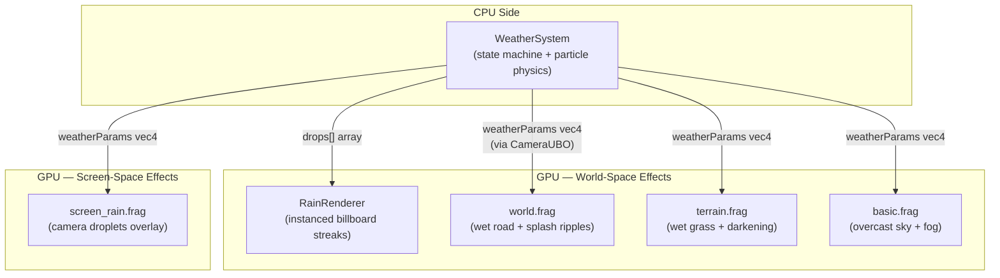
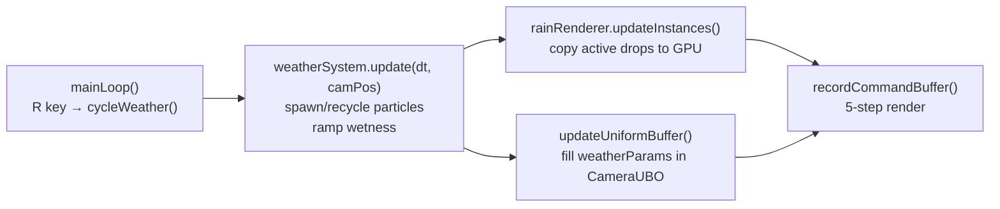
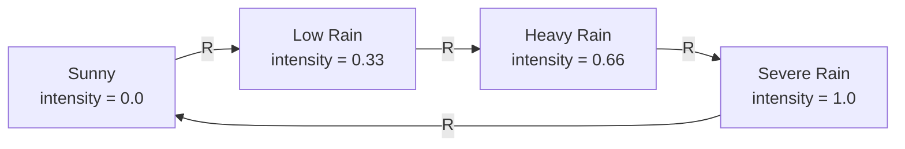
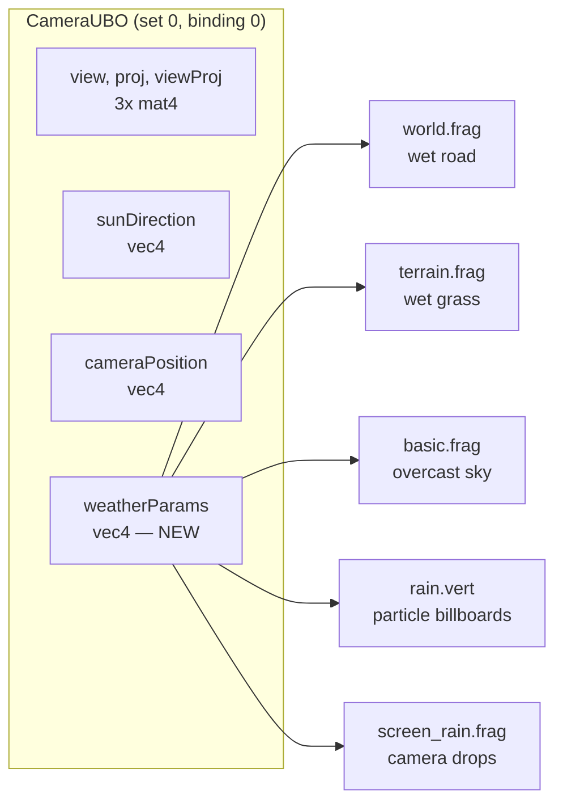
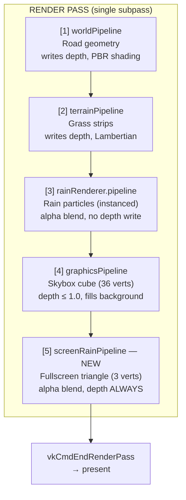
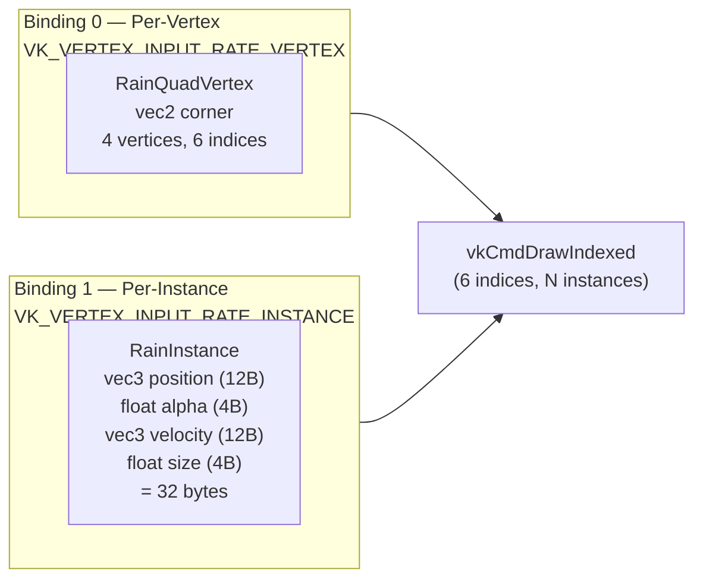
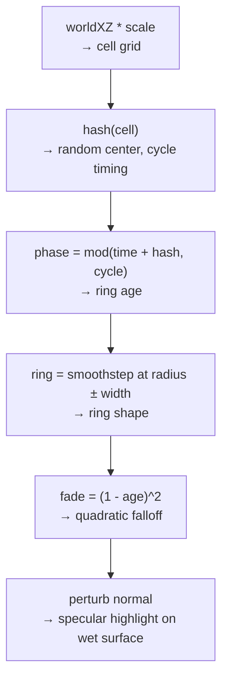
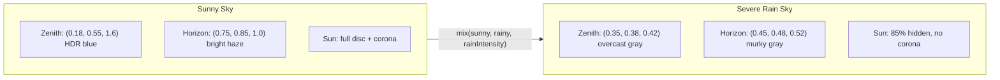
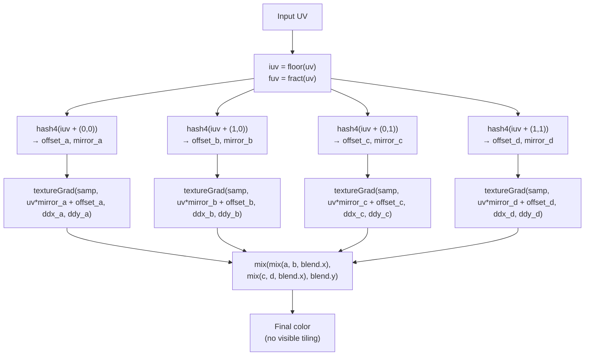
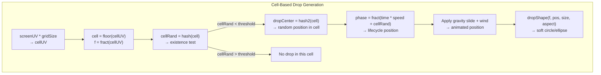

# DownPour Rain System — Technical Reference

A complete engineering reference for the rain rendering system. Covers the weather
state machine, GPU particle rendering, surface wet effects, atmospheric changes,
stochastic anti-tiling, and screen-space camera droplets.

---

## 1. System Architecture Overview

The rain system is built from five cooperating layers, each with a clear responsibility:



### Data Flow Per Frame



---

## 2. Weather State Machine

**File**: `src/simulation/WeatherSystem.h/cpp`

The `WeatherSystem` manages four discrete weather states, cycled by the **R key**:



### 2.1 Intensity Parameters

Each state has a fixed parameter set defined in `WeatherSystem::PARAMS[]`:

| Parameter | Sunny | Low | Heavy | Severe |
|-----------|-------|-----|-------|--------|
| Max particles | 0 | 2,000 | 10,000 | 25,000 |
| Spawn rate (drops/sec) | 0 | 400 | 2,000 | 5,000 |
| Drop speed (m/s) | 0 | 8 | 10 | 12 |
| Wind (m/s) | (0, 0, 0) | (1, 0, 0.5) | (3, 0, 1) | (6, 0, 3) |
| Fog density | 0.00020 | 0.00035 | 0.00060 | 0.00120 |
| Surface wetness | 0.0 | 0.3 | 0.7 | 1.0 |
| Rain intensity | 0.0 | 0.33 | 0.66 | 1.0 |
| Sky darkening | 0% | 15% | 40% | 70% |

### 2.2 Particle Pool

Pre-allocated pool of `MAX_DROPS = 25,000` `Raindrop` structs with an `active` flag.
No dynamic allocation during gameplay.

```cpp
struct Raindrop {
    glm::vec3 position;
    glm::vec3 velocity;
    float lifetime;
    float size;
    bool active;
};
```

### 2.3 Particle Physics

Each frame, `update(deltaTime, cameraPosition)`:

1. **Ramp wetness** toward target: 3-second ramp-up when raining, 5-second decay when sunny
2. **Integrate position**: `position += velocity * dt`
3. **Recycle** if `y < -1` (hit ground), out of 150m range, or `lifetime > 15s`
4. **Spawn new drops** to fill pool up to `maxDrops` at `spawnRate`

**Spawn volume**: 200 x 80 x 200m box centered on camera (moves with player).

**Velocity**: Downward at `dropSpeed` + wind vector + random variation (0.5 m/s jitter).

### 2.4 Wetness Ramping

Wetness transitions smoothly between states, preventing jarring visual pops:

$$w(t) = \begin{cases} w + \Delta t / 3 & \text{if } w < w_{\text{target}} \text{ (ramp up in 3s)} \\ w - \Delta t / 5 & \text{if } w > w_{\text{target}} \text{ (decay in 5s)} \end{cases}$$

---

## 3. CameraUBO Extension

**Files**: `src/DownPour.h`, all `.vert` and `.frag` shaders

The weather data reaches the GPU through a `vec4 weatherParams` field added to the
camera uniform buffer object:

```cpp
struct CameraUBO {
    alignas(16) glm::mat4 view;
    alignas(16) glm::mat4 proj;
    alignas(16) glm::mat4 viewProj;
    alignas(16) glm::vec4 sunDirection;    // xyz = dir toward sun, w = HDR intensity
    alignas(16) glm::vec4 cameraPosition;  // xyz = world pos, w = elapsed time
    alignas(16) glm::vec4 weatherParams;   // x = rainIntensity, y = wetness,
                                            // z = windX, w = windZ
};
```



Every shader in the project declares the same UBO layout at `set = 0, binding = 0`.

---

## 4. Render Pipeline

**File**: `src/DownPour.cpp` — `recordCommandBuffer()`

All geometry renders in a **single Vulkan render pass** with six pipelines:



**Key ordering rationale**:
- Steps 1–2: Opaque geometry writes depth
- Step 3: Transparent rain streaks test depth but don't write (avoids sorting)
- Step 4: Skybox fills remaining pixels at depth = 1.0
- Step 5: Screen rain overlay ignores depth entirely (`VK_COMPARE_OP_ALWAYS`)

---

## 5. Rain Particle Rendering (World-Space)

**Files**: `src/renderer/RainRenderer.h/cpp`, `shaders/rain.vert`, `shaders/rain.frag`

### 5.1 Instanced Billboard Architecture

Each raindrop is a single quad drawn via instanced rendering — one draw call for
all particles:



**Instance buffer**: Host-visible, persistently mapped, one per frame-in-flight.
Updated every frame by copying active drops from CPU pool.

### 5.2 Vertex Shader — Velocity-Aligned Billboards

**File**: `shaders/rain.vert`

The vertex shader stretches each quad along the raindrop's velocity vector:

```glsl
vec3 velDir = normalize(inVelocity);
vec3 right  = normalize(cross(velDir, toCamera));

float halfWidth  = inSize * 0.015;          // Thin streak
float halfLength = speed * 0.04 * inSize;   // Length ∝ speed

vec3 worldPos = inPosition
              + right  * inCorner.x * halfWidth
              + velDir * inCorner.y * halfLength;
```

This produces streaks that:
- Point along the velocity direction (downward + wind angle)
- Face the camera (billboard around velocity axis)
- Get longer at higher speeds

### 5.3 Fragment Shader — Soft Gradient Streak

**File**: `shaders/rain.frag`

- Elliptical falloff from center (wider horizontally, tight vertically)
- Vertical fade toward tips: `pow(1 - |dy|, 0.5)`
- Distance fade: `exp(-0.004 * distance)` to avoid popping
- Color: blue-white tint `(0.75, 0.80, 0.90)` at 40% alpha

### 5.4 Pipeline Configuration

```cpp
PipelineConfig config;
config.enableBlending   = true;    // SRC_ALPHA, ONE_MINUS_SRC_ALPHA
config.enableDepthWrite = false;   // Don't occlude other rain drops
config.depthCompareOp   = VK_COMPARE_OP_LESS;  // Test against scene depth
config.cullMode         = VK_CULL_MODE_NONE;    // Both sides of quad
```

---

## 6. Surface Wet Effects

### 6.1 Wet Road

**File**: `shaders/world.frag`

When `weatherParams.x > 0`, the road surface reacts:

| Effect | Formula | Rationale |
|--------|---------|-----------|
| Darken albedo | `baseColor *= mix(1.0, 0.55, wetness)` | Water fills micro-cavities, trapping light |
| Reduce roughness | `roughness = mix(roughness, 0.08, wetness)` | Water film creates glossy coating |
| Splash ripples | `splashRipples(worldXZ, time, intensity)` | Animated expanding rings on surface |
| Dim sun | `sunIntensity *= mix(1.0, 0.35, rainIntensity)` | Cloud cover reduces direct light |
| Increase ambient | `ambient = mix(sunny, overcast, rainIntensity)` | Overcast scatter is more diffuse |

**Splash ripple algorithm** — 3 layers of procedural expanding rings:



### 6.2 Wet Grass

**File**: `shaders/terrain.frag`

Grass responds more subtly than asphalt:

| Effect | Formula |
|--------|---------|
| Darken | `grassColor *= mix(1.0, 0.65, wetness)` |
| Dynamic fog | `fogDensity = mix(0.00020, 0.00120, rainIntensity)` |
| Fog color shift | `fogColor = mix(blue-ish, gray, rainIntensity)` |

---

## 7. Atmospheric Effects

### 7.1 Overcast Sky

**File**: `shaders/basic.frag`

The sky transitions from clear blue to overcast gray as rain intensity increases:



Key shader logic:
- Zenith/horizon colors lerp toward gray
- Sun visibility: `1.0 - rainIntensity * 0.85`
- Horizon glow fades: `glow *= (1.0 - rainIntensity * 0.7)`

### 7.2 Distance Fog

**Files**: `shaders/world.frag`, `shaders/terrain.frag`

Beer-Lambert exponential fog that thickens with rain:

$$\text{fogFactor} = 1 - e^{-\rho \cdot d}$$

where $\rho = \text{mix}(0.00020, 0.00120, \text{rainIntensity})$ and $d$ is fragment distance.

| Intensity | Fog Density | 50% fog at | 90% fog at |
|-----------|-------------|------------|------------|
| Sunny | 0.00020 | 3,466m | 11,513m |
| Low | 0.00035 | 1,980m | 6,579m |
| Heavy | 0.00060 | 1,155m | 3,838m |
| Severe | 0.00120 | 578m | 1,919m |

Fog color also shifts from blue-tinted `(0.75, 0.85, 1.0)` to gray `(0.55, 0.58, 0.62)`.

---

## 8. Stochastic Anti-Tiling (iq Technique)

**Files**: `shaders/terrain.frag`, `shaders/world.frag`

### 8.1 The Problem

Repeating a texture over a large surface creates visible grid patterns. At distance,
the human eye easily spots the periodic repetition.

### 8.2 The Solution — Tile-Based Hash Offsets

Based on Inigo Quilez's "Texture Repetition" article. For each fragment:

1. Compute which tile it falls in: `iuv = floor(uv)`
2. Hash 4 neighboring tiles for random UV offsets + mirror signs
3. Sample the texture 4 times with transformed UVs
4. Blend smoothly at tile boundaries using `smoothstep`



**Cost**: 4 texture samples per fragment instead of 1.

**Derivative propagation**: Each sample uses `textureGrad()` with properly mirrored
derivatives (`ddx * mirror.zw`, `ddy * mirror.zw`) to ensure correct mipmap selection.

### 8.3 Terrain Implementation

**File**: `shaders/terrain.frag`

```glsl
vec3 textureNoTile(sampler2D samp, vec2 uv) {
    // ... hash 4 neighbors, apply random offset + mirror ...
    vec2 b = smoothstep(0.25, 0.75, fuv);  // Smooth blend zone
    return mix(
        mix(textureGrad(samp, uva, ddxa, ddya).rgb,
            textureGrad(samp, uvb, ddxb, ddyb).rgb, b.x),
        mix(textureGrad(samp, uvc, ddxc, ddyc).rgb,
            textureGrad(samp, uvd, ddxd, ddyd).rgb, b.x),
        b.y);
}
```

Additional terrain variation layers:
- **Low-frequency** (50m wavelength): `0.85 + 0.3 * noise(worldXZ * 0.02)` — landscape-scale variety
- **Medium-frequency** (15m wavelength): `0.9 + 0.2 * noise(worldXZ * 0.07)` — patch-level variety
- **Edge noise**: Multi-octave (3 octaves) for natural road-to-grass transition

### 8.4 Road Implementation

**File**: `shaders/world.frag`

The road uses a `StochasticUV` struct to compute the hash offsets **once** and reuse
them for all three PBR texture maps (base color, normal, metallic-roughness):

```glsl
StochasticUV suv = computeStochasticUV(fragTexCoord);

vec3 baseColor  = textureNoTile3(baseColorMap, suv);
vec3 normalSamp = textureNoTile3(normalMap, suv);
vec2 mrSample   = textureNoTile2(metallicRoughnessMap, suv);
```

This ensures all PBR channels sample from the same randomized UV, preventing
visual artifacts from mismatched offsets between texture maps.

---

## 9. Screen-Space Camera Drops

**Files**: `shaders/screen_rain.vert`, `shaders/screen_rain.frag`, `src/DownPour.cpp`

### 9.1 Purpose

World-space rain streaks show rain falling through the scene. Screen-space drops
simulate rain hitting the camera lens — drops that land on the screen, slide down,
and splash. This dramatically increases immersion.

### 9.2 Fullscreen Triangle

**File**: `shaders/screen_rain.vert`

A single triangle covers the entire screen without any vertex buffer:

```glsl
vec2 pos = vec2((gl_VertexIndex << 1) & 2, gl_VertexIndex & 2) * 2.0 - 1.0;
gl_Position = vec4(pos, 0.0, 1.0);
fragUV = vec2(pos.x * 0.5 + 0.5, 0.5 - pos.y * 0.5);
```

Three vertices at `(-1,-1)`, `(3,-1)`, `(-1,3)` — the triangle extends past the
viewport on two sides, and the GPU clips it. More efficient than a fullscreen quad
(3 vertices instead of 6, no shared edge causing redundant fragment work).

### 9.3 Three Procedural Layers

**File**: `shaders/screen_rain.frag`

All layers use the same cell-based grid technique:



#### Layer 1: Stationary Drops

Small droplets that appear, sit briefly, then slide down under gravity.

| Property | Value |
|----------|-------|
| Grid sizes | 30x20 and 20x14 (two sub-layers) |
| Lifecycle | 1.5–3.5 seconds per cycle |
| Behavior | Appear → sit (20%) → slide (80%) → vanish |
| Slide distance | 0.6 cells downward |
| Wind effect | `windBias * 0.15` lateral shift |
| Visibility | All rain levels (density scales with intensity) |

#### Layer 2: Sliding Streaks

Larger drops that travel down the screen fast with a trailing smear.

| Property | Value |
|----------|-------|
| Grid size | 12x6 |
| Shape | Vertically elongated (aspect 2.5) |
| Speed | 1.2–2.0x base speed |
| Trail | Faint stretched ellipse behind the drop |
| Visibility | Heavy rain and above (`intensity > 0.2`) |

#### Layer 3: Splash Impacts

Brief expanding rings where drops hit the camera. Creates a sense of impact.

| Property | Value |
|----------|-------|
| Grid size | 18x12 |
| Lifecycle | 0.3–0.6 seconds (very short) |
| Shape | Expanding ring + center flash at impact |
| Ring | `smoothstep` pair creating thin annulus |
| Fade | Quadratic: `(1 - age)^2` |
| Visibility | Heavy rain and above (`intensity > 0.4`) |

### 9.4 Compositing

The three layers accumulate into a single alpha value, then blend onto the screen:

```glsl
vec3 waterTint      = vec3(0.65, 0.70, 0.80);       // Dark blue-gray (absorption)
vec3 highlightColor = vec3(1.0, 0.98, 0.95) * spec;  // Bright (refraction)
vec3 finalColor     = mix(waterTint, highlightColor, highlightMask * 0.5);
float alpha         = clamp(totalEffect, 0.0, 0.6);   // Cap at 60% opacity
outColor            = vec4(finalColor, alpha);
```

Blend mode: `SRC_ALPHA, ONE_MINUS_SRC_ALPHA` — drops darken the scene with
a blue-gray tint and add subtle specular highlights that follow the sun direction.

### 9.5 Pipeline Configuration

```cpp
config.enableBlending   = true;
config.enableDepthWrite = false;
config.depthCompareOp   = VK_COMPARE_OP_ALWAYS;  // Overlay ignores depth
config.cullMode         = VK_CULL_MODE_NONE;
config.noVertexInput    = true;  // No vertex buffer needed
```

The `noVertexInput` flag was added to `PipelineFactory` for this pipeline —
it sets `vertexBindingDescriptionCount = 0` and `vertexAttributeDescriptionCount = 0`.

---

## 10. PipelineFactory Extensions

**Files**: `src/core/PipelineFactory.h/cpp`

Two extensions were made to support the rain system:

### 10.1 Custom Vertex Input

Added optional vectors to `PipelineConfig` for pipelines that don't use the
default `Vertex` layout (e.g., rain particles with 2-binding instanced input):

```cpp
std::vector<VkVertexInputBindingDescription>   customBindings;
std::vector<VkVertexInputAttributeDescription> customAttributes;
```

### 10.2 No Vertex Input

Added `bool noVertexInput = false` for pipelines that generate geometry entirely
in the vertex shader (e.g., screen rain fullscreen triangle):

```cpp
if (config.noVertexInput) {
    vertexInputInfo.vertexBindingDescriptionCount   = 0;
    vertexInputInfo.vertexAttributeDescriptionCount = 0;
} else if (!config.customBindings.empty()) {
    // Use custom layout (rain particles)
} else {
    // Use default Vertex layout (road, terrain, car)
}
```

---

## 11. Integration Summary

### 11.1 DownPour.cpp Changes

| Method | Change |
|--------|--------|
| `initVulkan()` | Added `createScreenRainPipeline()`, `rainRenderer->init()` |
| `mainLoop()` | R key cycles weather, `weatherSystem.update()`, `rainRenderer->updateInstances()` |
| `updateUniformBuffer()` | Fills `weatherParams` from WeatherSystem getters |
| `recordCommandBuffer()` | Added rain particles (step 3) and screen rain overlay (step 5) |
| `cleanup()` | Destroys rain renderer, screen rain pipeline + layout |

### 11.2 DownPour.h Changes

| Addition | Type |
|----------|------|
| `Simulation::WeatherSystem weatherSystem` | Member — CPU particle physics |
| `RainRenderer* rainRenderer` | Member — GPU instanced rendering |
| `VkPipeline screenRainPipeline` | Member — screen drops pipeline |
| `VkPipelineLayout screenRainPipelineLayout` | Member — screen drops layout |
| `vec4 weatherParams` in `CameraUBO` | UBO field — shader weather data |

---

## 12. Controls

| Key | Action |
|-----|--------|
| **R** | Cycle weather: Sunny → Low → Heavy → Severe → Sunny |
| **WASD** | Move camera |
| **Mouse** | Look around |
| **ESC** | Toggle cursor capture |

---

## Appendix: Source File Reference

| Topic | Source File | Key Symbols |
|-------|------------|-------------|
| Weather state machine | `src/simulation/WeatherSystem.h/cpp` | `WeatherSystem`, `PARAMS[]`, `cycleWeather()` |
| Rain GPU rendering | `src/renderer/RainRenderer.h/cpp` | `RainRenderer`, `RainInstance`, `updateInstances()` |
| Rain particle shaders | `shaders/rain.vert`, `shaders/rain.frag` | Billboard expansion, gradient alpha |
| Screen rain shaders | `shaders/screen_rain.vert`, `shaders/screen_rain.frag` | `stationaryDrops()`, `slidingStreaks()`, `splashImpacts()` |
| Wet road effects | `shaders/world.frag` | `splashRipples()`, `textureNoTile3()`, `StochasticUV` |
| Wet grass effects | `shaders/terrain.frag` | `textureNoTile()`, `hash4()`, multi-octave noise |
| Overcast sky | `shaders/basic.frag` | Zenith/horizon lerp, sun visibility |
| Pipeline factory | `src/core/PipelineFactory.h/cpp` | `noVertexInput`, `customBindings` |
| Integration | `src/DownPour.h/cpp` | `CameraUBO`, `recordCommandBuffer()` |
| Build config | `CMakeLists.txt` | `src/renderer/RainRenderer.cpp` |
