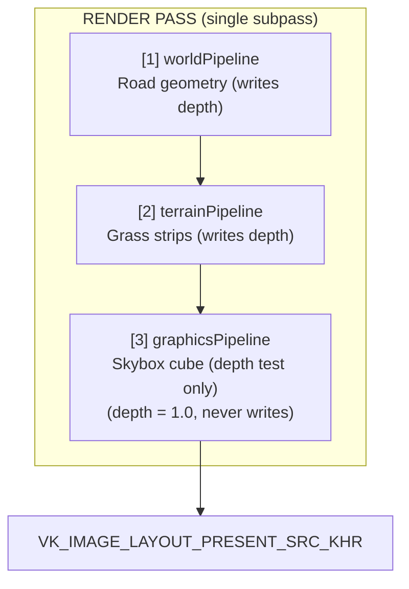
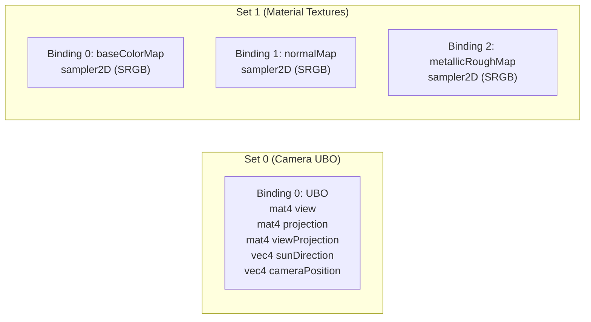
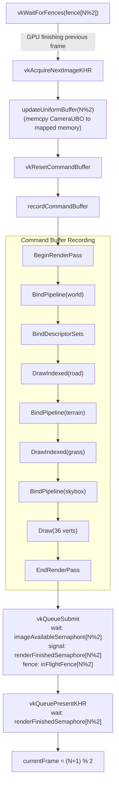
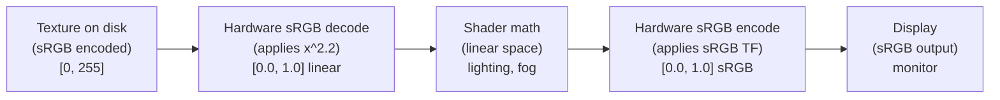
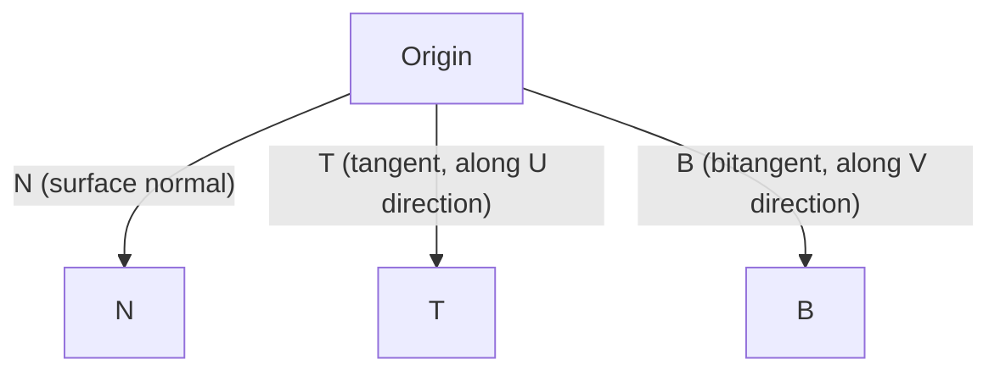
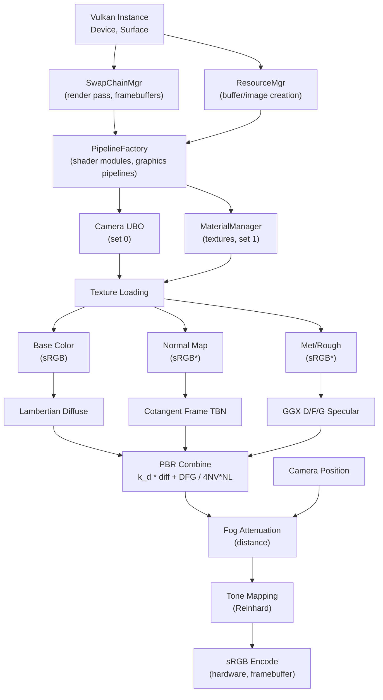

 # DownPour Road Rendering Guide

A mathematical and engineering reference for the DownPour rendering pipeline.
Written for the developer who wants to understand not just *what* the code does,
but *why* the math works.

---

## 1. Rendering Pipeline Overview

### 1.1 Pipeline Architecture

DownPour uses a single Vulkan render pass with three graphics pipelines, drawn
in strict order to exploit early depth rejection:



The ordering is deliberate. Opaque geometry (road, terrain) writes to the depth
buffer first. The skybox vertex shader outputs `gl_Position = clipPos.xyww`,
which places every fragment at the maximum depth value $z/w = 1.0$. Because the
skybox pipeline uses `VK_COMPARE_OP_LESS_OR_EQUAL` with depth writes disabled,
it only fills pixels that no opaque geometry touched. This is the standard
"draw skybox last" optimization -- it avoids overdraw on every pixel that already
has geometry.

### 1.2 Descriptor Set Layout

Each pipeline binds up to two descriptor sets. The layout is uniform across all
material-bearing pipelines:



The skybox pipeline (graphicsPipeline) only uses Set 0. It has no vertex
buffer -- the 36 cube vertices are hardcoded in the vertex shader and indexed
by `gl_VertexIndex`.

The camera UBO packs auxiliary data into the `w` components:
- `sunDirection.w` = light intensity (currently 1.0)
- `cameraPosition.w` = elapsed time in seconds (for future animation)

### 1.3 Frame Rendering Flow



Double buffering (`MAX_FRAMES_IN_FLIGHT = 2`) means the CPU can record frame
$N+1$ while the GPU is still executing frame $N$. The fence prevents the CPU
from overwriting the uniform buffer that the GPU is still reading.

---

## 2. Color Space and Gamma Correction

### 2.1 The Double-Gamma Bug

Early in development, DownPour exhibited washed-out, overly bright colors. The
root cause was applying gamma correction three times instead of once:

1. **Texture sampling**: `VK_FORMAT_R8G8B8A8_SRGB` tells the hardware to
   decode sRGB to linear on read. This is correct.
2. **Shader output**: The fragment shader wrote linear values. This is correct.
3. **Framebuffer write**: `VK_FORMAT_B8G8R8A8_SRGB` tells the hardware to
   encode linear to sRGB on write. This is correct.
4. **Manual `pow(color, 1/2.2)` in the shader**: This was WRONG.

Step 4 applied a second gamma encode before the hardware applied its own,
resulting in:

```latex
C_{display} = \left( C_{linear}^{1/\gamma} \right)^{1/\gamma} = C_{linear}^{1/\gamma^2}
```

With $\gamma = 2.2$, this means $C_{display} = C_{linear}^{1/4.84}$, which
raises every color value far too aggressively toward 1.0, washing out contrast.

### 2.2 The Gamma Power Function

The gamma function is the power map:

```latex
f_\gamma(x) = x^\gamma, \quad x \in [0, 1], \quad \gamma > 0
```

**Key properties:**
- $f_\gamma(0) = 0$, $f_\gamma(1) = 1$ for all $\gamma$
- $\gamma > 1$ darkens midtones (used in encoding: linear -> sRGB)
- $\gamma < 1$ brightens midtones (used in decoding: sRGB -> linear)
- Composition: $f_\alpha \circ f_\beta = f_{\alpha \cdot \beta}$

The last property is why double-gamma is so insidious. Applying $f_{1/2.2}$
twice is equivalent to a single $f_{1/4.84}$.

### 2.3 The Correct Pipeline



The shader must do ALL math in linear space and output linear values. The sRGB
framebuffer format handles the final encode automatically.

### 2.4 The sRGB Transfer Function

The actual sRGB standard uses a piecewise function, not a simple power:

```latex
C_{sRGB} = \begin{cases}
12.92 \cdot C_{linear} & \text{if } C_{linear} \leq 0.0031308 \\
1.055 \cdot C_{linear}^{1/2.4} - 0.055 & \text{if } C_{linear} > 0.0031308
\end{cases}
```

The linear segment near zero prevents the derivative from going to infinity
(the power function $x^{1/2.4}$ has infinite slope at $x = 0$). The exponent
is $1/2.4 \approx 0.4167$, not $1/2.2$. The simple $\gamma = 2.2$ is an
approximation that is "close enough" for back-of-envelope calculations but not
what the hardware actually implements.

**In DownPour's shaders, the correct approach is simply:**

```glsl
// world.frag -- NO manual gamma correction
outColor = vec4(color, 1.0);
// The VK_FORMAT_B8G8R8A8_SRGB framebuffer handles linear -> sRGB automatically.
```

---

## 3. Physically-Based Rendering (Cook-Torrance BRDF)

### 3.1 The Rendering Equation

All physically-based rendering starts from the rendering equation, which
describes the total outgoing radiance $L_o$ at a surface point in direction
$\omega_o$:

```latex
L_o(\mathbf{p}, \omega_o) = L_e(\mathbf{p}, \omega_o) + \int_{\Omega} f_r(\mathbf{p}, \omega_i, \omega_o) \cdot L_i(\mathbf{p}, \omega_i) \cdot (\omega_i \cdot \mathbf{n}) \, d\omega_i
```

where:
- $L_e$ is emitted radiance (zero for non-emissive surfaces)
- $f_r$ is the BRDF (Bidirectional Reflectance Distribution Function)
- $L_i(\omega_i)$ is incoming radiance from direction $\omega_i$
- $(\omega_i \cdot \mathbf{n})$ is the cosine foreshortening factor
- $\Omega$ is the hemisphere above the surface

For a single directional light (the sun), the integral collapses because the
light's radiance is a Dirac delta in solid angle:

```latex
L_o = f_r(\omega_{sun}, \omega_o) \cdot L_{sun} \cdot \max(N \cdot L, 0)
```

This is what DownPour evaluates per fragment.

### 3.2 The Cook-Torrance Specular BRDF

The Cook-Torrance model splits the BRDF into diffuse and specular components:

```latex
f_r = k_d \cdot \frac{\mathbf{c}}{\pi} + \frac{D \cdot F \cdot G}{4 \cdot (\omega_o \cdot \mathbf{n}) \cdot (\omega_i \cdot \mathbf{n})}
```

where:
- $k_d \cdot \frac{\mathbf{c}}{\pi}$ is the Lambertian diffuse term
  ($\mathbf{c}$ = albedo, $\pi$ normalizes the hemisphere integral)
- $D$ = Normal Distribution Function (microfacet orientation statistics)
- $F$ = Fresnel factor (angle-dependent reflectivity)
- $G$ = Geometry function (microfacet self-shadowing)

### 3.3 GGX Normal Distribution Function (D)

The GGX (Trowbridge-Reitz) distribution models the statistical orientation of
microfacets on a rough surface. Given the half-vector $\mathbf{H} =
\text{normalize}(\mathbf{L} + \mathbf{V})$:

```latex
D_{GGX}(\mathbf{N}, \mathbf{H}, \alpha) = \frac{\alpha^2}{\pi \left( (N \cdot H)^2 (\alpha^2 - 1) + 1 \right)^2}
```

**Derivation from microfacet theory:**

The microfacet model assumes a surface is composed of tiny perfect mirrors
(microfacets) with varying orientations. The NDF $D(\mathbf{H})$ gives the
density of microfacets oriented in direction $\mathbf{H}$. For a reflection
from $\mathbf{L}$ to $\mathbf{V}$ to occur, a microfacet must be oriented
exactly at $\mathbf{H}$.

GGX was derived by Trowbridge and Reitz (1975) as the distribution of slopes
on a surface with a Cauchy (Lorentzian) height distribution. Its key advantage
over Beckmann is the longer tail -- it produces a bright specular highlight
that falls off more gradually, which better matches measured material data.

The roughness parameter $\alpha = roughness^2$ remaps perceptual roughness to
physical roughness. This "squaring" makes the artist-facing slider feel
more linear -- equal increments in `roughness` produce roughly equal perceptual
changes in shininess.

```glsl
// GLSL implementation
float distributionGGX(vec3 N, vec3 H, float roughness) {
    float a  = roughness * roughness;        // perceptual -> physical
    float a2 = a * a;
    float NdotH  = max(dot(N, H), 0.0);
    float NdotH2 = NdotH * NdotH;

    float denom = NdotH2 * (a2 - 1.0) + 1.0;
    denom = 3.14159265 * denom * denom;

    return a2 / denom;
}
```

### 3.4 Schlick Fresnel Approximation (F)

When light hits an interface between two media (air and asphalt, for instance),
some fraction is reflected and the rest is transmitted. The Fresnel equations
from electromagnetic theory give exact results but are expensive to evaluate.
Schlick's approximation is:

```latex
F_{Schlick}(\theta, F_0) = F_0 + (1 - F_0)(1 - \cos\theta)^5
```

where $\theta$ is the angle between the view direction and the half-vector,
and $F_0$ is the reflectance at normal incidence.

**Deriving $F_0$ from refractive index:**

For a dielectric (non-metallic) material with refractive index $n$ in air
($n_{air} \approx 1$):

```latex
F_0 = \left( \frac{n - 1}{n + 1} \right)^2
```

For asphalt, $n \approx 1.5$ gives $F_0 = (0.5/2.5)^2 = 0.04$. This means
at normal incidence, only 4% of light is reflected. At grazing angles
($\theta \to 90\degree$), $F \to 1$ -- almost all light reflects. This is
why wet roads are blinding at shallow angles.

For metals, $F_0$ is the metal's reflectance color (e.g., gold has
$F_0 \approx (1.0, 0.71, 0.29)$). Metals have no meaningful refractive
index because free electrons dominate the interaction.

```glsl
// GLSL implementation
vec3 fresnelSchlick(float cosTheta, vec3 F0) {
    return F0 + (1.0 - F0) * pow(clamp(1.0 - cosTheta, 0.0, 1.0), 5.0);
}
```

### 3.5 Smith-GGX Geometry Function (G)

The geometry function accounts for microfacet self-shadowing (light blocked
before reaching a microfacet) and self-masking (reflected light blocked before
reaching the viewer). Smith's method separates these into two independent
terms:

```latex
G(\mathbf{N}, \mathbf{V}, \mathbf{L}, k) = G_1(\mathbf{N}, \mathbf{V}, k) \cdot G_1(\mathbf{N}, \mathbf{L}, k)
```

where the single-direction function uses the Schlick-GGX approximation:

```latex
G_1(\mathbf{N}, \mathbf{X}, k) = \frac{\mathbf{N} \cdot \mathbf{X}}{(\mathbf{N} \cdot \mathbf{X})(1 - k) + k}
```

The parameter $k$ depends on whether we are computing for direct or IBL
(image-based) lighting:

```latex
k_{direct} = \frac{(\alpha + 1)^2}{8}, \quad k_{IBL} = \frac{\alpha^2}{2}
```

where $\alpha = roughness^2$ as before. For DownPour's direct sunlight, we use
$k_{direct}$.

**Intuition:** At $k = 0$ (perfectly smooth), $G_1 = 1$ and there is no
self-shadowing. As roughness increases, more microfacets block each other,
reducing the reflected energy. At grazing angles ($N \cdot X \to 0$), the
geometry function goes to zero, preventing the specular term from blowing up
(which would be physically nonsensical -- you cannot reflect more energy than
arrives).

```glsl
// GLSL implementation
float geometrySchlickGGX(float NdotV, float roughness) {
    float r = roughness + 1.0;
    float k = (r * r) / 8.0;   // k for direct lighting
    return NdotV / (NdotV * (1.0 - k) + k);
}

float geometrySmith(vec3 N, vec3 V, vec3 L, float roughness) {
    float NdotV = max(dot(N, V), 0.0);
    float NdotL = max(dot(N, L), 0.0);
    float ggx1  = geometrySchlickGGX(NdotV, roughness);
    float ggx2  = geometrySchlickGGX(NdotL, roughness);
    return ggx1 * ggx2;
}
```

### 3.6 Energy Conservation

Energy conservation requires that the sum of reflected and refracted energy
not exceed the incoming energy:

```latex
k_s = F, \quad k_d = (1 - k_s) \cdot (1 - metallic)
```

The $(1 - metallic)$ factor eliminates diffuse reflection for metals. Physically,
metals have free electrons that absorb all refracted (transmitted) light almost
immediately -- there is no subsurface scattering and hence no diffuse component.
Only the specular (reflected) component survives.

For dielectrics (asphalt, rubber, paint), $metallic = 0$ and $k_d = 1 - F$,
meaning whatever energy is not reflected specularly goes into diffuse.

---

## 4. Normal Mapping

### 4.1 Why Normal Mapping

A flat road mesh with 4 vertices cannot represent the micro-geometry of
asphalt -- cracks, aggregate, bitumen texture. Normal mapping encodes
per-texel surface orientation in a texture, simulating this detail without
adding millions of triangles. The cost is one texture sample and a matrix
multiply per fragment.

### 4.2 Tangent Space and the TBN Matrix

Normal maps are stored in **tangent space**, a coordinate system local to each
point on the surface:



The TBN matrix transforms from tangent space to world space:

```latex
\mathbf{M}_{TBN} = \begin{bmatrix} T_x & B_x & N_x \\ T_y & B_y & N_y \\ T_z & B_z & N_z \end{bmatrix}
```

A normal map sample $(r, g, b)$ maps to tangent-space normal
$\mathbf{n}_t = (2r - 1, 2g - 1, 2b - 1)$, and the world-space normal is:

```latex
\mathbf{n}_{world} = \text{normalize}(\mathbf{M}_{TBN} \cdot \mathbf{n}_t)
```

### 4.3 Screen-Space Cotangent Frame

When vertex tangents are not available (as in DownPour's procedural terrain
and loaded road models that lack tangent attributes), we can reconstruct the
TBN basis in the fragment shader using screen-space partial derivatives.

**The math:** Given a surface parametrized by UV coordinates $(u, v)$, the
tangent and bitangent are the partial derivatives of world position with
respect to the texture coordinates:

```latex
\mathbf{T} = \frac{\partial \mathbf{P}}{\partial u}, \quad \mathbf{B} = \frac{\partial \mathbf{P}}{\partial v}
```

In GLSL, `dFdx()` and `dFdy()` give screen-space derivatives. From these, we
solve for T and B using the chain rule. If we define:

```latex
\Delta \mathbf{P}_1 = \text{dFdx}(\mathbf{P}_{world}), \quad \Delta \mathbf{P}_2 = \text{dFdy}(\mathbf{P}_{world})
```
```latex
\Delta u_1 = \text{dFdx}(u), \quad \Delta v_1 = \text{dFdx}(v)
```
```latex
\Delta u_2 = \text{dFdy}(u), \quad \Delta v_2 = \text{dFdy}(v)
```

Then the system is:

```latex
\begin{bmatrix} \Delta \mathbf{P}_1 \\ \Delta \mathbf{P}_2 \end{bmatrix}
=
\begin{bmatrix} \Delta u_1 & \Delta v_1 \\ \Delta u_2 & \Delta v_2 \end{bmatrix}
\begin{bmatrix} \mathbf{T} \\ \mathbf{B} \end{bmatrix}
```

Inverting the 2x2 UV matrix yields T and B:

```glsl
// GLSL: Cotangent frame from screen-space derivatives
mat3 cotangentFrame(vec3 N, vec3 worldPos, vec2 uv) {
    vec3 dp1  = dFdx(worldPos);
    vec3 dp2  = dFdy(worldPos);
    vec2 duv1 = dFdx(uv);
    vec2 duv2 = dFdy(uv);

    // Solve the linear system for T and B
    vec3 dp2perp = cross(dp2, N);
    vec3 dp1perp = cross(N, dp1);

    vec3 T = dp2perp * duv1.x + dp1perp * duv2.x;
    vec3 B = dp2perp * duv1.y + dp1perp * duv2.y;

    // Normalize, preserving orientation
    float invmax = inversesqrt(max(dot(T, T), dot(B, B)));
    return mat3(T * invmax, B * invmax, N);
}
```

### 4.4 Fallback Detection

When no normal map is present, DownPour's `MaterialManager` binds a 1x1 white
default texture. The shader can detect this and skip the normal map computation:

```glsl
vec3 normalSample = texture(normalMap, fragTexCoord).rgb;

// Default white texture has rgb = (1,1,1), which maps to tangent-space
// normal (1,1,1) -- clearly not a valid normal map.
// A flat normal map would be (0.5, 0.5, 1.0) = tangent-space (0,0,1).
if (normalSample.r > 0.95 && normalSample.g > 0.95 && normalSample.b > 0.95) {
    // No normal map -- use interpolated vertex normal
    N = normalize(fragNormal);
} else {
    vec3 tn = normalSample * 2.0 - 1.0;
    mat3 TBN = cotangentFrame(normalize(fragNormal), fragWorldPos, fragTexCoord);
    N = normalize(TBN * tn);
}
```

---

## 5. Procedural Road Markings

### 5.1 Technique Overview

Rather than baking road markings into the base color texture (which couples
line detail to texture resolution), DownPour generates them procedurally in the
fragment shader using world-space coordinates. This gives resolution-independent
markings at any camera distance.

The coordinate system:
- `fragWorldPos.x` = lateral position (perpendicular to road center)
- `fragWorldPos.z` = longitudinal position (along the road)

### 5.2 The `smoothstep` Function

Procedural markings rely heavily on `smoothstep` for anti-aliased edges.
Mathematically, `smoothstep(edge0, edge1, x)` maps $x$ through the Hermite
interpolant:

```latex
S(t) = 3t^2 - 2t^3, \quad t = \text{clamp}\left(\frac{x - e_0}{e_1 - e_0}, 0, 1\right)
```

**Key properties of $S(t)$:**
- $S(0) = 0$, $S(1) = 1$ (interpolates endpoints)
- $S'(0) = 0$, $S'(1) = 0$ (zero slope at endpoints, hence $C^1$ continuous)
- $S'(t) = 6t(1-t) \geq 0$ on $[0,1]$ (monotonically increasing)

The zero-derivative endpoints are what make it useful for anti-aliasing: the
transition from "not line" to "line" starts and ends gently, avoiding the
ringing artifacts that a linear ramp would produce.

### 5.3 GLSL Implementation

```glsl
// Procedural road markings in world.frag
vec3 addRoadMarkings(vec3 baseColor, vec3 worldPos) {
    float x = worldPos.x;  // lateral
    float z = worldPos.z;  // longitudinal

    vec3 lineColor = vec3(0.9, 0.9, 0.85);  // off-white paint

    // --- Center dashed line ---
    // Line width: 0.15m, centered at x=0
    float centerLine = 1.0 - smoothstep(0.0, 0.08, abs(x));

    // Dash pattern: 3m line, 6m gap (standard US highway marking)
    float dashPhase = mod(z, 9.0);  // 9m period
    float dashMask  = 1.0 - smoothstep(2.9, 3.0, dashPhase);

    centerLine *= dashMask;

    // --- Lane edge lines (solid) ---
    // Assume 2-lane road, lanes at +/- 1.8m from center
    float laneWidth = 3.6;
    float edgeRight = 1.0 - smoothstep(0.0, 0.06, abs(x - laneWidth * 0.5) - 0.06);
    float edgeLeft  = 1.0 - smoothstep(0.0, 0.06, abs(x + laneWidth * 0.5) - 0.06);

    // --- Shoulder lines ---
    float shoulderRight = 1.0 - smoothstep(0.0, 0.06, abs(x - laneWidth) - 0.06);
    float shoulderLeft  = 1.0 - smoothstep(0.0, 0.06, abs(x + laneWidth) - 0.06);

    // Composite
    float lineMask = max(centerLine, max(max(edgeRight, edgeLeft),
                                         max(shoulderRight, shoulderLeft)));

    return mix(baseColor, lineColor, lineMask);
}
```

---

## 6. Atmospheric Fog

### 6.1 Linear Fog (Current Implementation)

DownPour currently uses linear distance fog:

```latex
f_{linear} = \text{clamp}\left(\frac{d - d_{start}}{d_{end} - d_{start}}, 0, 1\right)
```

where $d$ is the Euclidean distance from the camera to the fragment, computed
per-vertex for efficiency:

```glsl
// world.vert
fragDistance = length(camera.cameraPosition.xyz - inPosition);
```

The fragment shader blends toward a sky-horizon color:

```glsl
// world.frag
vec3  fogColor  = vec3(0.55, 0.70, 0.90);
float fogStart  = 200.0;   // meters
float fogEnd    = 2000.0;  // meters
float fogFactor = clamp((fragDistance - fogStart) / (fogEnd - fogStart), 0.0, 1.0);
color = mix(color, fogColor, fogFactor);
```

Linear fog is computationally trivial but not physically motivated. It
produces a hard "wall" at $d_{end}$ where visibility abruptly cuts off.

### 6.2 Exponential Fog (Beer-Lambert Law)

A more physically accurate model comes from the Beer-Lambert law of light
attenuation. As a photon travels through a scattering medium (fog, haze, rain),
the probability of it surviving without being scattered or absorbed decreases
exponentially with distance:

```latex
T(d) = e^{-\sigma \cdot d}
```

where:
- $T(d)$ is the transmittance (fraction of light that reaches the viewer)
- $\sigma$ is the extinction coefficient (units: $m^{-1}$)
- $d$ is the path length through the medium

**Why exponential is correct:** Consider a thin slab of fog at distance $x$ with
thickness $dx$. The probability that a photon is scattered in this slab is
$\sigma \cdot dx$ (proportional to density and thickness). The survival
probability is $(1 - \sigma \cdot dx)$. Over a total distance $d$, the total
survival probability is the product over all slabs:

```latex
T = \prod_{i} (1 - \sigma \cdot dx) \xrightarrow{dx \to 0} e^{-\sigma \cdot d}
```

This is the fundamental reason: scattering is a multiplicative process, and the
product of many small attenuations is an exponential.

The final color blend is:

```latex
C_{final} = T(d) \cdot C_{surface} + (1 - T(d)) \cdot C_{fog}
```

```glsl
// Exponential fog (upgrade from linear)
float fogDensity = 0.0015;  // sigma, tune for desired visibility range
float fogFactor  = 1.0 - exp(-fogDensity * fragDistance);
color = mix(color, fogColor, fogFactor);
```

**Exponential-squared fog** ($T = e^{-(\sigma d)^2}$) gives even denser
falloff for heavy weather conditions like rain -- which is directly relevant
to DownPour's mission.

---

## 7. Road-Edge Blending

### 7.1 The Problem

A geometric boundary between road mesh and terrain mesh creates a pixel-perfect
straight line in the rendered image. Real roads have irregular edges: dirt,
gravel, encroaching grass. The hard line breaks the illusion.

### 7.2 Hash-Based Value Noise

To perturb the boundary, we use a simple hash-based noise function. Given a
2D world coordinate, it produces a pseudo-random value in $[0, 1]$:

```glsl
float hash(vec2 p) {
    return fract(sin(dot(p, vec2(127.1, 311.7))) * 43758.5453);
}

float valueNoise(vec2 p) {
    vec2 i = floor(p);
    vec2 f = fract(p);
    f = f * f * (3.0 - 2.0 * f);  // smoothstep interpolation

    float a = hash(i + vec2(0.0, 0.0));
    float b = hash(i + vec2(1.0, 0.0));
    float c = hash(i + vec2(0.0, 1.0));
    float d = hash(i + vec2(1.0, 1.0));

    return mix(mix(a, b, f.x), mix(c, d, f.x), f.y);
}
```

### 7.3 Blend Zones

The terrain shader can compute the distance from the fragment to the road edge
and apply a multi-zone blend:


```glsl
// In terrain.frag
float distToRoadEdge = abs(fragWorldPos.x) - roadHalfWidth;
float noiseOffset    = (valueNoise(fragWorldPos.xz * 0.5) - 0.5) * 1.5;
float blendDist      = distToRoadEdge + noiseOffset;

// Zones
float dirtFactor  = 1.0 - smoothstep(0.0, 0.5, blendDist);
float grassFactor = smoothstep(0.5, 2.0, blendDist);

vec3 dirtColor  = vec3(0.35, 0.28, 0.18);
vec3 grassColor = texture(grassTexture, fragTexCoord).rgb;

vec3 color = mix(dirtColor, grassColor, grassFactor);
color = mix(color, dirtColor, dirtFactor);  // override near road
```

---

## 8. Tone Mapping

### 8.1 The Dynamic Range Problem

The sun in DownPour has a radiance of `vec3(1.0, 0.98, 0.92)` scaled by the
Lambertian cosine. A surface facing the sun at a bright albedo (say, white
road marking at 0.9) receives:

```latex
L_{surface} = 0.9 \times 1.0 \times \cos(0\degree) = 0.9
```

But add ambient:

```latex
L_{total} = 0.9 \times (0.25 + 1.0 \times 1.0) = 1.125
```

Values above 1.0 clip to white -- losing detail. With specular highlights, the
problem is much worse. We need a mapping from $[0, \infty)$ to $[0, 1)$.

### 8.2 Reinhard Tone Mapping

The Reinhard operator is the simplest tone mapper that actually works:

```latex
L_d = \frac{L}{1 + L}
```

**Properties:**
- $L_d(0) = 0$ (black stays black)
- $\lim_{L \to \infty} L_d = 1$ (asymptotic approach, never reaches 1.0)
- $L_d'(L) = \frac{1}{(1+L)^2} > 0$ (monotonically increasing, preserves ordering)
- $L_d(1) = 0.5$ (mid-gray maps to 50%)

**Mathematical note:** Reinhard is the first-order Pade approximant of $\ln(1+L)$.
The Pade approximant of order $[m/n]$ is the ratio of a degree-$m$ polynomial
to a degree-$n$ polynomial that matches the Taylor series of the target function
to maximum order. For $\ln(1+L)$ around $L=0$:

```latex
\ln(1+L) \approx L - \frac{L^2}{2} + \cdots
```

The $[1/1]$ Pade approximant is $\frac{L}{1+L}$, which matches the first-order
Taylor coefficient and has the correct asymptotic behavior -- unlike the
truncated Taylor series, which diverges.

### 8.3 Alternative Operators

| Operator | Formula | Characteristics |
|----------|---------|-----------------|
| Reinhard | $L/(1+L)$ | Simple, can look washed out |
| ACES | Fitted cubic rational | Industry standard, higher contrast |
| Uncharted 2 | Piecewise Hable curve | Good for games, strong toe |
| AgX | Sigmoid with skew | Modern, avoids colored clipping |

DownPour uses Reinhard for simplicity. An upgrade to ACES would improve
contrast in highlights:

```glsl
// Current: Reinhard
color = color / (color + vec3(1.0));

// Alternative: ACES approximation (Narkowicz 2015)
// vec3 acesFilm(vec3 x) {
//     float a = 2.51;
//     float b = 0.03;
//     float c = 2.43;
//     float d = 0.59;
//     float e = 0.14;
//     return clamp((x*(a*x+b)) / (x*(c*x+d)+e), 0.0, 1.0);
// }
```

---

## 9. Vulkan Integration (C++ Side)

### 9.1 Descriptor Set Layout Creation

The material descriptor set layout defines three texture bindings for the PBR
material channels. From `DownPour.cpp`:

```cpp
void Application::createMaterialDescriptorSetLayout() {
    // 3 bindings: baseColor, normalMap, metallicRoughness
    std::array<VkDescriptorSetLayoutBinding, 3> bindings{};

    // Binding 0: Base color sampler
    bindings[0].binding            = 0;
    bindings[0].descriptorType     = VK_DESCRIPTOR_TYPE_COMBINED_IMAGE_SAMPLER;
    bindings[0].descriptorCount    = 1;
    bindings[0].stageFlags         = VK_SHADER_STAGE_FRAGMENT_BIT;
    bindings[0].pImmutableSamplers = nullptr;

    // Binding 1: Normal map sampler
    bindings[1].binding            = 1;
    bindings[1].descriptorType     = VK_DESCRIPTOR_TYPE_COMBINED_IMAGE_SAMPLER;
    bindings[1].descriptorCount    = 1;
    bindings[1].stageFlags         = VK_SHADER_STAGE_FRAGMENT_BIT;

    // Binding 2: Metallic-roughness sampler
    bindings[2].binding            = 2;
    bindings[2].descriptorType     = VK_DESCRIPTOR_TYPE_COMBINED_IMAGE_SAMPLER;
    bindings[2].descriptorCount    = 1;
    bindings[2].stageFlags         = VK_SHADER_STAGE_FRAGMENT_BIT;

    VkDescriptorSetLayoutCreateInfo layoutInfo{};
    layoutInfo.sType        = VK_STRUCTURE_TYPE_DESCRIPTOR_SET_LAYOUT_CREATE_INFO;
    layoutInfo.bindingCount = static_cast<uint32_t>(bindings.size());
    layoutInfo.pBindings    = bindings.data();

    if (vkCreateDescriptorSetLayout(device, &layoutInfo, nullptr,
                                     &materialDescriptorSetLayout) != VK_SUCCESS)
        throw std::runtime_error("Failed to create material descriptor set layout!");
}
```

### 9.2 Material Creation and Texture Binding

`MaterialManager::createMaterial` loads textures (from file or embedded GLB
data), creates Vulkan images with `VK_FORMAT_R8G8B8A8_SRGB`, and writes the
descriptor sets. The SRGB format is critical -- it tells the sampler hardware
to decode gamma on read:

```cpp
// In MaterialManager::createTextureImage
createImage(width, height,
            VK_FORMAT_R8G8B8A8_SRGB,         // <-- hardware sRGB decode
            VK_IMAGE_TILING_OPTIMAL,
            VK_IMAGE_USAGE_TRANSFER_DST_BIT | VK_IMAGE_USAGE_SAMPLED_BIT,
            VK_MEMORY_PROPERTY_DEVICE_LOCAL_BIT,
            outTexture.image, outTexture.memory);
```

When no texture is available (e.g., no normal map), a 1x1 white default texture
is bound instead. This avoids branching in the descriptor set allocation --
every material always has exactly 3 textures bound.

### 9.3 Pipeline Layout with Two Descriptor Sets

The world and terrain pipelines use both descriptor sets (camera + material),
while the skybox pipeline uses only the camera set:

```cpp
// World pipeline: camera (set 0) + material textures (set 1)
worldPipelineLayout = PipelineFactory::createPipelineLayout(
    device, {descriptorSetLayout, materialDescriptorSetLayout}
);

// Skybox pipeline: camera only (set 0)
pipelineLayout = PipelineFactory::createPipelineLayout(
    device, {descriptorSetLayout}
);
```

### 9.4 The recordCommandBuffer Pattern

The command buffer recording follows a strict pattern: bind pipeline, bind
descriptor sets, bind vertex/index buffers, issue draw call. Each pipeline
switch implicitly invalidates bindings that differ in layout:

```cpp
void Application::recordCommandBuffer(VkCommandBuffer cmd,
                                       uint32_t imageIndex,
                                       uint32_t frameIndex) {
    // ... begin render pass ...

    // 1. Road (worldPipeline, 2 descriptor sets, indexed draw)
    vkCmdBindPipeline(cmd, VK_PIPELINE_BIND_POINT_GRAPHICS, worldPipeline);
    vkCmdBindDescriptorSets(cmd, VK_PIPELINE_BIND_POINT_GRAPHICS,
                            worldPipelineLayout, 0, 1,
                            &descriptorSets[frameIndex], 0, nullptr);
    VkDescriptorSet roadMat = materialManager->getDescriptorSet(
        roadMaterialIds[0], frameIndex);
    vkCmdBindDescriptorSets(cmd, VK_PIPELINE_BIND_POINT_GRAPHICS,
                            worldPipelineLayout, 1, 1,
                            &roadMat, 0, nullptr);
    vkCmdBindVertexBuffers(cmd, 0, 1, &roadVertexBuffer, offsets);
    vkCmdBindIndexBuffer(cmd, roadIndexBuffer, 0, VK_INDEX_TYPE_UINT32);
    vkCmdDrawIndexed(cmd, roadIndexCount, 1, 0, 0, 0);

    // 2. Terrain (terrainPipeline, same pattern)
    vkCmdBindPipeline(cmd, VK_PIPELINE_BIND_POINT_GRAPHICS, terrainPipeline);
    // ... bind sets, buffers, draw ...

    // 3. Skybox (graphicsPipeline, no vertex buffer, no set 1)
    vkCmdBindPipeline(cmd, VK_PIPELINE_BIND_POINT_GRAPHICS, graphicsPipeline);
    vkCmdBindDescriptorSets(cmd, VK_PIPELINE_BIND_POINT_GRAPHICS,
                            pipelineLayout, 0, 1,
                            &descriptorSets[frameIndex], 0, nullptr);
    vkCmdDraw(cmd, 36, 1, 0, 0);  // hardcoded cube in vertex shader

    // ... end render pass ...
}
```

Note: the skybox uses `vkCmdDraw(36)` (non-indexed) because vertices are
generated in the vertex shader from a hardcoded array. There is no vertex
buffer to bind.

---

## 10. Dependency Graph



`* Note: Normal maps and metallic-roughness maps are technically linear data,
not sRGB. Using VK_FORMAT_R8G8B8A8_SRGB for these is a simplification in the
current codebase. Strictly correct usage would be VK_FORMAT_R8G8B8A8_UNORM for
non-color data. This does not affect visual quality significantly when the
shader accounts for it, but is worth correcting in a future cleanup pass.`

---

## Appendix: Source File Reference

| Topic | Source File | Key Lines |
|-------|-----------|-----------|
| Pipeline creation | `src/core/PipelineFactory.cpp` | `createPipeline()` |
| Frame rendering | `src/DownPour.cpp` | `recordCommandBuffer()`, `drawFrame()` |
| Descriptor sets | `src/DownPour.cpp` | `createDescriptorSetLayout()`, `createMaterialDescriptorSetLayout()` |
| Material loading | `src/renderer/MaterialManager.cpp` | `createMaterial()`, `createTextureImage()` |
| Swap chain/render pass | `src/core/SwapChainManager.cpp` | `createRenderPass()`, `chooseSwapSurfaceFormat()` |
| Road shading | `shaders/world.frag` | Full file |
| Terrain shading | `shaders/terrain.frag` | Full file |
| Skybox | `shaders/basic.vert`, `shaders/basic.frag` | Full files |
| Terrain generation | `src/renderer/TerrainGeometry.cpp` | `generateStrip()` |
| Uniform buffer | `src/DownPour.cpp` | `updateUniformBuffer()` |
